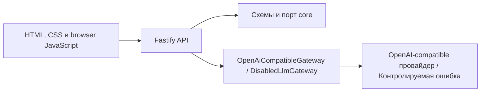

# Архитектура

## Общая схема

Проект устроен как pnpm-монорепозиторий и модульный монолит. В production
запускается один Fastify-процесс в одном контейнере.

## Модули

- `apps/web` содержит Fastify-сервер, HTTP-маршруты и статические файлы формы
- `packages/core` содержит Zod-схемы, типы и интерфейс `LlmGateway`
- `packages/llm` реализует `DisabledLlmGateway` и провайдер-независимый
  `OpenAiCompatibleGateway` для совместимых подмножеств Chat Completions и
  Responses API

`web` зависит от `core` и `llm`, а `llm` зависит от `core`. Пакет `core` не знает
о Fastify, HTTP, браузерном коде, переменных окружения приложения и
LLM-провайдерах.

## Поток генерации

Форма проверяет базовые ограничения в браузере и отправляет JSON в
`POST /api/generate`. Fastify-маршрут повторно валидирует недоверенный ввод
схемой из `core` и вызывает `LlmGateway`.

Gateway передаёт обоим LLM-протоколам один системный prompt, требующий только
JSON со структурированным черновиком заявки. После извлечения текста общий
предметный модуль выполняет `JSON.parse`, строгую Zod-валидацию черновика и
детерминированное форматирование результата. Итоговые `title`, `body` и
`warnings` повторно проверяются публичной схемой
`generateRequestResultSchema`, поэтому внешний успешный контракт
`POST /api/generate` не изменился.

Внутренний черновик содержит заголовок, наблюдаемую проблему, nullable-поле
известного практического значения, от одного до трёх требований и массив
предупреждений. Лишние, отсутствующие, пустые и превышающие лимиты значения
отклоняются. Парсер не извлекает JSON из Markdown, не исправляет частичный ответ
и не обрезает значения до допустимой длины. Форматтер собирает `body` из
смысловых блоков и всегда создаёт отдельный нумерованный раздел `Прошу:`.
Внутренняя схема использует тот же сборщик и отклоняет черновик, если готовый
`body` не поместится в публичный лимит.

Конфигурационный слой `apps/web` валидирует переменные окружения и передаёт в
`OpenAiCompatibleGateway` выбранный протокол, готовые URL, модель, ключ и схему
авторизации. `LLM_API_PROTOCOL` принимает `chat-completions` или `responses`.
При отсутствии переменной для обратной совместимости выбирается
`chat-completions`. Протокол не определяется по URL, модели или провайдеру.

Yandex AI настраивается в этом слое как один из OpenAI-compatible провайдеров.
Для Chat Completions слой выбирает `/v1/chat/completions` и YandexGPT, для
Responses API — `/v1/responses` и Alice AI LLM Flash. Идентификатор каталога
передаётся gateway через общий механизм дополнительных заголовков, поэтому
пакет `llm` не зависит от Yandex AI.

При отсутствующей или неполной конфигурации используется `DisabledLlmGateway`,
возвращающий контролируемую ошибку `generation_provider_unavailable`.

## Протоколы LLM

Оба протокола используют общий системный prompt, формирование пользовательского
сообщения, HTTP-транспорт, таймаут, обработку ошибок, разбор структурированного
черновика и форматирование заявки. Различаются только тело запроса, схема ответа
и извлечение текста.

Chat Completions получает `model`, `messages` и `temperature`. Текст извлекается
из `choices[0].message.content`.

Responses API получает `model`, `instructions`, `input`, `temperature` и
`max_output_tokens`, а также передаёт `store: false`: приложение не использует
сохранённое состояние ответа. Yandex-compatible ответ может содержать
агрегированный текст в верхнеуровневом `output_text`. Стандартный сырой
HTTP-ответ Responses API передаёт текст в блоках `output[].content[]` с типом
`output_text`.

Если провайдер передал `status`, gateway принимает текст только при значении
`completed`. Отсутствие `status` допускается только для упрощённого совместимого
ответа с непустым верхнеуровневым `output_text`. Для обхода стандартного
вложенного `output[]` требуется `status: completed`. После этой проверки gateway
сначала использует непустой верхнеуровневый `output_text`, а при его отсутствии
последовательно объединяет `text` всех текстовых блоков в message-элементах.
Нетекстовые, неизвестные и refusal-блоки не попадают во внутренний текст. После
нормализации оба формата используют общие разбор черновика и форматтер. Проект
не зависит от SDK провайдера.

Streaming, tools, conversations, background responses и хранение `response_id`
не поддерживаются.

API не логирует пользовательский текст и не возвращает фиктивную заявку.
Неизвестная ошибка возвращается как `internal_error` без внутренних деталей.

## Почему модульный монолит

Основной сценарий мал и выполняется синхронно. Один процесс упрощает разработку,
проверки и эксплуатацию, а границы пакетов отделяют доменные контракты от
интерфейса и будущей интеграции с LLM. Распределённая система сейчас не решает
практическую проблему проекта.

Для одной небольшой формы достаточно обычных HTML, CSS и минимального browser
JavaScript. Такой веб-слой сохраняет прямой путь от HTTP-запроса к доменному
порту и остаётся доступным для самостоятельного чтения и ревью. Если интерфейс
подтверждённо усложнится, его можно заменить без изменения `core` и LLM-границы.

## Намеренно отсутствующие части

Не реализованы выбор модели, хранение данных, учётные записи,
фотографии, правовая база, RAG, интеграции с мессенджерами, автоматическая
отправка, аналитика и отдельные сервисы. Для них не создаются пустые модули.
