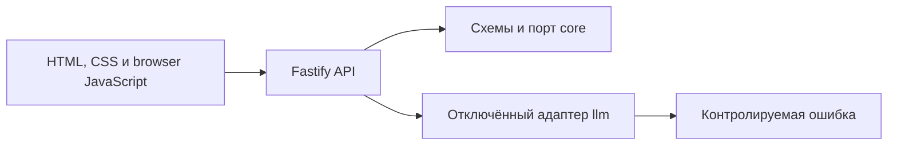

# Архитектура

## Общая схема

Проект устроен как pnpm-монорепозиторий и модульный монолит. В production
запускается один Fastify-процесс в одном контейнере.

## Модули

- `apps/web` содержит Fastify-сервер, HTTP-маршруты и статические файлы формы
- `packages/core` содержит Zod-схемы, типы и интерфейс `LlmGateway`
- `packages/llm` реализует отключённый адаптер без SDK конкретного провайдера

`web` зависит от `core` и `llm`, а `llm` зависит от `core`. Пакет `core` не знает
о Fastify, HTTP, браузерном коде, переменных окружения приложения и
LLM-провайдерах.

## Поток генерации

Форма проверяет базовые ограничения в браузере и отправляет JSON в
`POST /api/generate`. Fastify-маршрут повторно валидирует недоверенный ввод
схемой из `core`, создаёт случайный `requestId` и вызывает `LlmGateway`.

Текущая реализация порта всегда выбрасывает контролируемую инфраструктурную
ошибку. API преобразует её в код `generation_provider_unavailable`, не логирует
пользовательский текст и не возвращает фиктивную заявку.

## Почему модульный монолит

Основной сценарий мал и выполняется синхронно. Один процесс упрощает разработку,
проверки и эксплуатацию, а границы пакетов отделяют доменные контракты от
интерфейса и будущей интеграции с LLM. Распределённая система сейчас не решает
практическую проблему проекта.

Для одной небольшой формы достаточно обычных HTML, CSS и минимального browser
JavaScript. Такой веб-слой сохраняет прямой путь от HTTP-запроса к доменному
порту и остаётся доступным для самостоятельного чтения и ревью. Если интерфейс
подтверждённо усложнится, его можно заменить без изменения `core` и LLM-границы.

## Намеренно отсутствующие части

Не реализованы реальный LLM-вызов, выбор модели, хранение данных, учётные записи,
фотографии, правовая база, RAG, интеграции с мессенджерами, автоматическая
отправка, аналитика и отдельные сервисы. Для них не создаются пустые модули.
