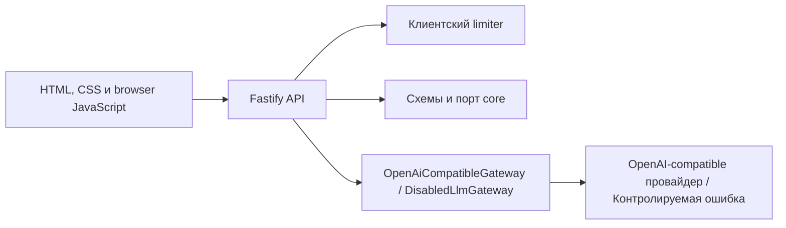

# Архитектура

## Общая схема

Проект устроен как pnpm-монорепозиторий и модульный монолит. В production
запускается один Fastify-процесс в одном контейнере.


```mermaid
flowchart LR
    Browser[HTML, CSS и browser JavaScript] --> Route[Fastify API]
    Route --> Limiter[Клиентский limiter]
    Route --> Core[Схемы и порт core]
    Route --> Adapter[OpenAiCompatibleGateway / DisabledLlmGateway]
    Adapter --> LLM[OpenAI-compatible провайдер / Контролируемая ошибка]
```

## Модули

- `apps/web` содержит Fastify-сервер, HTTP-маршруты и статические файлы формы
- `packages/core` содержит Zod-схемы, типы и интерфейс `LlmGateway`
- `packages/llm` реализует `DisabledLlmGateway` и провайдер-независимый
  `OpenAiCompatibleGateway` для совместимых подмножеств Chat Completions и
  Responses API

`web` зависит от `core` и `llm`, а `llm` зависит от `core`. Пакет `core` не знает
о Fastify, HTTP, браузерном коде, переменных окружения приложения и
LLM-провайдерах.

## Поток генерации

Форма проверяет базовые ограничения в браузере и отправляет JSON в
`POST /api/generate`. Обязательным остаётся только `description`; пустые
необязательные значения не отправляются. Поля `consequences` и `desiredActions`
ограничены 500 символами, как `impact` и отдельное `request` внутреннего
черновика: оба поля передают сведения того же предметного масштаба. Fastify-маршрут
повторно валидирует недоверенный ввод схемой из `core`. После успешной
валидации маршрут получает штатный `request.ip`, проверяет ранее установленный
подписанный технический идентификатор браузера и при необходимости только
подготавливает новый. Затем маршрут атомарно проверяет клиентские лимиты. Новая
или обновлённая cookie устанавливается только после допуска. Только допущенный
запрос вызывает `LlmGateway`.

Порядок реализованных проверок:

```text
валидация входных данных
→ клиентские лимиты
→ LlmGateway
```

Невалидный запрос не создаёт техническую cookie и не расходует квоты.
Отклонённый лимитером запрос не обращается к gateway.

## Клиентский limiter

`apps/web` создаёт один `GenerationRateLimiter` на экземпляр Fastify-приложения.
Limiter не относится к предметной логике заявки и не входит в `packages/core`.
Он хранит только IP-ключи, случайные технические идентификаторы, UTC-границы
суток, временные отметки и счётчики. Пользовательский ввод и результат генерации
в это состояние не попадают. IP, cookie, подпись, секрет и внутренние значения
счётчиков не включаются в публичные ошибки и логи.

Допуск выполняется одной операцией. Сначала удаляются истёкшие IP-отметки и
суточные записи, затем без изменения состояния проверяются скользящее IP-окно,
суточная квота технического клиента, его активный слот, консервативный
active-IP fallback и общая ёмкость хранилища. Установленный клиент проверяет
active-слот только по своему UUID. Запрос без валидной cookie отклоняется, если
с того же IP уже выполняется любая генерация. Поэтому разные установленные
клиенты за одним IP могут работать параллельно, а два первых запроса без cookie
сериализуются.

Если сработала хотя бы одна проверка, независимые квоты не изменяются и
подготовленный UUID не отправляется клиенту. При допуске одновременно
добавляется IP-отметка, увеличивается суточный счётчик, захватывается active-слот
клиента и увеличивается число активных запросов IP.

Активный слот освобождается в `finally` после успеха, контролируемой ошибки
gateway или неизвестного исключения. Там же уменьшается число активных запросов
IP, а запись удаляется после завершения последнего запроса с этого адреса. IP- и
суточная квоты уже допущенной попытки остаются израсходованными независимо от
результата gateway.

Технический UUID передаётся в подписанной cookie `uo_generation_client` с
атрибутами `HttpOnly`, `SameSite=Strict`, `Path=/` и ограниченным сроком жизни.
Для HTTPS-запроса добавляется `Secure`. Подпись создаёт и проверяет официальный
плагин `@fastify/cookie`. Неподписанное, повреждённое или не соответствующее
формату UUID значение не используется. Replacement cookie возвращается только
после успешного допуска limiter.

По умолчанию Fastify не доверяет proxy-заголовкам. Настройка
`GENERATION_TRUST_PROXY` принимает только точные значения `true` и `false` и
передаётся Fastify как `trustProxy`. Код приложения не разбирает
`X-Forwarded-For`.

Текущее значение `true` означает доверие forwarding-заголовкам от любого
источника, который достигает backend. Оно безопасно только при отсутствии
публичного доступа к backend в обход доверенного reverse proxy и при
обязательной перезаписи proxy-заголовков данными фактического соединения.
Передача пользовательских `X-Forwarded-For` и `X-Forwarded-Proto` без перезаписи
небезопасна. Ограниченный allowlist доверенных адресов и сетей относится к
отдельной issue #61 и здесь не реализован.

Состояние ограничено `GENERATION_RATE_LIMIT_STATE_CAPACITY`. Каждая IP-отметка,
суточная запись, active-слот клиента и active-IP запись учитываются в ёмкости.
Очистка выполняется детерминированно при обращении без фонового таймера. Если
после очистки для нового допуска недостаточно места, запрос отклоняется без
удаления актуальных записей.

Limiter рассчитан на один процесс MVP. Его счётчики и эфемерный секрет
отключённого локального gateway сбрасываются при перезапуске. Redis,
распределённая синхронизация и общие лимиты между несколькими экземплярами не
реализованы.

Gateway добавляет место, известные последствия и желаемые действия в
пользовательское сообщение отдельными подписанными блоками только при наличии
соответствующего непустого ввода. Поэтому модель получает эти сведения без
двусмысленного объединения и не получает пустые разделы.

Gateway передаёт обоим LLM-протоколам один системный prompt, требующий только
JSON со структурированным черновиком заявки. Для Responses API дополнительно
передаётся строгая JSON Schema через Structured Outputs в `text.format`: она
задаёт обязательные поля и базовые ограничения структуры ответа. После
извлечения текста общий предметный модуль всё равно выполняет `JSON.parse`,
строгую Zod-валидацию черновика и детерминированное форматирование результата.
Провайдерская схема не заменяет локальные предметные и межполевые проверки,
например запрет переводов строк и ограничение длины сформированного `body`.
Итоговые `title`, `body` и `warnings` повторно проверяются публичной схемой
`generateRequestResultSchema`, поэтому внешний успешный контракт
`POST /api/generate` не изменился.

Внутренний черновик содержит заголовок, наблюдаемую проблему, nullable-поле
известного практического значения, от одного до трёх требований и массив
предупреждений. Лишние, отсутствующие, пустые и превышающие лимиты значения
отклоняются. Парсер не извлекает JSON из Markdown, не исправляет частичный ответ
и не обрезает значения до допустимой длины. Форматтер собирает `body` из
смысловых блоков и всегда создаёт отдельный нумерованный раздел `Прошу:`.
Внутренняя схема использует тот же сборщик и отклоняет черновик, если готовый
`body` не поместится в публичный лимит.

Конфигурационный слой `apps/web` валидирует переменные окружения и передаёт в
`OpenAiCompatibleGateway` выбранный протокол, готовые URL, модель, ключ и схему
авторизации. `LLM_API_PROTOCOL` принимает `chat-completions` или `responses`.
При отсутствии переменной для обратной совместимости выбирается
`chat-completions`. Протокол не определяется по URL, модели или провайдеру.

Yandex AI настраивается в этом слое как один из OpenAI-compatible провайдеров.
Для Chat Completions слой выбирает `/v1/chat/completions` и YandexGPT, для
Responses API — `/v1/responses` и Alice AI LLM Flash. Идентификатор каталога
передаётся gateway через общий механизм дополнительных заголовков, поэтому
пакет `llm` не зависит от Yandex AI.

При отсутствующей или неполной конфигурации используется `DisabledLlmGateway`,
возвращающий контролируемую ошибку `generation_provider_unavailable`.

## Протоколы LLM

Оба протокола используют общий системный prompt, формирование пользовательского
сообщения, HTTP-транспорт, таймаут, обработку ошибок, разбор структурированного
черновика и форматирование заявки. Различаются только тело запроса, схема ответа
и извлечение текста.

Chat Completions получает `model`, `messages` и `temperature`. Текст извлекается
из `choices[0].message.content`.

Responses API получает `model`, `instructions`, `input`, `temperature`,
`max_output_tokens` и `text.format` с типом `json_schema`, а также передаёт
`store: false`: приложение не использует сохранённое состояние ответа.
Structured Outputs уменьшают вероятность свободного или неполного текста, но не
заменяют общий локальный путь `JSON.parse`, Zod-валидации и форматирования,
который после извлечения текста совпадает с путём Chat Completions.
Yandex-compatible ответ может содержать
агрегированный текст в верхнеуровневом `output_text`. Стандартный сырой
HTTP-ответ Responses API передаёт текст в блоках `output[].content[]` с типом
`output_text`.

Если провайдер передал `status`, gateway принимает текст только при значении
`completed`. Отсутствие `status` допускается только для упрощённого совместимого
ответа с непустым верхнеуровневым `output_text`. Для обхода стандартного
вложенного `output[]` требуется `status: completed`. После этой проверки gateway
сначала использует непустой верхнеуровневый `output_text`, а при его отсутствии
последовательно объединяет `text` всех текстовых блоков в message-элементах.
Нетекстовые, неизвестные и refusal-блоки не попадают во внутренний текст. После
нормализации оба формата используют общие разбор черновика и форматтер. Проект
не зависит от SDK провайдера.

Streaming, tools, conversations, background responses и хранение `response_id`
не поддерживаются.

API не логирует пользовательский текст и не возвращает фиктивную заявку.
Неизвестная ошибка возвращается как `internal_error` без внутренних деталей.

## Почему модульный монолит

Основной сценарий мал и выполняется синхронно. Один процесс упрощает разработку,
проверки и эксплуатацию, а границы пакетов отделяют доменные контракты от
интерфейса и будущей интеграции с LLM. Распределённая система сейчас не решает
практическую проблему проекта.

Для одной небольшой формы достаточно обычных HTML, CSS и минимального browser
JavaScript. Такой веб-слой сохраняет прямой путь от HTTP-запроса к доменному
порту и остаётся доступным для самостоятельного чтения и ревью. Если интерфейс
подтверждённо усложнится, его можно заменить без изменения `core` и LLM-границы.

## Намеренно отсутствующие части

Не реализованы выбор модели, хранение данных, учётные записи,
фотографии, правовая база, RAG, интеграции с мессенджерами, автоматическая
отправка, аналитика и отдельные сервисы. Для них не создаются пустые модули.
