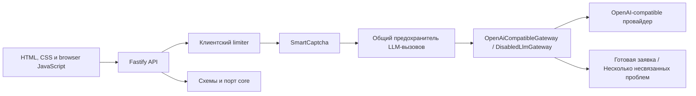

# Архитектура

## Общая схема

Проект устроен как pnpm-монорепозиторий и модульный монолит. В production
запускается один Fastify-процесс в одном контейнере.


```mermaid
flowchart LR
    Browser[HTML, CSS и browser JavaScript] --> Route[Fastify API]
    Route --> Limiter[Клиентский limiter]
    Limiter --> Captcha[SmartCaptcha]
    Captcha --> Safeguard[Общий предохранитель LLM-вызовов]
    Safeguard --> Adapter[OpenAiCompatibleGateway / DisabledLlmGateway]
    Route --> Core[Схемы и порт core]
    Adapter --> LLM[OpenAI-compatible провайдер]
    Adapter --> Outcome[Готовая заявка / Несколько несвязанных проблем]
```

## Модули

- `apps/web` содержит Fastify-сервер, HTTP-маршруты и статические файлы формы
- `packages/core` содержит Zod-схемы, типы, интерфейс `LlmGateway`, расширенный
  черновик первичной заявки и его детерминированный renderer
- `packages/llm` реализует `DisabledLlmGateway` и провайдер-независимый
  `OpenAiCompatibleGateway` для совместимых подмножеств Chat Completions и
  Responses API

`web` зависит от `core` и `llm`, а `llm` зависит от `core`. Пакет `core` не знает
о Fastify, HTTP, браузерном коде, переменных окружения приложения и
LLM-провайдерах.

## Расширенный черновик первичной заявки

Provider-independent `PrimaryRequestDraft` находится в `packages/core`. Его
строгая Zod-схема различает смысловые роли, а `renderPrimaryRequestDraft`
собирает публичный `GenerateRequestResult` в фиксированном порядке:

```text
problem
→ circumstances, если есть
→ impact, если есть
→ verification, если есть
→ COMMON_LEGAL_BASIS_BLOCK
→ Прошу: и нумерованные requests
```

Renderer не выводит индивидуальные факты из других полей. `null` полностью
пропускает необязательную часть, поэтому не остаются пустые заголовки и лишние
разделители. Нормативный блок хранится в одном экземпляре рядом с renderer и не
входит в динамические данные черновика.

Лимиты выбраны по масштабу смысловых ролей и проверены синтетическими fixtures:

| Поле | Роль | Лимит |
| --- | --- | ---: |
| `title` | Краткий заголовок | 120 символов |
| `problem` | Наблюдаемая проблема | 1950 символов |
| `circumstances` | Существенные обстоятельства | 600 символов |
| `impact` | Известные последствия и риски | 500 символов |
| `verification` | Обстоятельства для проверки | 500 символов |
| `requests` | Требования | 1–5 элементов |
| Элемент `requests` | Одно действие | 500 символов |
| `warnings` | Предупреждения | До 5 элементов по 200 символов |
| Готовый `body` | Все части с нормативным блоком | 2500 символов |

Лимит `problem` оставляет место для нормативного блока и минимального требования
даже на своей точной границе. Остальные поля ограничивают самостоятельные
дополнительные абзацы, а итоговый лимит `body` не позволяет одновременно
исчерпать все частные пределы. Превышение любого предела приводит к ошибке
валидации без обрезания.

`title`, `warnings` и полный `body` следуют публичному контракту результата.
Лимиты `impact` и отдельного требования сохраняют до 500 символов явно
переданных `consequences` и `desiredActions`. Для новых самостоятельных абзацев
выбраны 600 символов обстоятельств и 500 символов предмета проверки. Подробный
fixture входной двери помещается с четырьмя требованиями без потери сведений.

Provider-facing generated-ветка содержит те же смысловые части и поле
`outcome`. Локальная Zod-схема расширяет `primaryRequestDraftSchema`, поэтому
переиспользует её строковые, количественные и итоговый `body`-лимиты. После
проверки gateway удаляет discriminator и непосредственно передаёт
`PrimaryRequestDraft` единственному renderer.

## Поток генерации

Форма проверяет базовые ограничения в браузере и отправляет JSON в
`POST /api/generate`. Обязательным остаётся только `description`; пустые
необязательные значения не отправляются. Поля `consequences` и `desiredActions`
ограничены 500 символами, как `impact` и отдельное `request` внутреннего
черновика: оба поля передают сведения того же предметного масштаба.
Fastify-маршрут валидирует отдельную строгую транспортную схему, которая
добавляет к предметным полям необязательный `captchaToken`. После валидации
токен отделяется на HTTP-границе и не попадает в `packages/core`. Затем маршрут
получает штатный `request.ip`, проверяет ранее установленный подписанный
технический идентификатор браузера и при необходимости только подготавливает
новый. После атомарного допуска клиентским limiter обязательный режим проверяет
CAPTCHA. Затем общий предохранитель атомарно допускает вызов. Только успешно
проверенный или явно отключённый CAPTCHA-режим с допуском предохранителя вызывает
`LlmGateway`.

`LlmGateway.generateRequest()` возвращает типизированный outcome. Ветка
`generated` содержит существующий `GenerateRequestResult`, а
`multiple_issues` сообщает, что во вводе несколько самостоятельных несвязанных
проблем. Во втором случае маршрут возвращает контролируемую ошибку HTTP 400 с
публичным кодом `multiple_issues` и не формирует готовый текст заявки.

Порядок реализованных проверок:

```text
валидация входных данных
→ клиентские лимиты
→ серверная проверка CAPTCHA
→ общий предохранитель LLM-вызовов
→ LlmGateway
```

Невалидный запрос не создаёт техническую cookie и не расходует квоты.
Отклонённый лимитером запрос не обращается к verifier или gateway. Проверка
CAPTCHA, общий предохранитель и gateway занимают уже допущенный active-слот
limiter, который освобождается во внешнем `finally` после любого исхода.

## Общий предохранитель LLM-вызовов

`apps/web` создаёт один `GenerationSafeguard` на экземпляр Fastify-приложения.
После CAPTCHA его синхронный `acquire()` сначала проверяет аварийное отключение,
затем границу календарных суток UTC, дневной предел и общую ёмкость. Только после
всех проверок он увеличивает дневной счётчик и занимает active-слот. Отклонение
из-за ёмкости не расходует дневную попытку.

Суточный счётчик сбрасывается при первом обращении в следующих календарных
сутках UTC, но active-слоты при смене суток не сбрасываются. `release()`
идемпотентно освобождает только active-слот во внутреннем `finally` после успеха,
контролируемой ошибки gateway или неизвестного исключения. Допущенная попытка
остаётся учтённой независимо от результата gateway.

Это внутрипроцессная защита от массового расхода, а не точный денежный бюджет.
Перезапуск процесса сбрасывает суточный счётчик. Несколько экземпляров не имеют
общего состояния, поэтому Redis, provider usage, фактические расходы и
операторские отчёты относятся к другим issue.

## Клиентский limiter

`apps/web` создаёт один `GenerationRateLimiter` на экземпляр Fastify-приложения.
Limiter не относится к предметной логике заявки и не входит в `packages/core`.
Он хранит только IP-ключи, случайные технические идентификаторы, UTC-границы
суток, временные отметки и счётчики. Пользовательский ввод и результат генерации
в это состояние не попадают. IP, cookie, подпись, секрет и внутренние значения
счётчиков не включаются в публичные ошибки и логи.

Допуск выполняется одной операцией. Сначала удаляются истёкшие IP-отметки и
суточные записи, затем без изменения состояния проверяются скользящее IP-окно,
суточная квота технического клиента, его активный слот, консервативный
active-IP fallback и общая ёмкость хранилища. Установленный клиент проверяет
active-слот только по своему UUID. Запрос без валидной cookie отклоняется, если
с того же IP уже выполняется любая генерация. Поэтому разные установленные
клиенты за одним IP могут работать параллельно, а два первых запроса без cookie
сериализуются.

Если сработала хотя бы одна проверка, независимые квоты не изменяются и
подготовленный UUID не отправляется клиенту. При допуске одновременно
добавляется IP-отметка, увеличивается суточный счётчик, захватывается active-слот
клиента и увеличивается число активных запросов IP.

Активный слот освобождается в `finally` после успеха, контролируемой ошибки
CAPTCHA, технической недоступности verifier, ошибки gateway или неизвестного
исключения. Там же уменьшается число активных запросов IP, а запись удаляется
после завершения последнего запроса с этого адреса. IP- и суточная квоты уже
допущенной попытки остаются израсходованными независимо от результата CAPTCHA
или gateway.

Технический UUID передаётся в подписанной cookie `uo_generation_client` с
атрибутами `HttpOnly`, `SameSite=Strict`, `Path=/` и ограниченным сроком жизни.
Для HTTPS-запроса добавляется `Secure`. Подпись создаёт и проверяет официальный
плагин `@fastify/cookie`. Неподписанное, повреждённое или не соответствующее
формату UUID значение не используется. Replacement cookie возвращается только
после успешного допуска limiter.

По умолчанию Fastify получает `trustProxy: false` и не доверяет
proxy-заголовкам. `GENERATION_TRUSTED_PROXIES` принимает разделённый запятыми
allowlist буквальных IPv4, IPv6 и CIDR. После строгой проверки приложение
передаёт непустой массив Fastify через его штатный `trustProxy`. DNS-имя, `*`,
число hop, пустой элемент, некорректный адрес или CIDR останавливают запуск. Код
приложения сохраняет штатные `request.ip` и `request.protocol` и не разбирает
`X-Forwarded-For` или `X-Forwarded-Proto`.

Allowlist должен содержать только фактические адреса или сети доверенных proxy и
обновляться при изменении proxy-цепочки. Backend не должен иметь прямого
публичного доступа в обход proxy, а proxy обязан перезаписывать forwarding-
заголовки данными фактического соединения. Настройка приложения дополняет, но не
заменяет сетевое ограничение доступа.

Legacy-переменная `GENERATION_TRUST_PROXY` больше не поддерживается: её наличие
останавливает запуск, чтобы оператор не считал старую boolean-настройку
действующей. Для миграции её нужно удалить и задать явный allowlist в
`GENERATION_TRUSTED_PROXIES`.

Состояние ограничено `GENERATION_RATE_LIMIT_STATE_CAPACITY`. Каждая IP-отметка,
суточная запись, active-слот клиента и active-IP запись учитываются в ёмкости.
Очистка выполняется детерминированно при обращении без фонового таймера. Если
после очистки для нового допуска недостаточно места, запрос отклоняется без
удаления актуальных записей.

Limiter рассчитан на один процесс MVP. Его счётчики и эфемерный секрет
отключённого локального gateway сбрасываются при перезапуске. Redis,
распределённая синхронизация и общие лимиты между несколькими экземплярами не
реализованы.

## SmartCaptcha

`apps/web` представляет конфигурацию как discriminated union: `{ mode:
"disabled" }` либо `{ mode: "required", clientKey, serverKey }`. В обязательном
режиме отсутствие любого ключа останавливает запуск. Для локального запуска с
`DisabledLlmGateway` отсутствие `SMARTCAPTCHA_MODE` эквивалентно отключённому
режиму, но конфигурация подключённого LLM всегда требует явного режима.

`GET /api/captcha/config` возвращает только `required` и, в обязательном режиме,
клиентский ключ. Browser JavaScript строго проверяет число и тип полей ответа.
В режиме `required` он расширенным методом загружает официальный скрипт,
отрисовывает виджет с `invisible: true` и `hideShield: true`, показывает
встроенное уведомление об обработке данных, вызывает `execute` после локальной
валидации и передаёт callback-токен только в транспортном теле генерации. После
каждого результата выполняется `reset`, поэтому следующая попытка не
переиспользует токен.

Конкретный `SmartCaptchaVerifier` использует встроенный `fetch` и отправляет
`secret`, `token` и штатный `request.ip` формой на endpoint проверки
SmartCaptcha. Код не разбирает forwarding-заголовки самостоятельно. Запрос
ограничен timeout, а чтение ответа — небольшим пределом байтов. Verifier не
делает retry и возвращает только `verified`, `failed` или `unavailable`, не
перенося внешнее поле `message` во внутренний контракт.

Только строгий ответ `status: "ok"` с непустым `host` считается успешным.
`status: "failed"` означает пользовательский отказ. Timeout, сеть, non-2xx,
слишком большой ответ, некорректный JSON, неожиданная форма и `ok` с пустым
`host` означают `unavailable`. Это намеренный fail closed для платного endpoint,
включая HTTP-ошибки, которые документация провайдера предлагает обрабатывать
мягче.

Автоматические тесты внедряют `fetch`, verifier и объект
`window.smartCaptcha`, поэтому не выполняют запросы к внешнему сервису и не
требуют реальных ключей. Программная интеграция не означает, что CAPTCHA
включена в публичном экземпляре: реальные ресурс, ключи и ручная сквозная
проверка относятся к #62. При использовании reverse proxy безопасное публичное
включение требует настроенного allowlist и сетевого ограничения доступа к
backend.

Gateway сериализует исходный пользовательский ввод одним JSON-объектом с полями
`description`, `location`, `consequences` и `desiredActions`. Необязательные
строки передаются после удаления пробелов по краям, а отсутствующие значения —
как `null`. `description` остаётся свободным текстом и не считается готовым
значением выходного `problem`.

Gateway передаёт обоим LLM-протоколам один системный prompt и одну строгую JSON
Schema. Chat Completions получает её через `response_format`, Responses API —
через Structured Outputs в `text.format`. Корневой объект содержит обязательное
поле `draft` с вложенным `anyOf`: одна ветка требует полный черновик
`generated`, другая допускает только пустой `multiple_issues`. Такая оболочка
сохраняет объект в корне совместимой схемы и одновременно запрещает смешивать
оба исхода. Для Responses сохраняется `strict: true`.

После извлечения текста общий предметный модуль всё равно выполняет `JSON.parse`
и строгую Zod-валидацию корневой оболочки и черновика. Локальная discriminated
union окончательно проверяет межполевые правила. Для `generated` обязательны
непустые `title` и `problem`, nullable `circumstances`, `impact` и
`verification`, от одного до пяти требований и ограниченный массив
предупреждений. Для `multiple_issues` все строковые части должны быть `null`, а
`requests` и `warnings` — пустыми. Любое другое сочетание отклоняется fail closed
как невалидный ответ модели.

Детерминированное форматирование выполняется только для `generated`. После
успешной проверки provider-facing черновик непосредственно передаётся
расширенному renderer из `packages/core`. Обычный TypeScript-код вставляет два
фиксированных общих нормативных основания в виде коротких связных абзацев,
разделённых пустой строкой, без отдельного заголовка и без URL, а затем добавляет
нумерованный раздел `Прошу:`, который завершает основную часть заявки. Источники
нормативных положений зафиксированы в [`REQUEST_RULES.md`](REQUEST_RULES.md). LLM
не получает тексты и ссылки, не выбирает нормы и не делает дополнительный вызов.

Расширенный core-контракт проверяет полный `body` вместе с нормативным блоком по
публичному лимиту 2500 символов. Provider-facing локальная схема переиспользует
эту проверку без второго набора правил и без молчаливого усечения. Внешний
успешный контракт `POST /api/generate` по-прежнему содержит только `title`,
`body` и `warnings`.

Responses API по умолчанию получает `max_output_tokens: 4000`. Для консервативной
оценки учитывается весь 2500-символьный лимит итогового `body`, хотя нормативный
блок модель не возвращает, а также заголовок до 120 символов, предупреждения
суммарно до 1000 символов и JSON overhead. Лимит оставляет конечный запас на
токенизацию Structured Output, но не задаётся чрезмерно большим. В Chat
Completions сохраняется существующая форма запроса без отдельного поля лимита.

Классификация связанной и нескольких несвязанных проблем происходит внутри
этого же вызова LLM. Дополнительного запроса, автоматического retry, локальной
эвристики и классификации в браузере нет. При `multiple_issues` приложение не
выбирает одну проблему, не объединяет проблемы и просит пользователя составить
отдельные заявки.

Конфигурационный слой `apps/web` валидирует переменные окружения и передаёт в
`OpenAiCompatibleGateway` выбранный протокол, готовые URL, модель, ключ и схему
авторизации. `LLM_API_PROTOCOL` принимает `chat-completions` или `responses`.
При отсутствии переменной для обратной совместимости выбирается
`chat-completions`. Протокол не определяется по URL, модели или провайдеру.

Yandex AI настраивается в этом слое как один из OpenAI-compatible провайдеров.
Для Chat Completions слой выбирает `/v1/chat/completions` и YandexGPT, для
Responses API — `/v1/responses` и Alice AI LLM Flash. Идентификатор каталога
передаётся gateway через общий механизм дополнительных заголовков, поэтому
пакет `llm` не зависит от Yandex AI.

При отсутствующей или неполной конфигурации используется `DisabledLlmGateway`,
возвращающий контролируемую ошибку `generation_provider_unavailable`.

## Ручной fixture-based smoke-runner

Исполняемый smoke-runner находится в `apps/web/tests/manual` и не входит в
production build. Он напрямую импортирует общий массив `scenarios` из тестовой
структуры `packages/core`, не требует публичного runtime-экспорта fixtures и не
создаёт отдельный пакет.

Runner проверяет конфигурацию до первого запроса и последовательно вызывает
`generateRequest` ровно один раз для каждого сценария. Retry, параллельные
вызовы, LLM-as-a-judge и дополнительные запросы для оценки результата
отсутствуют. Обычная ошибка сценария накапливается в итоговой сводке, а
контролируемая общая недоступность провайдера останавливает дальнейшие запросы.

Для `generated` runner сначала применяет публичную схему результата. Невалидный
результат получает безопасную категорию ошибки и не печатается. Для валидного
результата runner использует нормализованные данные Zod, выводит ручной отчёт и
только затем проверяет непустые `title` и `body`, соответствие предупреждений
fixture и отдельный нумерованный раздел `Прошу:` с количеством требований от
одного до пяти.
Предупреждения должны оставаться отдельным полем и не повторяться в тексте
заявки. Для `multiple_issues` автоматически успешным считается только
одноимённый outcome.

Итоговый счётчик отражает только сценарии, прошедшие все автоматические
проверки. Сохранение фактов, отсутствие домыслов и обоснованность требований
нельзя надёжно подтвердить без семантического судьи. Поэтому runner выводит в
stdout синтетический ввод, публичный результат и списки `mustPreserveFacts` и
`mustNotInvent` для ручной проверки, но не сохраняет ответы в репозитории и не
считает ручное решение.

## Протоколы LLM

Оба протокола используют общий системный prompt, формирование пользовательского
сообщения, HTTP-транспорт, таймаут, обработку ошибок, разбор структурированного
черновика и форматирование заявки. Различаются только тело запроса, схема ответа
и извлечение текста.

Системный prompt требует классифицировать свободное `description` по смыслу:
наблюдаемая проблема помещается в `problem`, существенные дополнительные факты —
в `circumstances`, последствия и риски — в `impact`, а предположения и неизвестные
обстоятельства формулируются как предмет проверки в `verification`. Требования
попадают в `requests` только при наличии основания. Один смысловой факт должен
появляться ровно в одной динамической роли.

При нормализации эмоционального ввода конкретные сведения о человеке, месте и
обстоятельствах сохраняются и не заменяются выведенными категориями людей.

Локальная Zod-схема проверяет структуру ответа fail closed, но не определяет
смысловую эквивалентность формулировок. Отсутствие домыслов и смысловых повторов
дополнительно проверяется ручным просмотром полного LLM smoke-check.

Chat Completions получает `model`, `messages`, `temperature` и
`response_format` с общей строгой JSON Schema. Текст извлекается из
`choices[0].message.content`.

Responses API получает `model`, `instructions`, `input`, `temperature`,
`max_output_tokens` и `text.format` с типом `json_schema`, а также передаёт
`store: false`: приложение не использует сохранённое состояние ответа.
Structured Outputs уменьшают вероятность свободного или неполного текста, но не
заменяют общий локальный путь `JSON.parse`, Zod-валидации и форматирования,
который после извлечения текста совпадает с путём Chat Completions.
Yandex-compatible ответ может содержать
агрегированный текст в верхнеуровневом `output_text`. Стандартный сырой
HTTP-ответ Responses API передаёт текст в блоках `output[].content[]` с типом
`output_text`.

Если провайдер передал `status`, gateway принимает текст только при значении
`completed`. Отсутствие `status` допускается только для упрощённого совместимого
ответа с непустым верхнеуровневым `output_text`. Для обхода стандартного
вложенного `output[]` требуется `status: completed`. После этой проверки gateway
сначала использует непустой верхнеуровневый `output_text`, а при его отсутствии
последовательно объединяет `text` всех текстовых блоков в message-элементах.
Нетекстовые, неизвестные и refusal-блоки не попадают во внутренний текст. После
нормализации оба формата используют общие разбор черновика и форматтер. Проект
не зависит от SDK провайдера.

Streaming, tools, conversations, background responses и хранение `response_id`
не поддерживаются.

API не сохраняет и не логирует пользовательский текст или ответ LLM и не
возвращает фиктивную заявку. Контролируемый `multiple_issues` не содержит ввод,
ответ модели или технические подробности. Неизвестная ошибка возвращается как
`internal_error` без внутренних деталей.

## Завершение процесса

Первый `SIGINT` или `SIGTERM` запускает `app.close()`. Все последующие вызовы
shutdown используют уже начатую операцию и не создают конкурирующее закрытие.
Тот же путь используется после ошибки запуска сервера.

Graceful shutdown ограничен фиксированными 10 секундами. Успешное закрытие
завершает работу штатно. Ошибка `app.close()` устанавливает ненулевой код и
немедленно принудительно завершает процесс. Превышение срока также принудительно
завершает процесс с ненулевым кодом. Таймер очищается после успеха или ошибки
закрытия.

## Почему модульный монолит

Основной сценарий мал и выполняется синхронно. Один процесс упрощает разработку,
проверки и эксплуатацию, а границы пакетов отделяют доменные контракты от
интерфейса и будущей интеграции с LLM. Распределённая система сейчас не решает
практическую проблему проекта.

Для одной небольшой формы достаточно обычных HTML, CSS и минимального browser
JavaScript. Такой веб-слой сохраняет прямой путь от HTTP-запроса к доменному
порту и остаётся доступным для самостоятельного чтения и ревью. Если интерфейс
подтверждённо усложнится, его можно заменить без изменения `core` и LLM-границы.

## Намеренно отсутствующие части

Не реализованы выбор модели, хранение данных, учётные записи, фотографии,
индивидуальная юридическая квалификация, подбор законодательства, RAG,
интеграции с мессенджерами, автоматическая отправка, аналитика и отдельные
сервисы. Для них не создаются пустые модули.
