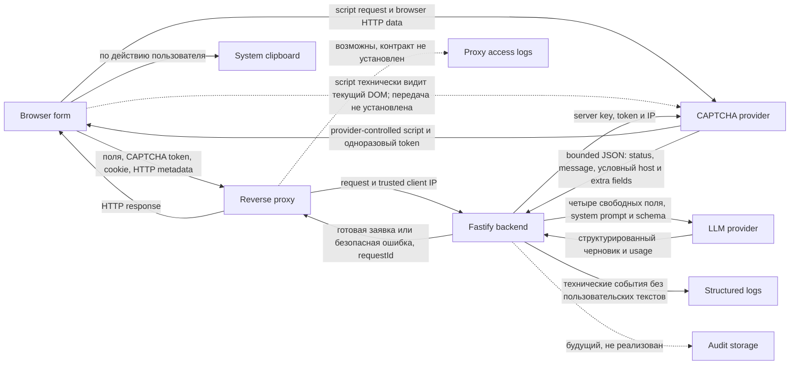

# Обработка персональных данных

## Статус документа

Этот документ фиксирует инженерный контракт обработки персональных данных для
типового публичного экземпляра сервиса. Факты приложения проверены по `main` на
коммите `2453016` 21 августа 2026 года. Законодательство и официальные материалы
проверены 20 августа 2026 года.

12 сентября 2026 года отдельно проверены текущий поток на `main` `f5db132`,
нормы о трансграничной передаче, случайных данных третьих лиц, специальных
категориях, биометрии и мерах статьи 18.1 по [L15], а также вступление в силу
поправок [L10]. Это не новая проверка всех утверждений документа. Ниже отдельно
зафиксированы подтверждение оператора и принятые им решения этой даты.

14 сентября 2026 года по `main` `37057ee` отдельно проверены app logs,
поставляемая Docker Compose-конфигурация и публично известная граница reverse
proxy. Семантика Docker logging driver повторно проверена по [D1]–[D4]. Оператор
утвердил назначение, доступ, максимальный семидневный retention и переход на
log-safe aliases. Эта проверка и решения не подтверждают закрытые факты
фактического production runtime, proxy logs и механизма удаления.

15 сентября 2026 года в рамках application change #275 raw `provider` и `model`
заменены фиксированными aliases на границе structured generation events.
Локальные синтетические regression tests проверяют оба класса конфигурации и
оба протокола, успех, отклонение и metadata-bearing отказы. Это не проверка
фактической production-инфраструктуры и не завершение #190.

15 сентября 2026 года для #184 проверен текущий поток на `main` `2716938`
после PR #277. В рабочем диалоге оператор утвердил минимальную процедуру
обращений, проверку заявителя, закрытый журнал и реакцию без locator. Итог —
`blocked`: синтетический dry run не подтверждает фактические возможности
получателей, proxy logs и применимое подтверждение уничтожения. Статьи 14, 20,
21 по [L1] и полный приказ № 179 [L7] повторно прочитаны 15 сентября.
Безопасная выжимка решения оператора опубликована в этом документе. Полный
рабочий диалог, закрытые evidence, частные operational facts и подтверждающие
материалы в GitHub не публикуются.

Документ не является юридическим заключением и не подтверждает соответствие
сервиса Федеральному закону № 152-ФЗ. Он отделяет установленное требование,
факт текущей архитектуры, предлагаемое инженерное решение и вопрос, который
нельзя закрыть без подтверждённых фактов и решения оператора.

В документе используются следующие пометки:

- **Норма** — требование из официального источника
- **Факт** — поведение текущего `main`, подтверждённое кодом или документацией
- **Решение** — предлагаемый проверяемый контракт проекта
- **Юридическая проверка** — вопрос для решения оператора по evidence, а не
  автоматическое одобрение разработчиком или LLM

Публичный репозиторий не содержит и не должен содержать фактические домены,
адреса, хосты, регионы, учётные записи, договоры и реквизиты частной
инфраструктуры. Конкретные production-факты хранятся у оператора и проверяются
вне GitHub.

### Решения оператора по проекту от 8 сентября 2026 года

Оператором публичного экземпляра является физическое лицо. Публичный контакт для обращений: `zayavka@ashikov.ru`. Иные сведения об операторе не публикуются.

Решением оператора по проекту после проверки предиката оператора требования статьи 18.1, части 1, пунктов 1 и 2 отмечены как `NOT_APPLICABLE`. Это датированное решение оператора по проекту, а не безусловный правовой вывод. Работников, непосредственно обрабатывающих персональные данные проекта, нет.

Решением оператора по проекту выбраны следующие основания: для `Ц1` — статья 6, часть 1, пункт 1, согласие; для `Ц2` — статья 6, часть 1, пункт 7, только текущая минимизированная цель защиты от злоупотреблений; для `Ц3` — статья 6, часть 1, пункт 7, только необходимая CAPTCHA в пределах одобренной конфигурации #181; для `Ц4` — статья 6, часть 1, пункт 7, только минимальные технические события диагностики и контроля расходов.

Согласие для `Ц1` должно быть отдельным, версионированным, датированным и доказуемым. Целевой контроль задаётся на уровне требования: отдельный минимальный долговечный ledger с `consentReceiptId`, `requestId`, точной `consentVersion`, серверным timestamp, status и необязательным timestamp отзыва. Доступ только у оператора. В ledger не записываются пользовательский текст, результат, IP, cookie или CAPTCHA token. Долговечная запись должна выполняться fail-closed до обращения к LLM. Механизм хранения и evidence retention определяются в задаче реализации #264 по официальным источникам. Предлагаемый #264 contract включает support-withdrawal locator. #184 остаётся операционным процессом отзыва, а #264 — задачей реализации consent ledger. #182 фиксирует эту downstream-работу и не требует закрытия #184 сейчас. Реализация не считается существующей до выполнения #264.

`Ц3` независима от `Ц1`: предварительная проверка согласия перед CAPTCHA не требуется. Consent control и ledger применяются перед LLM и иной внешней обработкой по `Ц1`.

Checkbox state, утверждённые текст и version, а после ответа `consentReceiptId` доступны same-document script. Оператор 15 сентября принял расширение остаточного риска по #193; обновлённый characterization и область решения описаны в [C1_CONSENT.md](C1_CONSENT.md#расширение-принятого-dom-риска-193). До релиза требуется security/privacy review реализации по прежним triggers. Буквальное переоткрытие #193 не требуется. Фактическая передача данных provider этим решением не утверждается.

Данные третьих лиц, специальные категории и биометрические данные намеренно не запрашиваются, но могут появиться в свободном вводе или результате. Детектора или фильтра нет. Согласие пользователя не является согласием третьего лица. Биометрическая идентификация имеет статус `NOT_APPLICABLE` как датированное решение оператора по проекту от 8 сентября 2026 года. На эту дату операционное правило оставалось незавершённым. Актуальный порядок принят 12 сентября и описан в разделе «Свободный текст и третьи лица».

Решением оператора по проекту от 8 сентября 2026 года на основании текущей evidence-policy по статье 22 зафиксированы `CONFIRMED` применимость и `CONFIRMED` невыполнение обязательного действия. Уведомление не подавалось. На эту дату правовой и проектный итог был `blocked`, `accepted_for_beta` не применялся. Изменение только проектного статуса от 12 сентября приведено ниже.

Решением оператора по проекту от 8 сентября 2026 года статья 12 была оставлена
`UNKNOWN` без project exception. Этот статус применимости заменён результатом
проверки и подтверждения оператора от 12 сентября, приведённым ниже.
Задачи #184, #190 и #191 остаются отдельными обязательными результатами.

### Решения и подтверждение оператора от 12 сентября 2026 года

**Статья 22.** По [датированному решению в #182](https://github.com/ashikov/uo-request-generator/issues/182#issuecomment-5646080273)
уведомление подаваться не будет. Применимость остаётся `CONFIRMED`, required
action — `CONFIRMED: not completed`, юридический итог — `blocked`.
Оператор принял риск неподачи только для `v0.2 — Public beta`: эта ветвь сама
по себе не блокирует закрытие #182 и приёмку #169. Это отдельное узкое
отступление от общего правила #261, а не `accepted_for_beta` для остаточной
неопределённости. Оно не подтверждает исполнение закона и не распространяется
на другие подтверждённые невыполненные обязанности.

**Статья 12.** После свежей проверки [L15] и [L10] оператор подтвердил отсутствие
передачи на территорию иностранного государства в рассматриваемом public-beta
потоке, включая одобренные классы получателей #181. Применимость —
`NOT_APPLICABLE`, юридический итог этой ветви — `not applicable`.
`accepted_for_beta` не требуется и не создаётся. Основание и границы результата
приведены в разделе «Локализация и трансграничная передача».

**Случайные данные.** Оператор утвердил ограничение принимаемых данных,
предупреждение без автоматического детектора и реакцию при выявлении через #184. Точное правило и принятый остаточный риск приведены в разделе «Свободный
текст и третьи лица». Согласие #264 не расширяется на третьих лиц или специальные
категории. #184 и #264 сохраняют собственные обязательные результаты до релиза.

**Меры статьи 18.1.** Оператор отдельно утвердил минимальный набор мер и личный
документированный внутренний контроль для текущей beta. Состав, периодичность
и границы решения приведены в разделе «Внутренние артефакты оператора».
Это утверждение порядка, а не подтверждение уже проведённых проверок или
выполнения связанных #183, #184, #185, #190, #191 и #264. Решения от 12 сентября
приняты оператором для задачи #182. Их фиксация здесь не утверждает публикацию
новых решений в GitHub или завершение самой issue.

## Порядок принятия решений для beta

**Решение владельца от 7 сентября 2026 года.** Для `v0.2 — Public beta`
внешняя юридическая или ИБ-проверка не является обязательным project gate.
Это политика проекта, а не правовой вывод об отсутствии специальных требований
к проверкам. Содержательные обязанности сохраняются. Внешняя профессиональная
проверка может быть полезна после beta.

Для каждого существенного вопроса оператор документирует первичные или
официальные источники, их даты/версии, доказанные факты, применимость к
фактическому потоку и assumptions. Решение разделено на три независимых слоя:

- **Evidence status**: `CONFIRMED`, `NOT_APPLICABLE` или `UNKNOWN`
- **Юридический итог конкретной ветви**: `approved`, `blocked` или `not applicable`
- **Project exception для beta**: `accepted_for_beta`, `review_required`,
  `revoked` или `expired`

Существенный `UNKNOWN` запрещает юридический `approved`, а `blocked` по
правовой ветви не превращается в `approved` проектным решением. Исключение
существует только при явном датированном решении владельца после
документированной проверки evidence, имеет точную область риска и потока и не
распространяется на другие obligations, unknowns, PDATA, security или release
gates. Отсутствие исключения не является молчаливым разрешением.

`accepted_for_beta` допустим только для остаточной неопределённости или
оценочного правового риска. Если одновременно `CONFIRMED` применимость
обязательного требования и `CONFIRMED` факт невыполнения required action,
project outcome остаётся `blocked` до исполнения либо до нового evidence,
меняющего применимость. При новом evidence, которое устанавливает такую пару,
действующее исключение автоматически переходит в `review_required`, перестаёт
снимать project blocker и требует нового рассмотрения. `review_required`,
`revoked` и `expired` также не дают допуска. Единственное отдельное отступление
от запрета принимать подтверждённое невыполненное обязательство — указанное
выше решение от 12 сентября только об уведомлении по статье 22 для `v0.2`.
Общее правило для остальных обязанностей не меняется.

Плановая дата пересмотра не является датой окончания действия. Событие,
требующее пересмотра, или новое существенное evidence немедленно переводит
действующее исключение в `review_required` в записи проекта и делает его
неактивным. По достижении жёсткой даты окончания действия запись проекта
автоматически переводит исключение в `expired` и делает его неактивным.
Владелец фиксирует явный отзыв исключения в записи проекта, после чего оно
немедленно переходит в `revoked` и становится неактивным. Состояния
`review_required`, `revoked` и `expired` не допускают проект.

Обязательные поля закрытой записи, безопасный публичный состав сведений, полный
перечень событий пересмотра и порядок отзыва либо окончания исключения задаёт
[PDATA-261](https://github.com/ashikov/uo-request-generator/issues/261).

Для #182 обычный юридический путь `approved` или `not applicable` не требует
исключения. Если после выполнения остальных критериев остаётся точно указанная
residual-risk ветвь, завершение фиксации правового контура возможно только при
действующем `accepted_for_beta`; её юридический итог при этом не становится
`approved`. Исключение для статьи 12 не заменяет решения об операторе, контакте,
основаниях, необходимом согласии или других независимых требованиях. Отдельный
проектный статус уведомления статьи 22 определяется решением от 12 сентября,
а не областью возможного исключения для статьи 12.

Перед финальной приёмкой #169 проверяются актуальность и точная область
исключения, отсутствие события пересмотра, отсутствие в его области
`CONFIRMED` применимости с `CONFIRMED` невыполненным required action и все
остальные release gates. Завершение #261 само по себе не создало принятия риска
по статье 12. Её текущий `NOT_APPLICABLE` основан на отдельной проверке и
подтверждении оператора от 12 сентября, а не на этой policy. Статья 22 учитывается
в #169 отдельно как принятый неблокирующий проектный риск, не как `passed`.

Ни internal assessment, ни юридический итог, ни project exception не
подтверждают полное соответствие 152-ФЗ и не заменяют юридическое заключение.
Решение согласовано с [PDATA #24](https://github.com/ashikov/uo-request-generator/issues/24).
Оно меняет порядок принятия решений, но не обновляет исторические даты проверки
всех технических и нормативных утверждений этого документа. Перед конкретным
допуском источники и факты проверяются заново, неизвестности не скрываются.

## Вывод

Сервис обрабатывает данные, которые могут быть персональными, даже если форма
не просит пользователя указать ФИО или телефон. Свободное описание, место,
последствия и желаемые действия могут содержать адрес, номер квартиры, сведения
о самом пользователе и третьих лицах. IP-адрес, технический идентификатор
браузера и `requestId` также следует консервативно учитывать в карте данных.

Текущая архитектура минимизирует собственное хранение. Пользовательские тексты
и готовая заявка не записываются приложением в базу данных или технические
логи. PostgreSQL, audit storage, автоматический retention и ручное удаление
аудиторской записи ещё не реализованы.

Этого недостаточно для публичного запуска. Решением оператора по проекту от 8 сентября 2026 года установлены оператор, публичный контакт `zayavka@ashikov.ru` и основания `Ц1`–`Ц4`. Для beta по-прежнему обязательны provider-evidence actions из закрытого #181,
публичная политика и информация о внешней обработке,
результаты #183, #184, #190 и #191, фактические проверки хранения consent evidence
по [#264](C1_CONSENT.md) и controls для технических
идентификаторов. Набор мер и порядок внутреннего контроля статьи 18.1 утверждены
12 сентября, их выполнение и достаточность проверяются до допуска по #169.
По решениям от 12 сентября статья 12 имеет `NOT_APPLICABLE`, а неподанное
уведомление по статье 22 не является project/release blocker при неизменном
правовом статусе. Правило случайных данных принято, но процесс #184 ещё должен
быть выполнен по собственным критериям.

Полный аудит текстов генераций не является условием запуска. Он увеличит объём
обработки и остаётся отдельным post-launch решением, которое допустимо принимать
только после доказанной эксплуатационной цели и отдельной проверки основания,
сроков, доступа и уничтожения.

## Границы исследования

Исследование охватывает:

- текущий поток `browser → reverse proxy → backend → external providers`
- обратный поток результата `backend → reverse proxy → browser`
- текущий поток `backend → technical structured logs`
- возможный поток `reverse proxy → access logs`, который зависит от эксплуатации
- потенциальный поток `backend → audit storage`
- текущий input contract и технические идентификаторы
- поддерживаемые классы CAPTCHA- и LLM-конфигураций
- минимальный baseline документов, UX, процессов и безопасности для `v0.2`

Исследование не устанавливает:

- фактический production endpoint, аккаунт, регион или договор поставщика
- фактическую сетевую топологию и состав лиц с доступом
- конкретный уровень защищённости ИСПДн
- юридическую допустимость отдельного provider endpoint
- соответствие сервиса законодательству в целом

Решением оператора по проекту от 8 сентября 2026 года установлены оператор, публичный контакт `zayavka@ashikov.ru` и основания `Ц1`–`Ц4`. Частные сведения об операторе не публикуются.

Эти факты отсутствуют в публичном репозитории. Там, где от них зависит решение,
результат остаётся `UNKNOWN` до проверки evidence и решения оператора.

## Текущая карта потоков

Диаграмма описывает доступную генерацию. При глобальном отключении browser
получает только public configuration и не передаёт форму, token или пользовательский
ввод в поток генерации. Прямой `POST /api/generate` останавливается в `onRequest`
до предметной обработки и внешних providers.

### Точки обработки

| Точка | Категории данных | Субъекты | Цель и действия | Получатель, хранение и срок | Источник факта | Основание и решение |
| --- | --- | --- | --- | --- | --- | --- |
| Форма в браузере | Свободные поля и закрытый `confirmedProblemSubject` | Пользователь и возможные третьи лица | `Ц1`: сбор, локальная проверка и отправка | Данные находятся в DOM. Приложение не использует `localStorage`, но browser restoration, extensions и локальные кэши не контролируются backend | [`index.html`](../apps/web/public/index.html), [`app.js`](../apps/web/public/app.js), [`contracts.ts`](../packages/core/src/contracts.ts) | Основание `Ц1`: статья 6, часть 1, пункт 1, согласие, выбрано решением оператора по проекту от 8 сентября 2026 года. Контракт и локальное обслуживание #264 описаны в [C1_CONSENT.md](C1_CONSENT.md), фактическое исполнение внешних действий отдельно. Уведомление о минимизации является выбранной инженерной мерой, а не отдельной нормой о конкретном UI-тексте |
| Browser → reverse proxy → backend | При доступной генерации: свободные поля, CAPTCHA token, cookie, HTTP metadata и IP. При глобальном отключении browser не отправляет форму или token | Пользователь и возможные третьи лица | `Ц1`–`Ц4`: принять HTTP-запрос, завершить TLS, передать trusted client IP, проверить и обработать | Proxy и backend получают полный request transit доступной генерации. Приложение держит данные в памяти запроса. Наличие и состав proxy logs не подтверждены, фактическое соблюдение утверждённого семидневного максимума не проверено | [`PRODUCTION_RUNTIME.md`](PRODUCTION_RUNTIME.md), [`app.ts`](../apps/web/src/app.ts), [`generation-rate-limit-config.ts`](../apps/web/src/generation-rate-limit-config.ts), [`generate.ts`](../apps/web/src/routes/generate.ts) | Основания выбраны решением оператора по проекту от 8 сентября 2026 года: `Ц1` — статья 6, часть 1, пункт 1, согласие; `Ц2`, `Ц3` и `Ц4` — статья 6, часть 1, пункт 7, соответственно только для текущей минимизированной защиты от злоупотреблений, необходимой CAPTCHA в пределах одобренной конфигурации #181 и минимальных технических событий диагностики и контроля расходов. До запуска подтвердить фактическое исполнение доступа и proxy logs без публикации топологии |
| Технический идентификатор браузера | Случайный UUID в подписанной HTTP-only cookie | Пользователь браузера | `Ц2`: дневной и конкурентный limiter | Cookie имеет `Path=/api/generate` и `Max-Age` до следующей UTC-day boundary, на которой сбрасывается дневное состояние limiter. При valid legacy-cookie с `Path=/` backend сохраняет тот же UUID на scoped path и удаляет широкий вариант. Process-local state логически истекает по правилам limiter, физически удаляется при следующем `acquire()` или перезапуске | [`generation-client-id.ts`](../apps/web/src/generation-client-id.ts), [`generate.ts`](../apps/web/src/routes/generate.ts), [`generation-rate-limiter.ts`](../apps/web/src/generation-rate-limiter.ts) | Инженерная минимизация срока и области реализована. Основание `Ц2`: статья 6, часть 1, пункт 7, выбрано решением оператора по проекту от 8 сентября 2026 года только для текущей минимизированной защиты от злоупотреблений. |
| Browser ↔ CAPTCHA provider | Browser HTTP data, возможная provider telemetry и возвращаемый одноразовый token. Provider-controlled classic script технически видит текущий DOM: исходные поля, а после ответа — `requestId`, `title`, `body` и `warnings` | Пользователь и возможные третьи лица в вводе и результате | `Ц3`: загрузить widget и получить token. Техническая возможность DOM-доступа не доказывает фактическую передачу этих данных provider | Script остаётся в контексте страницы после загрузки. Приложение не хранит token в browser history. Фактический состав и срок provider telemetry не определяются кодом | [`smartcaptcha.js`](../apps/web/public/smartcaptcha.js), [`app.js`](../apps/web/public/app.js), [P1], [P2], [P3] | Основание `Ц3`: статья 6, часть 1, пункт 7, выбрано решением оператора по проекту от 8 сентября 2026 года только для необходимой CAPTCHA в пределах одобренной конфигурации #181. Повторный security/privacy review по trigger #193 требуется до выпуска. Проверить договор, роль, настройки, сроки, загрузку и change control. CSP является defense-in-depth, но не изолирует допущенный same-document script от DOM. Нужны реальная изоляция либо документированное принятие остаточного риска |
| Backend → CAPTCHA provider | Server key, одноразовый token и IP | Пользователь браузера | `Ц3`: проверить token | Приложение не сохраняет token и не передаёт его LLM или в structured logs. Provider принимает token один раз в пределах пяти минут | [`smartcaptcha-verifier.ts`](../apps/web/src/smartcaptcha-verifier.ts), [P1] | Основание `Ц3`: статья 6, часть 1, пункт 7, выбрано решением оператора по проекту от 8 сентября 2026 года только для необходимой CAPTCHA в пределах одобренной конфигурации #181. Подтвердить поручение и допустимость конфигурации |
| CAPTCHA provider → backend verifier | Ограниченный 4096 байтами raw JSON: `status`, `message`, `host` для `status=ok` и возможные provider-defined extra fields, включая возвращённый IP | Пользователь браузера как участник проверяемого запроса | `Ц3`: прочитать и разобрать ответ provider | Raw response существует только в памяти запроса, не попадает в storage, LLM или structured logs. Неизвестные поля допускаются на wire-границе и затем отбрасываются | [`smartcaptcha-verifier.ts`](../apps/web/src/smartcaptcha-verifier.ts), [`smartcaptcha-verifier.test.ts`](../apps/web/tests/smartcaptcha-verifier.test.ts), [P1] | Основание следует из `Ц3`. В provider evidence register подтвердить смысл и допустимый состав ответа |
| CAPTCHA verifier → route | Validated projection: `status` и `message`, плюс непустой `host` только для `status=ok`. Внутренний результат: `verified`, `failed` или `unavailable` | Пользователь браузера как участник проверяемого запроса | `Ц3`: отбросить лишние поля и решить, продолжать ли запрос | Projection и внутренний результат существуют в памяти одного запроса. `host` не передаётся route, а проверка его непустого значения не является собственной allowlist-проверкой домена | [`smartcaptcha-verifier.ts`](../apps/web/src/smartcaptcha-verifier.ts), [`generate.ts`](../apps/web/src/routes/generate.ts) | Основание следует из `Ц3`. Domain restrictions проверяются как provider configuration fact |
| Backend → LLM provider | Четыре свободных поля, system prompt, JSON Schema, модель и HTTP metadata | Пользователь и возможные третьи лица | `Ц1`: получить структурированный черновик | `confirmedProblemSubject` не передаётся provider и остаётся в backend для проверки после ответа. Сроки, кэши, журналы, обучение, регионы и субобработчики зависят от provider, endpoint, аккаунта и настроек | [`openai-compatible-gateway.ts`](../packages/llm/src/openai-compatible-gateway.ts), [`llm-config.ts`](../apps/web/src/llm-config.ts) | Основание `Ц1`: статья 6, часть 1, пункт 1, согласие, выбрано решением оператора по проекту от 8 сентября 2026 года. Контракт и локальное обслуживание #264 описаны в [C1_CONSENT.md](C1_CONSENT.md), фактическое исполнение внешних действий отдельно. Production-конфигурация запрещена без provider-specific evidence register |
| LLM provider → backend | Черновик, provider usage и HTTP response | Пользователь и возможные третьи лица | `Ц1`: проверить schema и детерминированно собрать результат | Ответ находится в памяти запроса. Приложение не пишет его в storage или structured logs. Provider retention неизвестен до проверки | [`openai-compatible-gateway.ts`](../packages/llm/src/openai-compatible-gateway.ts), [`generate.ts`](../apps/web/src/routes/generate.ts) | Основание `Ц1`: статья 6, часть 1, пункт 1, согласие, выбрано решением оператора по проекту от 8 сентября 2026 года. Контракт и локальное обслуживание #264 описаны в [C1_CONSENT.md](C1_CONSENT.md), фактическое исполнение внешних действий отдельно. Подтвердить provider retention, поиск и удаление |
| Backend → reverse proxy → browser | `title`, `body`, `warnings`, безопасная ошибка и `requestId` в HTTP response | Пользователь и возможные третьи лица в результате | `Ц1`: предоставить результат | Серверная история отсутствует. Приложение отображает результат на текущей странице, а browser-managed restoration не контролирует | [`generate.ts`](../apps/web/src/routes/generate.ts), [`app.js`](../apps/web/public/app.js) | Основание `Ц1`: статья 6, часть 1, пункт 1, согласие, выбрано решением оператора по проекту от 8 сентября 2026 года. Контракт и локальное обслуживание #264 описаны в [C1_CONSENT.md](C1_CONSENT.md), фактическое исполнение внешних действий отдельно. Отразить отсутствие собственной серверной истории в политике |
| Browser → system clipboard | `title` и `body` по явному действию пользователя | Пользователь и возможные третьи лица в результате | `Ц1`: локально скопировать результат | Срок и последующие получатели определяются браузером и ОС. Backend копию не получает | [`app.js`](../apps/web/public/app.js), [`copy-utils.js`](../apps/web/public/copy-utils.js) | Отдельного серверного основания не добавлять. Прозрачно описать границу локальной обработки |
| Backend → structured logs | `event`, `requestId`, timestamp, статус, HTTP status, duration, aliases в `provider` и `model`, usage и hash prompt | Пользователь как потенциально определяемое лицо через корреляцию | `Ц4`: диагностика и контроль работы | stdout и stderr ограничены объёмом и числом файлов, но не днями. Свободный текст, результат, IP, cookie и CAPTCHA token не входят в контракт. Raw provider/model не читаются при формировании событий и заменяются фиксированными aliases публичных классов конфигурации | [`llm-config.ts`](../apps/web/src/llm-config.ts), [`generation-log.ts`](../apps/web/src/generation-log.ts), [`ARCHITECTURE.md`](ARCHITECTURE.md#структурированное-логирование-генерации) | Основание `Ц4`: статья 6, часть 1, пункт 7, выбрано решением оператора по проекту от 8 сентября 2026 года только для минимальных технических событий диагностики и контроля расходов. Утверждённые доступ, срок и aliases, а также незавершённые проверки зафиксированы в [контракте technical logs](#technical-logs-утверждённый-контракт-и-незавершённая-фактическая-проверка) |
| Backend → audit storage | Потенциально полный ввод, результат и metadata | Пользователь и третьи лица | `Ц5`: возможный будущий аудит | Не реализовано. Сроки 30 и 365 дней из #21 предварительны и не являются принятым решением | Issue #19, #21, #48 и #51 | Основание отсутствует. Не включать до решения о необходимости, составе, доступе, сроке и уничтожении |

### Ветки недоступной генерации

**Факт.** Public CAPTCHA configuration всегда содержит безопасный boolean
`generationAvailable`. При `false` browser показывает нейтральное состояние
недоступности, оставляет уведомление SmartCaptcha скрытым и не загружает script,
не создаёт widget, не получает token и не отправляет форму в
`POST /api/generate` ([`smartcaptcha-config.ts`](../apps/web/src/smartcaptcha-config.ts),
[`smartcaptcha.js`](../apps/web/public/smartcaptcha.js),
[`app.js`](../apps/web/public/app.js)).

**Факт.** Прямой `POST /api/generate` при `GENERATION_ENABLED=false` сохраняет
существующие `requestId` и metadata-only technical events для диагностики, но
route-level `onRequest` возвращает `generation_unavailable` до предметной
валидации. Эта ветка не подготавливает browser client ID, не создаёт и не
обновляет cookie, не изменяет IP/UUID limiter state, не передаёт token или IP
CAPTCHA provider, не занимает global admission и не вызывает LLM. Body может
быть технически принят Fastify, но не используется, не сохраняется и не
попадает в events ([`generate.ts`](../apps/web/src/routes/generate.ts),
[`generation-disabled-route.test.ts`](../apps/web/tests/generation-disabled-route.test.ts)).

**Факт.** `.env.production.example` задаёт custom LLM URL, key, model и auth
scheme, но не содержит `LLM_PROVIDER`. Частичная или невалидная конфигурация
может молча выбрать `DisabledLlmGateway`, после чего HTTP-сервис запускается и
запрос способен пройти CAPTCHA, но генерация завершится
`generation_provider_unavailable`
([`.env.production.example`](../.env.production.example),
[`llm-config.ts`](../apps/web/src/llm-config.ts),
[`app.ts`](../apps/web/src/app.ts)). Это расходится с публичным production
contract, по которому неполная обязательная конфигурация является ошибкой
запуска ([`PRODUCTION_RUNTIME.md`](PRODUCTION_RUNTIME.md)).

**Решение.** Инвариант отключённой генерации реализован и закреплён regression
tests в #188, закрытой 21 августа 2026 года. Он остаётся каноническим
engineering contract для будущих изменений. Частичная production
LLM-конфигурация должна завершать startup безопасной ошибкой. Полностью
отсутствующая конфигурация может сохранять явно документированный local
development или diagnostic mode. Это выбранные project launch controls, а не
самостоятельные дословные требования закона.

## Категории данных и субъектов

### Категории данных

Текущий сервис потенциально обрабатывает:

- свободное описание наблюдаемой проблемы
- место проблемы, включая адресоподобные сведения и номер помещения
- известные последствия
- желаемые действия
- выбранный предмет проблемы из закрытого списка
- IP-адрес
- случайный идентификатор browser client
- `requestId`
- CAPTCHA token и browser telemetry поставщика
- DOM ввода и результата, включая `requestId`, `title`, `body` и `warnings`,
  технически доступный загруженному provider-controlled CAPTCHA script. Это не
  доказывает фактическую передачу provider
- bounded raw response CAPTCHA provider: `status`, `message`, условный `host` и
  provider-defined extra fields, включая возможный возвращённый IP
- технические статусы, timestamps, длительность, raw provider/model и usage
- private configuration metadata, если raw provider или model содержат
  account, project или folder identifier
- производные metadata, включая `systemPromptHash`, по которому можно различить
  наличие и отсутствие подтверждения предмета, но нельзя вывести выбранное
  значение закрытого enum
- готовый текст заявки

Форма специально не запрашивает ФИО, телефон, email, паспортные данные,
специальные категории или биометрические данные. Их отсутствие в названиях
полей не исключает их появления в свободном тексте.

### Категории субъектов

- пользователь, который заполняет форму
- житель или иное лицо, о котором пользователь сообщил сведения
- представитель управляющей организации или иной участник описанной ситуации
- иное третье лицо, случайно или намеренно указанное в свободном тексте

### Свободный текст и третьи лица

**Норма.** Обработка допустима только при наличии основания, а объём данных не
должен быть избыточным для цели [L1, статьи 5 и 6]. Согласие может дать субъект
или его представитель в пределах полномочий. Получая данные не от субъекта,
оператор должен подтвердить основание и до начала обработки предоставить
субъекту предусмотренные сведения, кроме исключений закона [L1, статья 9,
части 1 и 8, статья 18, части 3 и 4].

**Факт.** Backend и LLM не определяют, кому принадлежат фрагменты свободного
текста. Автоматического поиска персональных, специальных или биометрических
данных нет.

**Норма.** Статья 10 запрещает обработку специальных категорий, кроме прямо
предусмотренных исключений. Обычное согласие `Ц1` не заменяет требуемую законом
письменную форму и не доказывает иное исключение. Статья 11 связывает
биометрический режим с использованием физиологических или биологических
характеристик для установления личности [L15, статьи 9–11]. Упоминание здоровья
или внешности само по себе не доказывает биометрическую идентификацию, но может
оставаться обработкой специальных либо обычных персональных данных.

**Решение оператора от 12 сентября 2026 года.** Для текущего MVP утверждено
следующее операционное правило:

1. Сервис предназначен для необходимых фактов одной проблемы. Идентифицирующие
   сведения о третьих лицах, специальные категории и данные для биометрической
   идентификации не принимаются намеренно. Предупреждение перед полями формы
   прямо ограничивает такой ввод и сообщает об отсутствии автоматической проверки.
2. Свободный ввод сохраняется без детектора, классификатора, DLP, дополнительного
   LLM-вызова или нового хранилища. Биометрическая идентификация не выполняется.
   Согласие пользователя не считается согласием третьего лица. Сервис не вводит
   новый сценарий представительства или получения согласия на специальные данные.
3. При случайном вводе такие сведения технически могут пройти через обычную
   генерацию к LLM и попасть в результат до выявления. Предупреждение не является
   фильтром или правовым основанием. Отсутствие собственного хранения не отменяет
   первоначальную обработку и не доказывает отсутствие копий у получателей.
4. При обращении или ином выявлении оператор не продолжает известное неправомерное
   использование или повторную отправку данных, устанавливает обстоятельства и
   применимое основание. В случаях статьи 21, части 1, спорные данные блокируются
   с момента обращения на период проверки. Прекращение и уничтожение либо
   обеспечение этих действий выполняются через #184 в применимые сроки статей
   20 и 21 из таблицы «Сроки из закона». Для выявленной неправомерной обработки
   срок прекращения — не более трёх рабочих дней, а при невозможности обеспечить
   правомерность срок уничтожения — не более десяти рабочих дней после выявления.
5. Процесс охватывает доступные данные приложения и действия у обработчиков
   согласно #181 и #184. Отсутствие серверной истории фиксируется честно.
   `requestId` не становится гарантированным locator, поиск и удаление у внешнего
   получателя требуют подтверждённого процесса. Удаление из browser-managed
   state и clipboard не обещается. В закрытом журнале реакции сохраняются только
   необходимые сведения о сроках, действиях и результате без копирования текста.
6. Наличие запрещённых для ввода сведений не означает автоматически инцидент,
   требующий уведомления. При признаках неправомерной или случайной передачи
   либо доступа проверяется полный trigger статьи 21, части 3.1, и применяется
   отдельный процесс #183.

**Принятый риск и граница.** Оператор явно принял для текущей beta риск
первоначальной непреднамеренной обработки до обнаружения при таком наборе мер.
Это выбор предупреждения и реакции, не исключение из статей 6, 10, 20 и 21 и
не разрешение продолжать выявленную неправомерную обработку. Не установлено
универсальное законное основание для любого случайного текста или факт
совершённого нарушения. Новые подтверждённые обстоятельства оцениваются
отдельно, без переноса исключения статьи 22.

Рассмотренная альтернатива — сохранять blocker до изменения свободного ввода и
доказательства более сильной защиты. Для MVP выбран указанный порядок без новой
подсистемы. Правило утверждено оператором 12 сентября 2026 года для задачи #182,
предупреждение уточнено в существующем HTML. Это не реализация процесса #184.
Его проверяемая готовность и собственные требования #264 остаются
release blockers. #264 не легализует обработку третьих
лиц, не получает специальное согласие и не снимает реакцию на выявленные случаи.

Историческая рекомендательная подсказка #186 не становится самостоятельным
требованием закона. Её уточнение здесь — выбранная часть операционного правила #182, а не новый
детектор или consent control. При изменении категорий, целей,
потока или новых фактах о неправомерной обработке оператор пересматривает правило
до допуска затронутого изменения.

## Минимизация входных данных

| Поле или идентификатор | Необходимость для основного сценария | Передача LLM | Нужен backend после ответа | Structured logs | Решение о минимизации |
| --- | --- | --- | --- | --- | --- |
| `description` | Необходимо для генерации | Да | Нет | Нет | Сохранить обязательным и ограниченным 2000 символами. Применять правило #182 от 12 сентября: не вводить идентифицирующие сведения третьих лиц и специальные категории |
| `location` | Улучшает результат, но не обязательно | Только непустое значение | Нет | Нет | Сохранить необязательным. Предупреждение предлагает минимально достаточное место без лишних идентифицирующих сведений. Правило #182 не разрешает идентифицирующие сведения третьих лиц |
| `consequences` | Дополняет результат, но не обязательно | Только непустое значение | Нет | Нет | Сохранить необязательным и не расширять состав |
| `desiredActions` | Дополняет результат, но не обязательно | Только непустое значение | Нет | Нет | Сохранить необязательным и не расширять состав |
| `confirmedProblemSubject` | Нужен для выбранного нормативного модуля | Само значение не передаётся. Наличие подтверждения различимо по system prompt и JSON Schema | Да, после ответа для deterministic gate с provider `subject` и evidence | Нет | Сохранить закрытым необязательным enum и не добавлять в production logs |
| `captchaToken` | Нужен только в обязательном CAPTCHA-режиме | Нет | Нет после проверки | Нет | Сохранить на HTTP-границе и не добавлять provider metadata |
| IP | Нужен для краткого rate limit и передаётся CAPTCHA | Нет | Логически перестаёт использоваться после окна. Физическое удаление происходит при следующем `acquire()` или restart | Нет | Не добавлять в обычные логи и audit storage без отдельной цели |
| Browser UUID | Нужен для дневного и конкурентного limiter | Нет | Cookie передаётся только на `/api/generate` до следующей UTC-day boundary. Дневное состояние логически истекает на той же границе. Физическое удаление происходит при следующем `acquire()` или restart | Нет | Не добавлять persistent identity или analytics purpose. При valid legacy-cookie удалять широкий вариант `Path=/`, сохраняя UUID |
| `requestId` | Нужен для корреляции технических событий и поддержки ошибок | Нет | Не связывается приложением с полным вводом, результатом или provider record | Да | Сохранить случайным UUID. Не считать текущим locator пользовательского содержания или доказательством личности |

Новых полей ради юридической формальности добавлять не нужно. Выбор правового
основания, операторские реквизиты и контакт для обращений относятся к
прозрачности и процедурам, а не к payload генерации.

## Цели обработки и основания

Идентификаторы `Ц1`–`Ц6` связывают каждую цель с потоками, получателями,
хранением и дополнительным решением.

| ID | Цель, данные и субъекты | Получатели | Хранение и прекращение | Основание и статус |
| --- | --- | --- | --- | --- |
| `Ц1` | Подготовить заявку: получить необходимые факты проблемы и допустимые данные пользователя, передать LLM, сформировать и вернуть результат. Случайные сведения третьих лиц — риск, а не цель приёма или предмет согласия пользователя. Для них применяется утверждённое выше правило реакции | Оператор, reverse proxy/runtime participant, LLM provider, пользователь | В приложении только память запроса и текущая страница. Browser/OS могут хранить локальное состояние. Срок и удаление у LLM неизвестны | Статья 6, часть 1, пункт 1, согласие, выбрано решением оператора по проекту от 8 сентября 2026 года. Согласие должно быть отдельным, версионированным, датированным и доказуемым. Consent guard и минимальный durable ledger до LLM реализованы по [#264](C1_CONSENT.md). |
| `Ц2` | Ограничить злоупотребления и расходы: обработать IP, browser UUID, timestamps и counters пользователя | Оператор и reverse proxy/runtime participant | Cookie ограничена `/api/generate` и следующим UTC-day boundary. In-memory state логически истекает по окну или UTC day, физически удаляется при следующем `acquire()` или restart | Статья 6, часть 1, пункт 7, выбрано решением оператора по проекту от 8 сентября 2026 года только для текущей минимизированной цели защиты от злоупотреблений. Ц2 не является автоматически частью согласия на генерацию. Минимизация срока и области browser identifier по #187 сохраняется. |
| `Ц3` | Проверить запрос через CAPTCHA: обработать browser HTTP data, token и IP пользователя. Provider-controlled script технически имеет доступ к текущему DOM ввода и результата | Оператор, reverse proxy/runtime participant и CAPTCHA provider. Фактическая передача DOM-данных provider не установлена | Приложение не сохраняет token. Provider принимает его один раз в пределах пяти минут. Остальные provider сроки неизвестны | Статья 6, часть 1, пункт 7, выбрано решением оператора по проекту от 8 сентября 2026 года только для необходимой CAPTCHA в пределах одобренной конфигурации #181. Сохраняются требования к роли, договору, DOM residual risk и trigger повторного review #193. Ц3 независима от Ц1, предварительная проверка согласия перед CAPTCHA не требуется. |
| `Ц4` | Диагностировать запросы и расходы: записать `requestId`, статусы, timestamps, duration и LLM metadata | Оператор и лица с доступом к runtime logs | Максимум 7 календарных дней по решению оператора. Фактический механизм удаления не подтверждён | Статья 6, часть 1, пункт 7, выбрано решением оператора по проекту от 8 сентября 2026 года только для минимальных технических событий диагностики и контроля расходов. Актуальные решения по `provider`, `model`, `systemPromptHash`, доступу, сроку и уничтожению зафиксированы в [контракте technical logs](#technical-logs-утверждённый-контракт-и-незавершённая-фактическая-проверка). |
| `Ц5` | Возможный полный аудит генераций: будущий ввод, результат и metadata пользователя и третьих лиц | Не определены | Не реализовано. Сроки и уничтожение не утверждены | Нет доказанной необходимости или основания. Post-launch решение по #19, #21, #48 и #51 |
| `Ц6` | Возможная продуктовая аналитика: будущие события просмотра и воронки | Не определены | Не реализовано | Не определено. Post-launch issue #86, отдельная проверка до фактического включения |

**Норма.** Оператор несёт бремя доказательства получения согласия. Если согласие
будет выбрано, с 1 сентября 2025 года оно должно оформляться отдельно от иных
подтверждаемых пользователем документов [L1, статья 9, L3]. Согласие не
освобождает от минимизации, безопасности, локализации и правил передачи.

**Решение.** Решением оператора по проекту от 8 сентября 2026 года для Ц1 выбрано согласие по статье 6, части 1, пункту 1. Согласие должно быть отдельным, версионированным и доказуемым. Consent guard и минимальный durable ledger реализованы по [#264](C1_CONSENT.md). Оператор 15 сентября 2026 года утвердил окончательный текст, immutable version `c1-2026-09-15-r1` и операторский срок хранения consent evidence. #184 остаётся операционным процессом отзыва со статусом `blocked`; фактические проверки хранения и подтверждения уничтожения не заменяются реализацией ledger.

## Участники и роли

| Участник | Что установлено | Что не установлено | Контракт до запуска |
| --- | --- | --- | --- |
| Оператор публичного экземпляра | Оператором является физическое лицо, фактически определяющее цели, состав и действия обработки. Публичный контакт: `zayavka@ashikov.ru` | Иные сведения об операторе не публикуются | Решением оператора по проекту от 8 сентября 2026 года предикаты статьи 18.1, части 1, пунктов 1 и 2 отмечены как `NOT_APPLICABLE`. Работников, непосредственно обрабатывающих персональные данные проекта, нет |
| Пользователь | Предоставляет свободный ввод и получает результат | Не установлены возраст, статус и полномочия сообщать сведения о третьих лицах | Не считать пользователя оператором вместо владельца публичного экземпляра |
| Reverse proxy/runtime participant | Передаёт полный HTTP request и response, может завершать TLS и иметь технический доступ к runtime или logs | Не установлено, управляется ли контур оператором или внешним поставщиком. Наличие, состав и фактическое соблюдение контракта access logs не подтверждены | Если участвует внешнее лицо, учесть его роль и договор. В любом случае подтвердить access и logs facts без раскрытия топологии |
| CAPTCHA provider | Получает browser HTTP data, token и IP. Provider-controlled script технически видит текущий DOM ввода и результата, но это не доказывает передачу provider. Действующие условия SmartCaptcha называют отношения поручением и допускают собственное использование HTTP-информации для развития и обучения, если не включён запрет [P3] | Полный состав telemetry, DOM behavior, срок, настройка аккаунта и достаточность договорного механизма | Проверить договор, специальный параметр, роль для каждой цели, весь DOM lifetime и исполнение требований поручения [L1, статья 6, часть 3] |
| LLM provider | Получает четыре свободных поля, system prompt и schema | Роль, юридическое лицо, страны, storage, processing, logs, cache, training, subprocessors и deletion зависят от конкретной конфигурации | Не считать OpenAI-compatible протокол доказательством роли или географии. Нужен provider-specific evidence register |
| Будущий database provider | Отсутствует в текущей архитектуре | Не выбран | Не определять роль и договор до решения о persistent audit storage |

Если обработка поручается другому лицу, статья 6, часть 3, требует определить в
поручении перечень данных, операции, цели, конфиденциальность, требования части
5 статьи 18 о локализации и статьи 18.1, предоставление подтверждающих
документов по запросу оператора, безопасность по статье 19 и сообщение об
инцидентах. Конкретная география, transfer, retention и другие provider facts
дополнительно фиксируются в evidence register и не выдаются за дословный
перечень условий поручения [L1, статьи 6, 12 и 18]. Наличие обычных terms или
API-ключа само по себе не доказывает полноту договорного механизма.

## Хранение и сроки

| Носитель или система | Текущее содержание | Текущий срок | Решение |
| --- | --- | --- | --- |
| DOM и browser-managed state | Ввод, `requestId`, результат и warnings | Приложение не задаёт local persistence. Срок restoration, cache, autofill и extensions зависит от браузера. Загруженный provider-controlled CAPTCHA script технически видит текущий DOM до ухода со страницы | Не обещать срок, который backend не контролирует. Отдельно решить browser script isolation или принять документированный риск |
| System clipboard | `title` и `body` после действия пользователя | Определяется браузером и ОС | Backend не получает копию. Описать как локальную границу пользователя |
| Browser cookie | Подписанный случайный UUID | До следующей UTC-day boundary, `Path=/api/generate` | Не использовать как persistent identity. При valid legacy-cookie удалять вариант `Path=/`, сохраняя UUID |
| Process-local limiter | IP, UUID, timestamps, counters | Данные логически перестают влиять после окна, UTC day или завершения active request. Физически удаляются при следующем `acquire()` либо restart | Сохранить без текстов. Не заявлять автоматическое удаление сразу после истечения |
| Backend memory | Ввод, token, черновик и результат | На время одного запроса | Не добавлять cache и retries без отдельного анализа |
| Reverse proxy | Полный HTTP transit и потенциальные access-log metadata | Наличие logs не подтверждено. Если они применимы, максимум составляет 7 календарных дней | Подтвердить наличие, состав, копии и удаление по [контракту technical logs](#technical-logs-утверждённый-контракт-и-незавершённая-фактическая-проверка) |
| Structured Docker logs | Технические события и LLM metadata | Максимум 7 календарных дней. Фактическое соблюдение и механизм удаления не подтверждены | Проверить actual runtime и обеспечить удаление по [контракту technical logs](#technical-logs-утверждённый-контракт-и-незавершённая-фактическая-проверка) |
| CAPTCHA provider | HTTP data, token, IP и telemetry | Token живёт пять минут. Остальные сроки из текущего provider contract публичным кодом не установлены [P1, P3] | Подтвердить до допуска production-конфигурации |
| LLM provider | Свободные поля, prompt/schema, output и metadata | Зависит от конкретного provider, endpoint и аккаунта | `store: false` в Responses request не является общей гарантией. Требуется письменное evidence для конкретной конфигурации |
| Audit storage | Отсутствует | Не применяется | Не принимать предварительные 30/365 дней из #21 как итог #24 |
| Резервные копии audit storage | Отсутствуют | Не применяется | При появлении storage определить backup, восстановление, срок, доступ и подтверждаемое уничтожение до включения записи |

**Норма.** Идентифицируемые данные хранятся не дольше, чем этого требует цель,
и уничтожаются или обезличиваются после достижения цели либо утраты
необходимости [L1, статья 5, часть 7]. Уничтожение должно подтверждаться по
требованиям Роскомнадзора [L7].

### Technical logs: утверждённый контракт и незавершённая фактическая проверка

**Публичный статус #190 на 14 сентября 2026 года: `blocked`.** Фактический
app-level contract и поставляемая конфигурация подтверждены. Оператор утвердил
назначение, роли и lifecycle доступа, максимальный семидневный retention,
log-safe aliases для `provider` и `model` и сохранение `systemPromptHash` в тех
же границах доступа и срока. Фактический production runtime, дополнительные
копии app logs, состав proxy logs и поддерживаемый механизм календарного
удаления остаются `UNKNOWN`. Изменение приложения для aliases реализовано в
рамках #275 и проверено локально 15 сентября. По evidence-policy такой результат нельзя считать
`approved`.

Владельцем этого контракта и решения о доступе является оператор публичного
экземпляра, определённый 8 сентября 2026 года. Публично ответственность
фиксируется только этой обезличенной ролью. Фактический исполнитель
эксплуатационных действий и выданные ему права остаются закрытым evidence.

#### Evidence и применимость

| Вопрос | Статус | Evidence, дата и граница применимости |
| --- | --- | --- |
| App events | `CONFIRMED` для application contract | Структурный allowlist JSON Lines в stdout и безопасный fallback в stderr проверены по `main` `37057ee` 14 сентября. Fastify access logger отключён. Application change #275 и локальные синтетические regression tests от 15 сентября подтверждают замену raw `provider` и `model` фиксированными aliases |
| Диагностика запуска | `CONFIRMED` в проверенной ветви | Невалидная LLM-конфигурация завершает процесс с общей ошибкой конфигурации и стандартной диагностикой Node.js в stderr. Regression test подтверждает отсутствие raw API key, model и URL только для этой ветви. Это не часть схемы generation events и не доказательство состава любой возможной runtime error |
| Поставляемое хранение app logs | `CONFIRMED` только для Compose-контракта | `compose.production.yaml` задаёт `json-file`, `max-size: 10m` и `max-file: 3`. Разрешённая синтетическая конфигурация Compose проверена 14 сентября. [D1] подтверждает ротацию по размеру и удаление старейшего избыточного файла, но не срок в днях |
| Фактический production runtime | `UNKNOWN` | Оператор 14 сентября отдельно подтвердил, что репозиторный Compose-контракт не считается доказательством фактического runtime. Logging driver, options и дополнительные копии app logs требуют закрытой проверки фактически запущенного контейнера. По [D2] driver проверяется на созданном контейнере |
| Proxy logs | `UNKNOWN` | Оператор 14 сентября не подтвердил наличие, состав или отсутствие access/error logs. Репозиторий задаёт только сетевую границу reverse proxy и не содержит его конфигурацию. Результат #181 `not applicable` относится только к отдельному внешнему получателю и не доказывает отсутствия proxy logs |
| Доступ и его lifecycle | `CONFIRMED` как решение оператора | Решение оператора от 14 сентября: владелец — оператор, постоянный доступ имеет только роль оператора runtime, дополнительный доступ ограничен конкретной диагностикой или incident и сроком цели. Пересмотр выполняется перед #169, после существенного изменения, после incident и при выдаче или изменении временного доступа. Прекращение роли или цели требует отзыва в тот же день. Фиксированный 90-дневный пересмотр для текущего однопользовательского MVP не установлен |
| Календарный retention | `CONFIRMED` как решение оператора | Решением оператора от 14 сентября максимальный срок app и применимых proxy logs установлен в 7 календарных дней для текущей public beta. Это срок проекта, а не нормативный срок. `max-size` и `max-file` не доказывают его соблюдение |
| Уничтожение и подтверждение | `UNKNOWN` для фактического механизма | `docker logs --since` и `--until` фильтруют просмотр по [D3] и не удаляют данные. Ежедневная проверка отсутствия старых записей допустима как evidence контроля, но не является механизмом удаления. Поддерживаемый механизм определяется только после проверки actual runtime |
| `provider`, `model`, `systemPromptHash` | `CONFIRMED` для решения и application change | Оператор 14 сентября выбрал log-safe aliases для `provider` и `model`. Замена реализована по #275 и проверена локально 15 сентября. `systemPromptHash` сохраняет прежнюю семантику, минимальный доступ и семидневный срок. Фактическое production runtime этим не подтверждено |

Состав app events ограничен следующими полями:

- `generation_started`: `event`, `requestId`, `timestamp`
- итоговое событие: `event`, `requestId`, `timestamp`, `status`, `durationMs`,
  `httpStatus`
- после обращения к metadata-capable LLM gateway: вложенный `llm` с aliases в
  `provider` и `model`, `usage`, `usageStatus`, `systemPromptHash` и
  `durationMs`
- только для допустимой ошибки ответа provider: проверенный
  `providerHttpStatus`
- при отказе writer: `generation_event_write_failed`, `requestId` и
  `failedEvent`

Этот перечень является исчерпывающим структурным allowlist приложения.
Поля `description`, `location`, `consequences`, `desiredActions`, готовая заявка,
system prompt, provider response body, IP-адрес, browser UUID, cookie, CAPTCHA
token, API keys, `Authorization`, полный набор HTTP headers и `process.env`
не передаются в app events. Недоверенные raw `provider` и `model` не читаются
на границе structured logging: aliases основаны только на публичном классе
конфигурации и не включают частные значения или их производные. Полный контракт
aliases, событий и статусов находится в разделе
[«Структурированное логирование генерации»](ARCHITECTURE.md#структурированное-логирование-генерации).

Отдельная общая диагностика ошибки конфигурации при запуске может попасть в
stderr до создания Fastify app. Она не получает request data и не относится к
структурированным generation events. Текущий тест защищает только проверенные
значения LLM-конфигурации от попадания в эту диагностику. Неизвестные будущие
ошибки нельзя считать безопасными без отдельной проверки.

В custom configuration raw `provider` ограничен только форматом произвольного
identifier, а raw `model` принимает произвольную непустую configuration string.
Во встроенной конфигурации provider задан кодом, но model также может включать
private configuration identifier. Operational contract консервативно считает
оба поля недоверенными для всех поддерживаемых классов и не считает их закрытым
безопасным enum. `systemPromptHash` не раскрывает текст prompt, но различает
вариант без подтверждённого предмета и общий вариант с подтверждённым предметом.
Он не различает конкретное значение закрытого enum, потому что для всех
подтверждённых предметов используется один общий prompt. Это производное
значение всё равно требует минимального доступа и срока.

#### Утверждённый контракт и оставшиеся проверки

1. Назначение app и применимых proxy logs ограничивается диагностикой запроса по
   `requestId`, контролем доступности и класса отказа, проверкой технического
   usage и расходов. Использование для продуктовой аналитики, профилирования или
   восстановления пользовательского текста не допускается.
2. Реализованный app contract заменяет raw `provider` и `model` стабильными log-safe
   aliases, не содержащими account, project, folder, endpoint или иной private
   identifier. Закрытое сопоставление aliases с одобренной конфигурацией хранит
   оператор. Aliases различают только публичные классы, а не конкретные модели
   или частные конфигурации. Raw значения остаются private configuration metadata
   внутреннего gateway-контракта и не передаются в structured app events.
3. `systemPromptHash` сохраняется только для воспроизводимости вызова, не
   публикуется и не используется как пользовательский атрибут. Он получает тот же
   минимальный доступ и семидневный срок. Его изменение или замена не входят в
   #190 или #275 без отдельной доказанной необходимости.
4. Единственная постоянная роль доступа — обезличенная роль оператора runtime с
   минимально необходимыми эксплуатационными полномочиями. Дополнительный доступ
   оператор выдаёт только для конкретной диагностики или incident review с целью,
   областью и датой
   прекращения. Публичные issue, PR, CI artifacts и обычные отчёты не получают
   сырые logs.
5. Закрытая запись доступа фиксирует роль, цель, минимальную область, решение о
   выдаче, дату начала и для временного доступа дату прекращения. Credentials и
   содержимое logs в запись не копируются. Доступ пересматривается перед #169,
   после существенного изменения logging/runtime, после incident и при выдаче
   или изменении временного доступа. Прекращение роли или цели отзывает доступ в
   тот же день и фиксируется в закрытой записи. Фиксированный пересмотр каждые
   90 дней для текущего однопользовательского MVP не вводится.
6. Максимальный срок app и применимых proxy logs — 7 календарных дней от
   timestamp, назначенного logging runtime. Это решение проекта для текущей
   public beta, а не нормативный срок. Более раннее удаление при ротации
   допустимо. Все фактически обнаруженные копии входят в ту же границу срока.
7. Календарный срок должен обеспечиваться поддерживаемым механизмом фактического
   runtime, а не `max-size`, `max-file`, `--since` или `--until`. Прямое
   изменение daemon-managed `json-file` files не допускается по [D1]. Ежедневная
   закрытая проверка отсутствия доступных записей старше срока может служить
   evidence контроля, но не заменяет механизм удаления. После проверки actual
   runtime выбирается самый маленький безопасный способ. Если существующий
   substrate не обеспечивает его без изменения, #190 остаётся `blocked` и
   требуется отдельная минимальная operational или application Task.
8. Для proxy logs оператор сначала закрыто подтверждает сам факт наличия. Если
   logs отключены, фиксируются `not applicable`, проверенная конфигурация и дата.
   Если logs существуют, до утверждения их состава отдельно проверяются
   request/response body, raw URL и query, IP, host, user agent, referrer, cookie,
   CAPTCHA token, headers, копии и фактический способ удаления. Наличие или
   отсутствие любого из этих полей заранее не предполагается.

Для `approved` оператор должен в закрытом evidence register подтвердить
фактический runtime, дополнительные копии app logs, наличие и состав proxy logs,
поддерживаемый механизм календарного удаления и evidence его выполнения.
Application change #275 сохраняет metadata-only contract, но не подтверждает
эти operational facts. Публично фиксируются только дата, итоговый статус и обезличенная
область проверки.

## Локализация и трансграничная передача

### Требования

**Норма.** При сборе персональных данных граждан Российской Федерации, в том
числе через Интернет, нельзя использовать находящиеся за пределами России базы
данных для записи, систематизации, накопления, хранения, уточнения и извлечения,
кроме указанных в законе исключений [L1, статья 18, часть 5, L2].

**Норма.** Трансграничная передача — передача персональных данных на территорию
иностранного государства органу власти иностранного государства, иностранному
физическому или юридическому лицу [L15, статья 3, пункт 11]. Территория передачи
и статус получателя — разные признаки, один не заменяет другой. До
начала такой деятельности оператор направляет отдельное уведомление
Роскомнадзору и выполняет требования статьи 12 [L1, статья 12, L4, L10]. Это
самостоятельный вопрос и не заменяет локализацию.

До уведомления оператор получает от иностранного получателя сведения о мерах
защиты, условиях прекращения обработки, его наименовании и контактах. Для
государства вне действующего перечня адекватной защиты нужны также сведения о
его правовом регулировании [L1, статья 12, часть 5, L10, L13]. После уведомления
передача в государство из перечня может начаться с учётом возможного решения о
запрете или ограничении. Для государства вне перечня она по общему правилу не
начинается до истечения срока проверки по статье 12, части 9, кроме узкого
случая защиты жизни, здоровья или иных жизненно важных интересов [L1, статья 12,
части 8–11, L10]. Применение этой развилки к конкретному маршруту требует
решения оператора по evidence.

### Применимость статьи 12 к текущей beta

**Подтверждённый оператором факт от 12 сентября 2026 года.** В рассматриваемом
целевом public-beta потоке, включая классы получателей #181, отсутствует
передача на территорию иностранного государства. Это явное подтверждение
оператора после исследования, не результат внешнего наблюдения production.
Статус `approved` в #181 сам по себе такого факта не устанавливал.

**Вывод о применимости.** Территориальный признак статьи 3, пункта 11,
отсутствует, поэтому применимость статьи 12 — `NOT_APPLICABLE`, её отдельное
уведомление для подтверждённого потока не требуется. Статус неизвестности
от 8 сентября заменён этим выводом. Принятие риска по #261 не требуется.

**Границы.** Вывод основан на подтверждении оператора, не утверждает выполнение
локализации по статье 18, части 5, других уведомлений или всех требований 152-ФЗ.
Он не подтверждает уже выполненную сверку deployment в #229 или обновление
закрытого реестра. Изменение географии, получателей или потока требует новой
оценки статьи 12 до включения изменённой конфигурации. Отсутствие передачи нельзя
автоматически переносить на любой поддерживаемый endpoint.

### Классы поддерживаемых конфигураций

| Класс | Возможная запись, хранение и обработка | Localization и transfer risk | Production invariant |
| --- | --- | --- | --- |
| SmartCaptcha `required` | Browser напрямую загружает provider script. Он технически видит текущий DOM ввода и результата весь срок жизни страницы, хотя фактическая передача не установлена. Backend передаёт token и IP | География и операции должны подтверждаться договором и настройками. Иностранный маршрут может создать трансграничную передачу | Provider approval #181 проверяет получателя и конфигурацию. Browser trust boundary имеет отдельный outcome #193 и не считается доказательством фактической передачи DOM provider |
| SmartCaptcha `disabled` | Внешней CAPTCHA-передачи нет | Риски CAPTCHA provider отсутствуют, остальные потоки не меняются | Допустимо для разработки и диагностики. Для публичного экземпляра запрещено действующим release contract #62 и #169 |
| Встроенная LLM-конфигурация | Конкретные provider endpoint и account могут хранить input, output, logs, cache и metadata | Название preset не доказывает фактическую локализацию конкретного аккаунта и функции | Требовать тот же evidence register, что и для custom endpoint. Не публиковать production choice |
| Произвольный OpenAI-compatible endpoint | Протокол задаёт только HTTP-форму. Provider может реализовать любые storage, cache, training и routing | Риск неизвестен до проверки конкретной пары provider и endpoint | Default deny. Разрешать только утверждённую конфигурацию с доказанными facts |
| Responses API со `store: false` | Gateway просит не хранить application state, если provider поддерживает это значение | Не управляет abuse logs, cache, processing location или договором и может иметь иной смысл у compatible provider. Официальные правила OpenAI подтверждают это только для OpenAI [P4] | Считать техническим сигналом, а не legal approval |
| Chat Completions API | Gateway не передаёт универсальный storage flag | Поведение полностью зависит от provider | Отдельно подтвердить retention, cache и deletion |
| `DisabledLlmGateway` | Данные не передаются LLM | LLM localization и transfer отсутствуют, но генерация недоступна | Допустимо для разработки и диагностики, не решает публичный сценарий |

### Evidence register конфигурации

В #181 оператор утверждает закрытую запись целевой конфигурации либо
проверяемого класса конфигураций до переключения. Запись включает:

- юридическое лицо получателя и его роль
- применимый договор и поручение
- API endpoint, project или account и модель
- закрытая версия или fingerprint целевой конфигурации либо однозначных
  predicates её класса без публикации идентификаторов и значений
- категории передаваемых данных и цели
- страны обработки и хранения
- место баз данных для операций статьи 18, части 5
- наличие и маршрут трансграничной передачи
- принадлежность стран к действующему перечню адекватной защиты [L13]
- меры защиты иностранного получателя и условия прекращения обработки
- правовое регулирование государства вне действующего перечня
- наименование и контакты иностранного получателя
- input, output, metadata, cache и abuse-log retention
- использование данных для обучения или улучшения
- subprocessors
- способ ограничения доступа и удаления
- инцидентный контакт и обязательство своевременно сообщать оператору
- дата проверки и лицо, одобрившее конфигурацию

Запись содержит частные реквизиты и не публикуется. В GitHub допустим только
обезличенный итог `approved`, `blocked` или `not applicable` без endpoint,
account, региона и договорных материалов. #181 не требует уже применённой
конфигурации или завершения #229. В #229 оператор до включения сверяет
фактически выбранную конфигурацию с закрытой записью. Изменение получателя,
договора, endpoint, project или account, модели, протокола, географии, категорий
данных, retention, training, subprocessors либо дополнительных provider features,
меняющих storage/data flow, аннулирует прежний допуск до повторной проверки.
Для MVP это может быть проверяемый operator/deployment gate без runtime allowlist.

Для beta полнота evidence определяется существенными predicates текущего
потока, а не исчерпывающим знанием внутренних систем поставщика. Официальные
условия и документированные controls могут быть достаточным evidence без
ответа поддержки. Неизвестная внутренняя telemetry или subprocessor chain
блокирует решение только при установленной связи с конкретным обязательным
договорным, data-flow или security predicate. Записи прямых получателей,
применимые договоры, география и существенные ограничения не исключаются.
Отсутствие фактов нельзя заменять предположением об их положительном значении.

Технический запрет логирования для выбранной Yandex-конфигурации и граница
договорного срока описаны в
[production runbook](PRODUCTION_RUNTIME.md#отключение-логирования-yandex-ai-studio).
Он не является самостоятельным approval получателей или разрешением запуска.

Browser trust boundary внешнего CAPTCHA script не входит в provider approval
issue #181. Отдельная issue #193 использует подтверждённые provider facts как
входные данные. Принятое по ней решение зафиксировано ниже. CSP остаётся
defense-in-depth и не считается изоляцией same-document script от DOM.

### Решение по browser trust boundary внешнего CAPTCHA script

**Решение от 22 августа 2026 года. Владелец решения — ответственный за
информационную безопасность проекта.** Для текущего MVP принят остаточный риск
same-document DOM-доступа внешнего CAPTCHA script. Это решение закрывает только
инженерный browser trust boundary #193. Оно не утверждает допустимость
конкретного получателя или production-конфигурации, не заменяет закрытый
provider approval #181 и решение оператора по evidence.

**Техническая граница.** После локальной проверки валидной формы приложение
запрашивает CAPTCHA controller. В обязательном режиме controller динамически
добавляет в текущий документ обычный classic script. После успешной загрузки
script не удаляется, а controller кэшируется. Код приложения не создаёт между
этим script и страницей отдельного origin, sandbox или иного разграничения
DOM-прав.

Фактический интервал технического доступа начинается с исполнения добавленного
script после валидной отправки и продолжается до уничтожения текущего документа,
например при переходе или закрытии страницы. Сброс CAPTCHA widget после
результата не завершает этот интервал. Удаление тега после исполнения также не
отозвало бы уже полученные ссылки, callbacks, observers или иной созданный кодом
state.

В этом интервале same-document script технически может читать:

- значения `description`, `location`, `consequences`, `desiredActions` и
  `confirmedProblemSubject`, включая их последующие изменения
- статический текст и состояние текущей страницы
- показанные после успешного ответа `title`, `body` и `warnings`
- показанные после ошибки безопасное сообщение и `requestId`

Обезличенный characterization test воспроизводит эту возможность на локальном
classic script без внешней сети и реального provider. Он доказывает только
возможность доступа в общей DOM-границе. Ни тест, ни это решение не утверждают,
что фактический CAPTCHA provider читает, собирает, сохраняет или передаёт
перечисленные данные.

**Действующие компенсирующие меры.** При `generationAvailable=false` browser не
загружает script, не создаёт widget или token и не отправляет форму. Невалидная
форма не начинает CAPTCHA. Недоступная или некорректная конфигурация, ошибка
загрузки, пустой token и ошибки CAPTCHA обрабатываются fail closed без
незащищённой генерации. CAPTCHA token отделён от предметного ввода на серверной
границе и не передаётся LLM или structured logs. Пользовательские тексты и
готовая заявка не пишутся приложением в persistent storage или technical logs.
Эти меры сокращают число запусков, downstream-передачу и собственное хранение,
но не ограничивают DOM-права успешно загруженного script.

Серверный код сейчас не задаёт CSP policy. Даже после добавления CSP останется
только defense-in-depth: allowlist источников может запретить загрузку
неразрешённого кода, но допущенный classic script исполняется в том же документе
с теми же DOM-возможностями. CSP не задаёт отдельный ACL на поля формы и
результат для каждого script и не отзывает доступ после загрузки. Поэтому CSP не
может быть доказательством изоляции допущенного provider script.

**Остаточный риск.** Ошибка, компрометация цепочки поставки или изменение
допущенного внешнего script технически могут привести к чтению ввода, результата
и `requestId` в течение срока жизни страницы и к действиям с ними в пределах
доступных browser API. Содержание может включать персональные данные пользователя
или третьих лиц. Факт реализации такой возможности текущим provider не
установлен.

Для текущего MVP риск принят, потому что script загружается только для
пользовательской валидной попытки при доступной генерации и обязательной CAPTCHA,
собственное постоянное хранение текстов отсутствует, а действующий release
contract требует внешнюю CAPTCHA. Подтверждённого provider-specific механизма
изолированного widget в #181 нет. Введение отдельного документа или origin,
замена anti-abuse механизма либо проверка совместимости ограниченного iframe
потребовали бы нового интеграционного контракта и несоразмерного текущему MVP
изменения потока. Принятие риска не разрешает неодобренную production-
конфигурацию и не отменяет остальные launch blockers.

#### Сравнение применимых вариантов

| Вариант | Фактическая граница | Проверяемость | Same-document доступ к вводу и результату | Сложность для MVP | Предположение о provider |
| --- | --- | --- | --- | --- | --- |
| Текущая загрузка и принятие риска | Общий документ без изоляции | Локальный characterization test воспроизводит доступ | Да, ввод доступен после загрузки, результат и `requestId` — после rendering | Низкая, production-код не меняется | Не требуется утверждать фактическое чтение или передачу |
| CSP с allowlist текущего script | Ограничение источника загрузки, не DOM-граница | Проверяется по headers и blocked resources | Да для допущенного script | Низкая или средняя, но outcome #193 не меняет | Требуется доверять допущенному содержимому |
| Более поздняя динамическая загрузка после локальной валидации | Сокращает начало интервала, не создаёт границу | Проверяется последовательностью событий | Да после загрузки, включая ещё заполненный ввод и более поздний результат | Уже реализовано | Не требуется |
| Удаление тега после загрузки или token | Не отзывает исполненный код и созданный им state | Удаление тега проверяемо, отсутствие дальнейшего доступа не следует из него | Может сохраниться для ввода и результата | Низкая, но риск не закрывает | Не требуется |
| Загрузка как module | Меняет область имён и loading semantics, не DOM-права | Тип script проверяем | Да | Средняя и требует совместимости script | Требует неподтверждённой поддержки module |
| Proxy или self-hosting того же script | Меняет доставку и change control, не DOM-права | Доставка и fingerprint проверяемы | Да | Средняя или высокая | Требует права, обновления и проверяемый supply contract, которых #181 не подтвердил |
| Ограниченный iframe | Изоляция возникает только при доказанных отдельном origin или sandbox и узком message contract. Для текущей интеграции такая граница не установлена | При установленном контракте проверяются DOM denial и сообщения | Может быть закрыт, только если input и result не передаются frame | Высокая | Требует неподтверждённой совместимости widget и token flow |
| Отдельный CAPTCHA document или origin до основной страницы | Отдельный browsing context без DOM основной страницы | Проверяются origin boundary, token handoff и отсутствие input/result в CAPTCHA document | Нет при корректной реализации | Высокая, меняет пользовательский и token flow | Не требует предполагать отсутствие DOM-чтения внутри отдельного документа |
| Отказ от внешнего browser script или замена anti-abuse механизма | Устраняет эту внешнюю same-document границу | Проверяется отсутствием загрузки и новым end-to-end contract | Нет для внешнего CAPTCHA script | Высокая и противоречит текущему release contract | Требует выбора и одобрения другого механизма |

#### Обязательный пересмотр

Владелец решения обязан открыть повторную security/privacy review до выпуска
изменения, если происходит хотя бы одно из событий:

- меняются CAPTCHA provider, URL или способ загрузки внешнего script
- меняется модель интеграции classic script, module или iframe, site/widget API,
  controller cache, widget lifecycle, token flow, момент либо срок жизни script
- появляются подтверждённые в #181 или при инциденте provider facts, влияющие на
  оценку чтения, сбора, передачи, хранения, обучения, subprocessors или
  содержимого script
- меняются состав пользовательских данных на странице, поля формы или категории
  ввода, включая появление специальных либо биометрических данных
- меняются состав или время rendering результата, warnings, ошибок и `requestId`,
  появляются новые чувствительные результаты или идентификаторы в DOM, browser
  history, persistent DOM либо переход без уничтожения документа
- CSP изменяется так, что расширяет полномочия внешнего кода
- вводятся или меняются iframe, sandbox, origin boundary, proxy, self-hosting,
  integrity либо иные меры, заявленные как изменение границы
- появляется технически простая и поддерживаемая настоящая isolation boundary
- characterization test перестаёт воспроизводиться либо начинает показывать
  более широкий или более долгий доступ
- происходит компрометация supply chain, неправомерный DOM-доступ или иной
  security/privacy incident, относящийся к внешнему script
- меняется обязательность внешней CAPTCHA, release contract или scope продукта
  выходит за пределы текущего MVP

**Юридическая проверка.** Для каждого provider требуется установить, выполняет
ли он операции в базе данных за пределами России при сборе, возникает ли
трансграничная передача, достаточны ли уведомления и поручение, а также допустим
ли конкретный маршрут. Согласие пользователя не следует считать автоматическим
разрешением любого маршрута.

## Публичные документы и UX

| Сущность | Правовой или продуктовый статус | Предлагаемый минимальный состав проекта | Текущее состояние |
| --- | --- | --- | --- |
| Политика обработки персональных данных | Обязательна для оператора, собирающего данные через сайт [L1, статья 18.1, часть 2] | Оператор и контакт, цели, категории данных и субъектов, основания, действия, сроки, получатели, transfer, права, удаление и сведения о реализуемых требованиях защиты без чувствительных деталей. Финальный состав проверяет и утверждает оператор по evidence | Отсутствует. Launch blocker |
| Отдельная политика конфиденциальности | Не установлена как отдельный второй обязательный документ, если политика обработки полностью покрывает прозрачность | Создавать только при подтверждённой отдельной цели, не дублировать политику | Не создавать автоматически |
| Согласие | Нужно только если выбрано основанием. Тогда оформляется отдельно и должно быть доказуемым [L1, статья 9, L3] | Для любого согласия обеспечить конкретное, предметное, информированное, сознательное и однозначное волеизъявление по статье 9, части 1. Реквизиты части 4 применяются, только когда закон требует письменную форму | Решением оператора по проекту от 8 сентября 2026 года для Ц1 выбрано согласие по статье 6, части 1, пункту 1. Текст, версия, узкий SQLite ledger и consent guard #264 описаны в [C1_CONSENT.md](C1_CONSENT.md). Локальная реализация не подтверждает фактическую production-готовность. |
| Предупреждение о составе данных рядом с формой | Выбранная мера утверждённого правила #182, а не установленный законом точный UI-текст | Не вводить идентифицирующие сведения третьих лиц, специальные категории и данные для биометрической идентификации. Автоматической проверки нет | Подсказка #186 уточнена по решению от 12 сентября. Не заменяет основание, согласие #264 или процесс #184 |
| Уведомление SmartCaptcha | Требование provider при скрытом shield [P2] | Указать обработку SmartCaptcha и дать provider notice | Уже реализовано. Не заменяет документ оператора |
| Сведения об операторе | Нужны для прозрачности, обращений и уведомлений | Подтверждённые реквизиты и канал связи | Решением оператора по проекту от 8 сентября 2026 года оператором признано физическое лицо. Единственный утверждённый публичный контакт: `zayavka@ashikov.ru`. Иные сведения об операторе не публикуются. |
| Механизм отзыва | Нужен, если согласие выбрано основанием | Канал, идентификация, срок, прекращение у обработчиков | #184 остаётся отдельным операционным процессом отзыва. #264 отдельно реализует consent ledger и proposed support-withdrawal locator contract. Контракт и локальное обслуживание #264 описаны в [C1_CONSENT.md](C1_CONSENT.md), фактическое исполнение внешних действий отдельно. |

Финальные юридические формулировки не входят в #24. Они зависят от оператора,
оснований и договоров и должны получить документированное решение оператора
по evidence в отдельной issue.

### Внутренние артефакты оператора

Статья 18.1, часть 1, требует необходимых и достаточных мер, состав которых
оператор определяет самостоятельно, если иное не установлено законом. Пункты
1–6 приведены как примеры таких мер, а не как шесть независимо универсальных
обязанностей. Предикат юридического лица прямо указан для пунктов 1 и 2.
Внутренний контроль или аудит и ознакомление непосредственно обрабатывающих
данные работников ниже являются выбранными project controls `v0.2`. Их форма,
достаточность или документированная замена проверяются оператором по evidence, а
не приписываются закону автоматически [L1, статья 18.1, часть 1].

**Утверждённый порядок от 12 сентября 2026 года.** Для текущего потока оператор
выбрал личный документированный внутренний контроль без новой подсистемы или
обязательного внешнего аудита. Утверждённый набор мер объединяет уже определённые
результаты проекта, а не создаёт отдельный документ для каждого пункта закона:

- Реестр целей, оснований, категорий, получателей и ограничений обработки
  по #181 и #182, включая минимизацию и правило случайных данных
- Публичную информацию и отдельное доказуемое согласие по #185 и #264
- Реакцию на обращения субъектов и инциденты по #184 и #183
- Ограничение доступа, сроков хранения и уничтожение по #190, применимые меры
  защиты и оценку их достаточности с учётом вреда и угроз по #191

Оператор проверяет фактическое выполнение этих мер перед допуском beta по #169,
затем при существенных изменениях обработки или инцидентах. В закрытой короткой
записи сохраняются дата, проверенные требования и подтверждения, выявленные
проблемы, необходимые исправления и результат повторной проверки. Частные
сведения, пользовательские тексты и результаты контроля не публикуются.
При появлении работников пересматривается применимость ознакомления и обучения.

Набор утверждён для реализации в текущем ограниченном потоке. До допуска по #169
оператор проверяет его достаточность по фактическим результатам связанных задач
и устраняет выявленные пробелы. Обнаруженное обязательное требование не заменяется
чек-листом или принятием риска. Отдельное решение статьи 22 сохраняется только
в своей узкой области. Статус `approved` относится к выбранному порядку контроля,
а не к уже выполненным проверкам, готовности реализации или полному соответствию
152-ФЗ. Критерий #182 об утверждении набора мер и внутреннего контроля зафиксирован,
но собственные release blockers связанных задач и итоговая проверка #169 остаются.

Эти материалы содержат частные факты и не публикуются целиком. В публичной
issue допустим только безопасный статус `approved`, `not applicable` или
`blocked` и дата проверки. Таблица фиксирует решения проекта, а не утверждает,
что закон всегда требует отдельного документа для каждой строки.

| Артефакт | Назначение и владелец | Статус до запуска | Проверка оператором |
| --- | --- | --- | --- |
| Реестр целей и оснований | Оператор фиксирует `Ц1`–`Ц4`, категории, субъектов, действия, сроки и прекращение | Project launch artifact. Для юридического лица форма также учитывает статью 18.1, часть 1 | Юридическая |
| Политика и локальные акты | Оператор, являющийся юридическим лицом, издаёт документы по статье 18.1, части 1, пункту 2, в необходимом составе | Для юридического лица — `approved`. Для иной формы оператора допустим `not applicable` только после проверки предиката нормы | Юридическая |
| Внутренний контроль или аудит | Выбранный project control по примеру статьи 18.1, части 1, пункта 4: оператор проверяет соответствие обработки закону, требованиям защиты и своим документам | Порядок `approved` решением оператора от 12 сентября 2026 года, описан выше. Выполнение и достаточность проверяются до #169. Это не подтверждение уже проведённого контроля | Юридическая и ИБ |
| Ознакомление работников | Выбранный project control по примеру статьи 18.1, части 1, пункта 6, когда работники непосредственно обрабатывают данные | При наличии таких работников — `approved` либо документирована другая необходимая и достаточная мера после проверки evidence оператором. При их отсутствии — `not applicable` | Юридическая и ИБ |
| Evidence register получателей и конфигураций | Оператор хранит договорные, localization, transfer, retention и incident facts | Обязателен для каждого production provider и reverse proxy/runtime контура | Юридическая и ИБ |
| Подтверждения уведомлений | Оператор хранит решения по статьям 12 и 22, номера и даты без публикации реквизитов | Для описанного автоматизированного public flow уведомление по статье 22 требуется до обработки, если не доказано конкретное исключение части 2, пунктов 7–9. Статья 12 применяется при наличии transfer | Юридическая |
| Матрица ролей и доступа | Назначенное оператором лицо фиксирует минимальные доступы к configuration и logs | Обязательна | ИБ |
| Процедура и журнал запросов субъектов | Назначенное оператором лицо регистрирует сроки и безопасный результат | Обязательны, журнал создаётся по факту обращений | Юридическая |
| Процедура и журнал инцидентов | Ответственные фиксируют классификацию, уведомления, идентификаторы и меры | Обязательны, журнал создаётся по факту событий | Юридическая и ИБ |
| Оценка вреда, модель угроз и уровень защищённости | Оператор обосновывает применимые меры без публикации инфраструктуры | Обязательны в применимом составе | ИБ и при необходимости юридическая |
| Регламент technical logs | Оператор фиксирует состав, доступ, срок и уничтожение app и proxy logs | Обязателен | ИБ и юридическая для срока |

## Права субъектов и жизненный цикл

### Решение оператора и границы #184

**Решение оператора от 15 сентября 2026 года: `blocked`.** Оператор лично
принимает обращения, проверяет достаточность запроса и заявителя, ведёт закрытый
журнал, выполняет доступные действия и контролирует сроки. Отдельная постоянная
роль исполнителя не вводится. Появление другого исполнителя требует отдельного
решения о доступе и обязанностях.

Входы процедуры — инженерный контракт #24, допуск классов получателей #181,
решения #182 от 8 и 12 сентября, актуальные требования #184 и ответы оператора
в рабочем диалоге от 15 сентября. Факты приложения проверены по `main` `2716938`
после PR #277, [`ARCHITECTURE.md`](ARCHITECTURE.md),
[`generate.ts`](../apps/web/src/routes/generate.ts),
[`generation-rate-limiter.ts`](../apps/web/src/generation-rate-limiter.ts),
[`generation-safeguard.ts`](../apps/web/src/generation-safeguard.ts),
[`generation-log.ts`](../apps/web/src/generation-log.ts) и
[`openai-compatible-gateway.ts`](../packages/llm/src/openai-compatible-gateway.ts).
Нормативный текст статей 14, 20 и 21 повторно прочитан по [L1], полный приказ
№ 179 — по официальному PDF [L7] 15 сентября. Это не новая проверка всего закона
или фактического развёртывания. Частные факты исполнения не выводятся из кода.

Для процедуры не создаются учётные записи, публичный lookup/delete API, PostgreSQL,
хранилище аудита или поиск по пользовательскому тексту. Существенные `UNKNOWN`
сохраняют итог `blocked`. После их закрытия нужно отдельное финальное решение
оператора. Неподанное уведомление по статье 22 не является самостоятельным
блокером #184 согласно актуальному решению оператора. `not applicable` относится к обоснованно отсутствующей области, а не к процессу целиком.
В этом документе опубликована безопасная выжимка решения оператора. Полный
рабочий диалог, закрытые evidence, частные operational facts и подтверждающие
материалы в GitHub не публикуются.

### Минимальный процесс

1. Принять письмо на `zayavka@ashikov.ru` независимо от наличия locator.
   Зарегистрировать дату получения и условный номер обращения. Для первичного
   обращения документы заранее не требуются. Общую информацию о порядке
   обработки и правах можно сообщить без раскрытия индивидуальных данных.
2. Определить тип требования и отдельно зафиксировать события, запускающие сроки
   из таблицы: обращение или получение запроса, получение подтверждающих сведений,
   выявление нарушения, достижение цели либо поступление отзыва. Недостающие
   сведения не дают автоматического продления или обнуления применимого срока.
3. Перед индивидуальным раскрытием или действием в отношении конкретного субъекта
   проверить достаточность запроса, заявителя и связь с обработкой по порядку ниже.
   Недостаточная проверка запрещает раскрытие и необратимое действие, но не
   отменяет проверку сообщения о возможной неправомерной обработке.
4. Проверить каждую применимую область матрицы действий. `requestId` использовать
   только для корреляции технических событий. Не требовать повторной отправки
   исходного текста только ради поиска и не восстанавливать его из логов.
5. При применимости статьи 21, части 1, блокировать спорные данные на период
   проверки. При выявлении неправомерной обработки не использовать и не
   отправлять известные спорные данные повторно. Применимые меры у обработчика
   обеспечиваются отдельно; отсутствие серверной истории не отменяет этот путь.
6. Выполнить доступные действия либо обеспечить их у лица, действующего по
   поручению. Иному получателю передать требование по его установленной роли.
   Роль, закрытый канал, возможность действия и подтверждение результата берутся
   из закрытых подтверждений #181. Документы заявителя, пользовательский текст
   и избыточные сведения автоматически не пересылаются.
7. Различать запрошенное действие, подтверждённое исполнение и `UNKNOWN`.
   Отправленное требование не подтверждает исполнение. Ожидание получателя не
   продлевает законный срок. При отсутствии маршрута или подтверждения
   фиксировать конкретный блокирующий пробел и продолжать доступные меры.
8. Направить применимые уведомления и безопасный ответ в установленный срок.
   Указать проверенные области, границы поиска, подтверждённые действия и
   ограничения без чужих данных. В журнале сохранить метаданные и ссылки
   на закрытые подтверждения.

### Проверка заявителя и представителя

**Норма и решение оператора.** Для формального индивидуального запроса применяются
требования статьи 14, части 3: номер основного документа, удостоверяющего личность
субъекта или представителя, дата его выдачи и выдавший орган, сведения,
подтверждающие отношения с оператором либо факт обработки, и подпись субъекта
или представителя. Электронный запрос подписывается электронной подписью
в соответствии с законодательством [L1]. Обычное письмо остаётся каналом
первоначального обращения, но само по себе не подтверждает эти обстоятельства.

Оператор проверяет электронную подпись доступным стандартным способом, если
это возможно. Собственная инфраструктура проверки подписи для beta не создаётся.
Если достоверность подписи, личность или связь с конкретной обработкой не
подтверждены, оператор запрашивает только минимально недостающие сведения,
не раскрывает индивидуальные данные и не выполняет необратимое действие.
Перечисление реквизитов в письме само по себе не является успешной проверкой.

`requestId`, browser UUID, адрес email и будущий `consentReceiptId` не являются
идентификацией, аутентификацией или доказательством личности. Проверенная личность
сама по себе и знание locator не гарантируют принадлежность конкретной записи.
Locator допускается как дополнительное сведение для связи с обработкой.
Поиск конкретного доказательства согласия после #264 выполняется только после
соразмерной проверки заявителя. Публичный endpoint поиска не создаётся.

У представителя отдельно проверяются личность, действительность полномочий и
их распространение именно на запрошенное действие. Пока это не подтверждено,
индивидуальные сведения не раскрываются и необратимое действие не выполняется.
Полные копии документов не собираются и не сохраняются по умолчанию, если
достаточную проверку можно выполнить без них. Документы и результаты проверки
не публикуются. Пользовательские тексты и избыточные данные не переносятся
в журнал обращений.

### Сроки из закона

**Норма.** Срок выбирается по фактам и основанию требования [L1]. Рабочие дни
не смешиваются с календарными. В журнале отмечаются дата запуска каждой ветви,
контрольный срок и подтверждение уведомления. При пересечении ветвей общий
срок ответа не заменяет более короткий срок обязательного действия.

| Ветка | Событие и срок | Уведомления, условия и исключения | Источник |
| --- | --- | --- | --- |
| Информация о наличии и обработке данных, ознакомление | 10 рабочих дней с обращения или получения запроса; ознакомление безвозмездно | Продление максимум на 5 рабочих дней только с мотивированным уведомлением субъекту о причинах. Ответ в форме обращения/запроса, если заявитель не указал иное. Чужие данные не раскрываются без законного основания | Статья 14, части 2–3, статья 20, части 1 и 3 |
| Отказ в индивидуальном доступе | Письменный мотивированный ответ за 10 рабочих дней с обращения или получения запроса | Ссылка на применимое положение статьи 14, части 8, или иного федерального закона. Продление максимум на 5 рабочих дней с мотивированным уведомлением. Технический пробел не становится законным основанием отказа | Статья 20, часть 2 |
| Запрос Роскомнадзора об информации | 10 рабочих дней с получения запроса | Продление максимум на 5 рабочих дней с мотивированным уведомлением именно органу | Статья 20, часть 4 |
| Блокирование при выявлении неправомерной обработки | С момента применимого обращения или получения запроса, на период проверки | Данные относятся к субъекту. Обеспечить блокирование у лица, действующего по поручению | Статья 21, часть 1 |
| Блокирование при выявлении неточности | С момента применимого обращения или получения запроса, на период проверки | Блокирование не должно нарушать права и законные интересы субъекта или третьих лиц. Обеспечить действие у лица, действующего по поручению | Статья 21, часть 1 |
| Уточнение неполных, неточных или неактуальных данных по сведениям субъекта/представителя | 7 рабочих дней со дня предоставления подтверждающих сведений | Уведомить субъекта/представителя об изменениях и мерах, принять разумные меры уведомления третьих лиц, которым данные были переданы | Статья 20, часть 3 |
| Уничтожение незаконно полученных или ненужных для заявленной цели данных по сведениям субъекта/представителя | 7 рабочих дней со дня представления подтверждающих сведений | Уведомить субъекта/представителя и принять разумные меры уведомления ранее получивших данные третьих лиц. Эта ветвь не заменяется сроком отзыва | Статья 20, часть 3 |
| Уточнение после подтверждения неточности | 7 рабочих дней со дня представления подтверждающих сведений субъектом, представителем, органом либо необходимых документов | Уточнить или обеспечить уточнение у лица, действующего по поручению, и снять блокирование. Применимые уведомления — по статье 20, части 3 | Статья 21, часть 2 |
| Прекращение неправомерной обработки | Не более 3 рабочих дней с даты выявления | Прекратить или обеспечить прекращение у лица, действующего по поручению. Об устранении нарушения уведомить субъекта/представителя, также орган, если обращение/запрос направлен им | Статья 21, часть 3 |
| Уничтожение при невозможности обеспечить правомерность | Не более 10 рабочих дней с даты выявления неправомерной обработки | Уничтожить или обеспечить уничтожение. Уведомить субъекта/представителя и орган при указанном в предыдущей строке условии | Статья 21, часть 3 |
| Прекращение по требованию субъекта | 10 рабочих дней с даты получения требования | Обеспечить применимое прекращение. Продление максимум на 5 рабочих дней с мотивированным уведомлением субъекту. Исключения: статья 6, часть 1, пункты 2–11, статья 10, часть 2, статья 11, часть 2; требуется доказать конкретную применимость | Статья 21, часть 5.1 |
| Достижение цели | Прекратить/обеспечить прекращение и уничтожить/обеспечить уничтожение не более чем за 30 календарных дней с достижения цели | Проверить иное условие применимого договора/соглашения с субъектом и самостоятельное законное основание обработки без согласия | Статья 21, часть 4 |
| Отзыв согласия | Прекратить/обеспечить прекращение и при отсутствии необходимости дальнейшего хранения уничтожить/обеспечить уничтожение не более чем за 30 календарных дней с поступления отзыва | Проверить применимый договор/соглашение и самостоятельное законное основание обработки без согласия. Ц2–Ц4 не отзываются автоматически вместе с Ц1 | Статья 21, часть 5 |
| Временная невозможность уничтожения в сроки частей 3–5.1 | Блокировать/обеспечить блокирование и обеспечить уничтожение не позднее 6 месяцев, если иной срок не установлен федеральным законом | Нужна установленная невозможность уничтожения и реальное блокирование. `UNKNOWN` маршрута или отсутствие ответа получателя не дают автоматической шестимесячной отсрочки | Статья 21, часть 6 |

Для прекращения по требованию, достижения цели и отзыва указанные части не
устанавливают универсального отдельного уведомления всем субъектам или органу.
Оператор направляет ответ заявителю по процедуре и проверяет дополнительные
обязанности по фактам; уведомления статьи 20, части 3, и статьи 21, части 3,
сохраняются при их применимости. При недостаточной проверке заявителя оператор
сообщает о минимально недостающих сведениях в пределах применимого срока,
не раскрывая данные. Это не автоматический юридический отказ или продление.

### Матрица действий текущего потока

`search`, `block`, `correct`, `stop`, `delete` обозначают поиск, блокирование,
уточнение, прекращение и уничтожение. `not applicable` означает отсутствие
предмета действия либо управления локальной пользовательской областью со стороны
backend. «Нет механизма» — технический пробел существующей области, а не освобождение
от обязанности. `UNKNOWN` не разрешает обещать исполнение.

| Область | `search` | `block` | `correct` | `stop` | `delete` и подтверждение |
| --- | --- | --- | --- | --- | --- |
| Собственная серверная история заявок | `not applicable`: не хранится | `not applicable` | `not applicable` | `not applicable` к отсутствующей записи | `not applicable`: акт для несуществующей записи не формируется |
| Память запроса backend и транзит proxy | После завершения запроса адресного поиска нет | Адресного механизма нет | Адресного механизма нет | Отмены отдельного выполняющегося LLM-вызова нет; новые генерации можно остановить глобально | Адресного механизма после запроса нет. Завершение запроса не доказывает уничтожение всех копий |
| DOM, восстановление состояния и кэш браузера, clipboard | Действия оператора — `not applicable` | `not applicable` | `not applicable` | Удалённое управление — `not applicable` | `not applicable` для backend; удаление локальных копий не обещается |
| Техническая cookie браузера | Операторского поиска нет, UUID не является личностью | Адресного механизма нет | Адресного механизма нет | Общий запрет новых генераций не удаляет cookie | Истекает на следующей границе UTC-суток. Очистка legacy-cookie — миграция, не процедура удаления по обращению |
| Внутрипроцессный limiter: IP, UUID, отметки и счётчики | Операторского адресного интерфейса нет | Адресного механизма нет | Адресного механизма нет | Новую генерацию можно остановить глобально | Истёкшее состояние очищается при следующем `acquire()`, перезапуск сбрасывает состояние. Подтверждение уничтожения по [L7] не установлено |
| Общий safeguard: счётчики и active slots | Адресного интерфейса субъекта нет | Адресного механизма нет | Адресного механизма нет | Существующая конфигурация останавливает новые генерации после применения | Active slot освобождается в `finally`, дневной счётчик сбрасывается при следующем допуске в новые UTC-сутки или перезапуске. Это не удаление заявки |
| Технические логи приложения | `CONFIRMED`: корреляция событий по `requestId`, без пользовательских текстов и избыточных данных | Индивидуальный механизм приложением не реализован | Индивидуальный механизм не реализован | Запрет генераций не является адресным прекращением Ц4 | Адресное удаление не реализовано. Календарный механизм общего жизненного цикла и подтверждение уничтожения — `UNKNOWN`, вход из #190 |
| Логи proxy | `UNKNOWN`: наличие и состав не проверены | `UNKNOWN` | `UNKNOWN` | `UNKNOWN` | `UNKNOWN`: нужны закрытая фактическая проверка и подтверждение |
| LLM-получатель | `UNKNOWN`: gateway не сохраняет идентификатор записи у получателя | `UNKNOWN` | `UNKNOWN` | `UNKNOWN` для уже переданных данных; guard предотвращает новые вызовы | `UNKNOWN`: одобрение класса и настройки ограничения хранения не доказывают адресное удаление |
| CAPTCHA-получатель | `UNKNOWN` | `UNKNOWN` | `UNKNOWN` | `UNKNOWN` для данных получателя; отключение новой генерации не отзывает загруженный script | `UNKNOWN`: одноразовость token не доказывает уничтожение остальных данных. Передача DOM-содержимого не установлена |
| Инфраструктурный обработчик | `UNKNOWN` в подтверждённой области обработки | `UNKNOWN` | `UNKNOWN` | `UNKNOWN` для действий самого обработчика | `UNKNOWN`: нужен подтверждённый процесс согласно роли |
| Закрытый журнал обращений и необходимые входящие материалы | Оператор находит собственное дело по условному номеру | При применимости ограничить использование спорных сведений на период проверки | Исправить подтверждённую ошибку, сохранив безопасную запись действия | Прекратить ненужное использование; необходимость хранения доказательств оценивается отдельно | Избыточные сведения уничтожаются после соответствующей проверки, если больше не нужны. Техническое подтверждение применимого уничтожения не установлено |
| Журнал согласий #264 | Индивидуальный поиск после проверки заявителя по [контракту ledger](C1_CONSENT.md) | Не обещает остановки внешней обработки | Неизменяемая версия не подменяется догадкой | Подтверждённый отзыв отражается как `revoked` с `revocationTimestamp` | Операторский срок и локальное удаление — [C1_CONSENT.md](C1_CONSENT.md#отзыв-срок-хранения-и-удаление); применимые подтверждения уничтожения отдельно |
| Будущее хранилище аудита, автоматическое удаление и CLI #21/#48/#51 | `not applicable`: не реализованы | `not applicable` | `not applicable` | `not applicable` к отсутствующей записи | `not applicable`; #51 не является действующим инструментом |

«Не найдено в собственной серверной истории» относится только к отсутствующей
истории и не означает, что данные нигде не обрабатывались или не сохранились.
Оператор не раскрывает найденные app events по одному UUID. Отсутствие события
также не доказывает отсутствие передачи. Даже без locator для каждой внешней
области проверяется подтверждённый маршрут. Если маршрут не подтверждён,
результат — `UNKNOWN` и блокирующий пробел, а не «данные удалены».

### Отзыв Ц1 и реакция на случайные данные

Отзыв принимается на `zayavka@ashikov.ru` и без receipt. После проверки заявителя
оператор устанавливает область обработки, зависящую от согласия Ц1, и применяет
ветку статьи 21. При отсутствии самостоятельного законного основания обработка
прекращается, применимое уничтожение обеспечивается в срок из таблицы.
Завершённая генерация не создаёт серверной истории, но внешняя область проверяется
независимо. До #264 фиксируются только процедурные действия; запись в
несуществующем ledger и исполнение отзыва без подтверждения не заявляются.

Реализованный [ledger #264](C1_CONSENT.md) не меняет этот процесс.
`consentReceiptId` используется как вспомогательный locator только
после проверки заявителя и связи с обработкой. Подтверждённый результат отзыва
отражается в найденной записи согласия как `status=revoked` с
`revocationTimestamp`. Изменение ledger не доказывает прекращение или удаление
у получателей. Если receipt не найден или связь не подтверждена, результат
фиксируется честно, без выдуманной `consentVersion` и без отказа принять обращение.
Персональный запрет всех будущих генераций текущим сервисом не реализован.
Ц2–Ц4 автоматически не отзываются: требования к каждой цели рассматриваются
по её самостоятельному основанию и фактам, а не игнорируются.

При выявлении случайных данных применяется утверждённое правило #182.
Оператор проверяет обстоятельства и основание, не продолжает известное
неправомерное использование и повторную отправку. При невозможности надёжно
остановить только затронутую обработку оператор разрешил временный глобальный
`stop` существующим механизмом, если это необходимо. Конфигурация отключения
должна быть применена, а отсутствие новых вызовов проверено; изменение значения
в файле само по себе не подтверждает остановку. Уже начатый внешний вызов guard
не отменяет, а ранее загруженный CAPTCHA script не изолирует.

Несвязанные области автоматически не отключаются, если нарушение можно
надёжно изолировать. Если существующие средства не обеспечивают остановку,
фиксируется блокирующий пробел без заявления об исполнении. При признаках инцидента
отдельно проверяется полный состав условий статьи 21, части 3.1, и применяется #183.
Обращение, неточность или упоминание третьего лица не запускают уведомление
об инциденте автоматически. Учебная проверка не выполняет действий в рабочем экземпляре.

### Закрытый журнал и подтверждения уничтожения

Оператор утвердил закрытый журнал только с метаданными с доступом только у оператора.
Точная инфраструктурная реализация и место не публикуются. Минимальный состав:

- Условный номер обращения, дата получения и даты контрольных событий
- Тип требования, применимая правовая ветка и контрольный срок
- Статус и безопасный результат проверки заявителя без документов
- Категории затронутых систем и получателей
- Выполненные либо запрошенные действия, необходимые уведомления и безопасный итог
- Ссылки на закрытые подтверждения
- `consentVersion` только при отдельном подтверждённом доказательстве согласия

Пользовательский текст обращения, полный ввод или результат заявки, копии
удостоверяющих документов, секреты и иные избыточные сведения в журнал не переносятся.
Ссылки на подтверждения не дают доступа посторонним. Публичный результат не содержит
реальных номеров дел, locator, подписей, документов и содержания переписки.

Для журнала обращений оператор не устанавливает произвольный фиксированный срок:
хранение допускается не дольше необходимости для исполнения процедуры и
подтверждения результата, если иной срок не установлен применимым требованием
[L1, статья 5, часть 7]. При завершении дела и внутреннем контроле оператор
проверяет оставшуюся необходимость хранения и фиксирует безопасный результат.
Это критерий пересмотра, а не установленное число дней. Избыточные входящие
документы и сведения уничтожаются после соответствующей проверки, если
не нужны для дальнейшего исполнения или обязательных подтверждений.

**Норма.** Приказ № 179 действует с 1 марта 2023 года до 1 марта 2029 года.
Для уничтожения данных при автоматизированной или смешанной обработке нужны
акт и выгрузка журнала регистрации событий информационной системы; для
неавтоматизированной — акт. Акт и выгрузка хранятся три года с момента
уничтожения, отдельно от журнала обращений [L7, пункты 1–2, 7–8 Требований].
Полный официальный скан прочитан 15 сентября, нормативный вход оператора
подтверждён. Это не доказательство готовности текущих систем.

Акт содержит обязательные сведения об операторе и применимых обработчиках,
субъекте либо иной информации об определённом физическом лице, исполнителях
и их подписях, категориях данных, применимом носителе или информационной системе,
способе, причине и дате уничтожения. Электронный акт подписывается по закону.
Выгрузка содержит сведения о субъекте либо иную информацию об определённом
лице, категории данных, систему, причину и дату уничтожения. Если выгрузка
не позволяет указать отдельные сведения, они вносятся в акт; это не отменяет
саму выгрузку [L7, пункты 3–6]. Обязательные реквизиты остаются закрытыми,
пользовательский текст в подтверждения не переносится.

Для каждой области оператор отдельно устанавливает применимость [L7], наличие
технически достаточного журнала событий и возможность получить обязательное
подтверждение. Запись `delete completed`, истечение limiter, перезапуск,
ротация по размеру, фильтр просмотра логов и `store: false` сами по себе
этого не доказывают. Если подтверждение получить нельзя, фиксируется блокирующий пробел.
Для отсутствующей сохранённой заявки уничтожение и акт не симулируются.

### Синтетический dry run от 15 сентября 2026 года

Проведён ручной разбор процедуры по условным обращениям `DR-01`–`DR-08`.
Вход — тип требования, условный статус проверки и абстрактная область обработки.
Реальные письма, документы, пользовательские тексты, логи рабочего экземпляра
и записи внешних получателей не использовались. Отправка писем, запросы к
получателям, запись журнала согласий и действия в рабочем экземпляре не выполнялись. Рабочие дни считаются отдельно от
календарных; применимый реальный календарь для настоящего обращения проверяет оператор.

| Сценарий | Проверенный ход процедуры | Результат и граница |
| --- | --- | --- |
| `DR-01`: первичное письмо без locator | Приём и регистрация → общая информация → минимальное уточнение для индивидуального запроса | Приём не заблокирован отсутствием кода; индивидуального раскрытия нет |
| `DR-02`: индивидуальный запрос с одним `requestId` | Проверка недостаточна → запрос минимальных сведений → фиксация применимого срока ответа 10 рабочих дней | UUID не принят как личность; необратимое действие не выполнено, автоматического продления нет |
| `DR-03`: связь условно подтверждена, серверная история отсутствует | Отсутствующая история → поиск только технических событий → проверка LLM, CAPTCHA, инфраструктурной области и proxy logs | Для истории `not applicable`; неподтверждённые внешние возможности и proxy logs — `UNKNOWN`. Отсутствие копий не заявлено |
| `DR-04`: отзыв Ц1 без receipt до #264 | Приём → условно достаточная проверка → ветка отзыва 30 календарных дней → проверка самостоятельных оснований Ц2–Ц4 и внешних областей | Ledger не изображён существующим; отзыв принят, подтверждённого внешнего исполнения нет, итог `blocked` |
| `DR-05`: представитель с неподтверждёнными полномочиями | Проверка объёма полномочий → минимальное уточнение | Индивидуального раскрытия и необратимого действия нет |
| `DR-06`: подтверждающие сведения о неточности либо незаконном получении | Отдельные ветки уточнения и уничтожения статьи 20: каждая 7 рабочих дней с представления сведений → применимое блокирование/уточнение статьи 21 → уведомления субъекта и разумные меры уведомления прежних получателей | Семидневные ветки не заменены сроком отзыва; подтверждение уничтожения не симулировано |
| `DR-07`: выявлена неправомерная обработка случайных данных | Запрет повторной отправки → применимое блокирование → прекращение за 3 рабочих дня с выявления → при невозможности обеспечить правомерность уничтожение за 10 рабочих дней с выявления → оценка изоляции/глобального stop → отдельная проверка условий #183 | Guard не объявлен отменой переданного запроса; внешний путь и подтверждение уничтожения остаются блокирующими пробелами, уведомление об инциденте не автоматическое |
| `DR-08`: требование прекратить обработку, мотивированное продление либо невозможность уничтожения | Ветка 10 рабочих дней и проверка исключений → мотивированное уведомление для продления максимум на 5 → отдельно достижение цели 30 календарных дней и временная невозможность уничтожения с блокированием и пределом 6 месяцев | Продление не применено к срокам 3/7/10 дней устранения нарушения; шестимесячная ветвь не разрешена одним `UNKNOWN` или ожиданием ответа получателя |

**Результат:** приём, проверка, классификация сроков, границы поиска и выбор
действий прошли синтетический разбор. Это проверка документа, а не доказательство
реальной проверки подписи, доставки уведомлений, календарного удаления логов,
остановки или уничтожения данных у получателей. Dry run не закрыл фактические
`UNKNOWN`. Отсутствующая серверная история обработана корректно; внешний путь
рассмотрен и честно завершён блокирующим пробелом, а не пропущен.

### Блокирующие пробелы и дальнейшие задачи

| Блокирующий пробел | Недостающие подтверждения | Владелец и связь |
| --- | --- | --- |
| Фактические proxy logs | Подтверждённые наличие/отсутствие, состав, поиск, доступные действия и подтверждение результата | Оператор, вход из #190 |
| Действия у внешних получателей | Для LLM, CAPTCHA и инфраструктурной области: роль, подтверждённый маршрут, доступные действия и достаточное подтверждение исполнения | Оператор, закрытые подтверждения #181 как вход для #184; прежний допуск класса не отменяется |
| Уничтожение собственных данных | Для применимых памяти процесса, limiter, app/proxy logs, журнала и входящих материалов: применимость [L7], фактический механизм и достаточные подтверждения | Оператор; жизненный цикл логов остаётся #190, необходимые изменения выносятся отдельно |

Повторное чтение [L1] и [L7] закрыло пробел доступности нормативного текста,
но не подтвердило фактическое исполнение. Существенный `UNKNOWN` в любой
применимой области сохраняет итог #184 `blocked`. Успешный dry run и принятие
риска статьи 22 не означают исполнения обязанностей.

Если после проверки конкретной области необходимо изменение приложения,
оно не реализуется внутри #184. Предлагаемый отдельный атомарный результат:
«Обеспечить подтверждение уничтожения для одной подтверждённой области обработки».
Задача оформляется по [`ISSUE_GUIDELINES.md`](ISSUE_GUIDELINES.md) в Epic PDATA,
с настоящим номером issue после создания, оценкой размера по выявленному пробелу
и milestone `v0.2`, если изменение необходимо для допуска. Цель — получить
проверяемое подтверждение реально выполняемого уничтожения. Объём — только
выявленная область, минимальный механизм, закрытые обязательные подтверждения и
синтетическая проверка. Общая подсистема аудита, пользовательские тексты,
избыточные данные и публичный API исключены.
Критерий готовности — выполненное действие и достаточное подтверждение по [L7].
Зависимость — закрытые факты и применимость из #184/#190; результат блокирует
соответствующую ветвь #184 и #169. Независимый сбор подтверждений получателей возможен
параллельно. Для кода нужны регрессионные тесты; обязательны `make lint-md`,
`pnpm check`, `git diff --check`. Это локальное предложение, не созданная
задача GitHub и не утверждённый дизайн изменения.

### Связь с существующими issue

- #21 — будущий автоматический retention для хранилища аудита
- #51 — будущая локальная CLI-команда после #48, сейчас сохранённой заявки нет
- #185 использует канал, права, ограничения и датированный статус процесса,
  публикация политики не превращает `blocked` #184 в `approved`
- #264 реализует проверку согласия и ledger, использует процедуру отзыва и отдельно
  определяет срок хранения доказательств, поиск, доступ и удаление
- #169 проверяет закрытие существенных блокирующих пробелов, фактическое исполнение мер и
  отдельное финальное решение оператора, учебная проверка не разрешает запуск

## Безопасность и инциденты

### Текущий минимальный baseline

Уже реализовано:

- строгая server-side Zod-валидация и body limit
- rate limit, SmartCaptcha и общий safeguard до LLM
- отделение CAPTCHA token от core и LLM
- случайный `requestId` без кодирования пользовательских данных
- structured logs без свободного ввода, результата, prompt, response body, IP,
  cookie, CAPTCHA token, secrets и полного набора headers
- secrets вне кода и публичной browser-конфигурации
- один непривилегированный контейнер с read-only root filesystem и единственным
  закрытым persistent volume узкого consent ledger [#264](C1_CONSENT.md)
- ограничение роста Docker logs
- отсутствие необязательной базы данных и истории пользовательских текстов

Отсутствие пользовательских текстов не делает все поля логов публично
безопасными. В custom configuration raw `provider` и `model` задаются
произвольными допустимыми строками, а встроенная model может включать private
project или folder identifier. Приложение по #275 заменяет эти значения
фиксированными log-safe aliases в structured events. Актуальный доступ,
срок и границы фактической проверки определены в
[контракте technical logs](#technical-logs-утверждённый-контракт-и-незавершённая-фактическая-проверка).

До запуска требуется операционный baseline:

- перечень лиц и ролей с доступом к configuration и logs
- минимальные права и порядок прекращения доступа
- документированная оценка необходимых и достаточных мер статьи 18.1. Для
  юридического лица она учитывает применимую политику и локальные акты. В
  project baseline выбраны внутренний контроль или аудит и, при наличии
  непосредственно обрабатывающих данные работников, их ознакомление. Документированная
  проверка оператора может подтвердить другой достаточный набор, не выдавая каждый пример
  статьи 18.1 за универсальную обязанность
- правила доступа и регистрация с учётом всех действий с персональными данными
  в применимой ИСПДн по статье 19, части 2, пункту 8. Запись действия может быть
  metadata-only без копирования payload, но полноту охвата подтверждает оператор
  по документированным техническим и правовым evidence
- выполнение фактических проверок и изменений из
  [контракта technical logs](#technical-logs-утверждённый-контракт-и-незавершённая-фактическая-проверка)
- закрытый provider evidence register и договорные incident contacts
- оценка вреда по требованиям Роскомнадзора [L8]
- определение уровня защищённости и применимого набора мер по ПП РФ № 1119 и
  приказу ФСТЭК № 21
- оценка эффективности мер до ввода ИСПДн в эксплуатацию
- применимый механизм уничтожения данных. Отдельно установить, требует ли
  нейтрализация актуальных угроз средств защиты с функцией уничтожения,
  прошедших оценку соответствия, и применить их при выполнении условия статьи
  19, части 2, пункта 3.1
- утверждённый маршрут взаимодействия с ГосСОПКА при применимом computer incident
- процесс резервного копирования и восстановления только если появится
  persistent storage
- проверяемый процесс реагирования на incident

Конкретный уровень защищённости нельзя вывести из публичного кода. Он зависит от
категорий данных, числа субъектов, типа актуальных угроз и эксплуатационных
фактов [L5, L6]. Применимость и реализация перечисленных мер для памяти процесса,
browser state, app и proxy logs, provider processing и будущего storage
определяются по статье 19, части 2, пунктам 3.1, 4, 8 и 12
[L1, L11, L12]. Это требует документированного решения оператора по evidence. Требование
регистрировать и учитывать все действия не является основанием сохранять
полный пользовательский ввод или результат, но выбранная metadata-only запись
должна доказуемо покрывать применимые действия.

### Минимальный процесс инцидента

1. Остановить неправомерную передачу или доступ без уничтожения необходимых
   доказательств.
2. Определить, является ли событие computer incident в ИСПДн. Отдельно
   проверить полный trigger статьи 21, части 3.1: установлена ли неправомерная
   или случайная передача, предоставление, распространение либо доступ и
   повлекло ли это нарушение прав субъектов.
3. Зафиксировать время обнаружения, затронутые категории, системы, получателей,
   описание incident, предполагаемые причины и вред, меры по устранению
   последствий и назначенный контакт оператора в закрытом журнале без
   копирования пользовательского payload.
4. Если применима статья 21, часть 3.1, не позднее 24 часов направить
   Роскомнадзору сведения об incident, предполагаемых причинах и вреде,
   принятых мерах и уполномоченном контакте. Не позднее 72 часов направить
   результаты внутреннего расследования и сведения о лицах, действия которых
   стали причиной incident, если они установлены. Порядок взаимодействия с
   реестром инцидентов установлен приказом Роскомнадзора № 187 [L1, L14].
5. Определить маршрут ГосСОПКА по приказу ФСБ № 77. Если НКЦКИ организовал с
   оператором прямое получение информации, передать сведения по этому каналу в
   течение 24 часов. В остальных случаях формы Роскомнадзора служат маршрутом
   передачи сведений в НКЦКИ и не образуют второе уведомление от оператора
   [L12].
6. Сохранить подтверждения подачи и идентификатор инцидента, если он присвоен,
   без копирования пользовательского текста в журнал процедуры.
7. Уведомить лицо, действующее по поручению, или иного получателя согласно его
   роли, устранить причину и проверить прекращение доступа, блокирование или
   уничтожение, когда это требуется.
8. Зафиксировать lessons learned и минимальное изменение мер.

Закон прямо устанавливает в этом сценарии сроки уведомления Роскомнадзора и
взаимодействие с ГосСОПКА. Факт прямого взаимодействия конкретного оператора с
НКЦКИ отсутствует в репозитории и требует подтверждения оператором по evidence. Документ не
утверждает такой же срок уведомления каждого субъекта без отдельного правового
основания [L1, статья 19, часть 2, пункт 12, статья 21, часть 3.1, L12, L14].

Тяжёлая инфраструктура вроде Kubernetes, SIEM, Vault, отдельной IAM-платформы,
DLP или WAF не следует из исследования как обязательный baseline текущего MVP.
Новые средства выбираются только по модели угроз и проверяемой необходимости.

## Матрица требований

| Результат | Классификация | Статус и основание |
| --- | --- | --- |
| Строгий input contract и ограничение размера | `already satisfied` | Реализованы browser и server limits, strict Zod и pre-parse body limit |
| Отсутствие пользовательских текстов в structured logs | `already satisfied` | Зафиксировано типами, writer и regression tests |
| Корреляция technical events через случайный `requestId` | `already satisfied` | Возвращается в HTTP response и входит в structured events. Не находит пользовательский текст или provider record |
| Отделение CAPTCHA token от core и LLM | `already satisfied` | Token остаётся на HTTP-границе |
| Отсутствие постоянного audit storage | `already satisfied` | Уменьшает launch-scope, но не отменяет внешнюю обработку |
| Ограничение роста Docker logs | `already satisfied` | #47 завершена. Срок и доступ утверждены, а их фактическое исполнение и удаление проверяются по [контракту technical logs](#technical-logs-утверждённый-контракт-и-незавершённая-фактическая-проверка) |
| Карта данных и engineering contract | `requires documentation` | Этот документ закрывает архитектурную часть #24 |
| Публичная политика обработки данных | `requires documentation` | Обязательна по статье 18.1, части 2 |
| Предупреждение и правило случайных данных | `documented decision` | 12 сентября утверждено правило #182 без детектора, уточнена подсказка #186. Риск первоначальной передачи до выявления принят, реакция через #184 остаётся обязательной до релиза |
| Срок и область technical browser cookie | `already satisfied` | #187: cookie ограничена `/api/generate` и следующей UTC-day boundary, legacy `Path=/` удаляется с сохранением UUID. Закон не задаёт точный срок или path |
| Generation request при глобально отключённой генерации | `already satisfied` | #188 закрыта: public configuration останавливает browser до CAPTCHA и submit, а backend guard до validation, cookie, limiter, CAPTCHA, admission и LLM сохраняет только `requestId` и metadata-only events |
| Частичная production LLM-конфигурация | `requires application change` | Сейчас может молча выбрать disabled gateway. Production contract должен fail closed до начала приёма пользовательских запросов |
| Aliases provider/model в structured logs | `already satisfied` для приложения | Решение оператора от 14 сентября реализовано по #275 и проверено локально 15 сентября: фиксированные aliases публичных классов заменяют raw configuration strings. Production runtime не проверялось |
| Процесс запросов субъектов | `blocked` | 15 сентября минимальный порядок, проверка заявителя и журнал утверждены оператором; синтетический dry run выполнен. Proxy logs, действия у получателей и применимое подтверждение уничтожения остаются `UNKNOWN` |
| Необходимые и достаточные меры статьи 18.1 | `documented decision` | Набор мер и личный внутренний контроль утверждены 12 сентября. Выполнение и достаточность проверяются до #169. Решение не подтверждает уже проведённую проверку или исполнение связанных задач |
| Доступ и жизненный цикл technical logs | `blocked` | Оператор 14 сентября утвердил владельца, минимальные роли, событийный пересмотр, отзыв в тот же день и максимальный срок 7 дней. Application change #275 реализовано, но фактический runtime, дополнительные копии, proxy logs и механизм удаления остаются незавершёнными |
| Применимые меры защиты ИСПДн | `requires operational procedure` | Нужны закрытая классификация, оценка вреда и угроз, уровень защищённости и проверяемый минимальный набор мер. Атомарный outcome #191 |
| Incident response | `requires operational procedure` | Нужны полный trigger нарушения прав, закрытый журнал, точный RKN/NKTsKI flow и tabletop. Атомарный outcome #183 |
| Допустимые CAPTCHA и LLM configurations | `requires provider/configuration constraint` | #181 утверждает внешних получателей и целевой configuration class по закрытому evidence register. В #229 фактическая конфигурация проверяется до включения против одобренной записи без обязательного runtime policy engine |
| Browser trust boundary внешнего CAPTCHA script | `accepted residual risk` | #193: 22 августа 2026 года ответственный за ИБ проекта принял для текущего MVP same-document риск. Characterization test фиксирует возможность DOM-доступа без утверждения о поведении provider. Обязательные triggers выше требуют повторной review |
| Оператор и основания целей | `documented decision` | Решением оператора по проекту от 8 сентября 2026 года оператором признано физическое лицо, публичный контакт: `zayavka@ashikov.ru`. Для `Ц1` выбрано согласие по статье 6, части 1, пункту 1. Для `Ц2`, `Ц3` и `Ц4` выбрана статья 6, часть 1, пункт 7, с указанными ограниченными областями |
| Поручения внешним обработчикам | `requires operator decision` | Роль и договор зависят от каждого provider |
| Трансграничная передача | `NOT_APPLICABLE` | 12 сентября после проверки [L15] оператор подтвердил отсутствие передачи на иностранную территорию для текущего потока. Исключение #261 не требуется. Локализация отдельно, изменения потока требуют повторной оценки |
| Уведомление об обработке по статье 22 | `non-blocking project risk` | Решение от 12 сентября: уведомление подаваться не будет, но не блокирует #182 или #169 для `v0.2`. Применимость `CONFIRMED`, required action `CONFIRMED: not completed`, юридический итог `blocked`. Это не `accepted_for_beta` по общему правилу #261 |
| Полный audit storage | `post-launch improvement` | #19 и #48 без milestone. Не нужен для `v0.2` |
| Автоматический retention и ручное удаление audit record | `post-launch improvement` | #21 и #51 выполняются только после #48 |
| Browser history | `post-launch improvement` | #37, требует отдельной privacy review перед реализацией |
| Product analytics | `post-launch improvement` | #86, фактическое включение зависит от этого контракта |

## Launch blockers для `v0.2`

Следующие результаты являются blockers, потому что без них нельзя доказать
наличие основания, прозрачность и допустимость действующего внешнего потока:

1. Решением оператора по проекту от 8 сентября 2026 года установлены оператор, публичный контакт `zayavka@ashikov.ru` и основания `Ц1`–`Ц4`. Предикаты статьи 18.1, части 1, пунктов 1 и 2 отмечены как `NOT_APPLICABLE` этим датированным решением. Работников, непосредственно обрабатывающих данные, нет. Набор мер статьи 18.1 и личный внутренний контроль утверждены 12 сентября. До запуска остаётся обязательной проверка их фактического выполнения и достаточности по описанному выше порядку. Реализация consent ledger и guard #264 описана в [C1_CONSENT.md](C1_CONSENT.md); отдельные фактические проверки до production сохраняются.
2. Для фактических CAPTCHA, LLM и внешних runtime participants закрыт evidence
   register, подтверждены договорные роли, локализация, transfer, retention и
   incident obligations. Deployed config совпадает с одобренной записью, а
   изменение значимых параметров аннулирует допуск. Неодобренная конфигурация
   не включается. Для MVP достаточно закрытой approval record и проверяемого
   operator/deployment verification без runtime allowlist.
3. Для внешнего CAPTCHA script #193 закрыта документированным принятием
   остаточного риска same-document доступа к DOM от 22 августа 2026 года и
   воспроизводимым обезличенным characterization test. CSP учитывается только
   как defense-in-depth. Решение действует до обязательного trigger повторной
   review.
4. Ветви уведомлений учитываются раздельно. По подтверждению оператора от
   12 сентября статья 12 имеет `NOT_APPLICABLE` для текущего потока. По отдельному
   решению той же даты неподанное уведомление статьи 22 не блокирует проект,
   но его применимость остаётся `CONFIRMED`, required action —
   `CONFIRMED: not completed`, юридический итог — `blocked`. Ни одна из этих
   ветвей не снимает остальные требования локализации, PDATA или release gates.
5. Публичная политика и информация о внешней обработке остаются launch blockers. Публичный контакт оператора установлен как `zayavka@ashikov.ru`. Для `Ц1` выбрано согласие, его реализация #264 описана в [C1_CONSENT.md](C1_CONSENT.md). Checkbox state, утверждённые текст и version, а после ответа `consentReceiptId` доступны same-document script. Оператор 15 сентября принял расширение остаточного риска по #193; обновлённый characterization и область решения описаны в [C1_CONSENT.md](C1_CONSENT.md#расширение-принятого-dom-риска-193). До релиза требуется security/privacy review реализации по прежним triggers. Буквальное переоткрытие #193 не требуется. Фактическая передача данных provider этим решением не утверждается.
6. Приняты отдельные минимальные outcomes: процесс запросов субъектов #184,
   доступ и жизненный цикл technical logs #190, применимые меры защиты ИСПДн
   #191 и incident process #183. На 14 сентября #190 имеет статус `blocked`.
   Доступ, максимальный семидневный срок и aliases утверждены, но actual runtime,
   дополнительные копии, proxy logs и механизм удаления не подтверждены.
   Application change #275 реализовано и проверено локально 15 сентября.
7. Technical browser cookie ограничена `/api/generate` и следующей UTC-day
   boundary, общей с дневным limiter. Legacy-вариант `Path=/` удаляется без
   замены UUID. Закон не задаёт точный TTL или `Path`.
8. Частичная или невалидная production LLM-конфигурация завершает startup
   безопасной ошибкой и не подменяется `DisabledLlmGateway`. Production example
   содержит полный синтетический набор обязательных имён параметров.

Финальная обезличенная end-to-end проверка этих результатов уже предусмотрена
issue #169. Новую дублирующую release-gate issue создавать не нужно.

## Post-launch improvements

- Вернуться к #19 и #48 только после подтверждения необходимости хранения
  полных текстов. До этого PostgreSQL не добавлять.
- Для #21 заново определить сроки по утверждённым целям и фактам provider.
  Значения 30 и 365 дней не считать результатом этого исследования.
- Реализовать #51 после стабильной audit schema и регламента запросов субъектов.
- Перед #37 отдельно оценить локальное хранение результата в browser и
  прозрачность для пользователя.
- Перед фактическим включением #86 проверить provider, cookies, telemetry,
  уведомления и основание аналитики.
- После появления persistent storage определить backup, restoration, access
  review и подтверждаемое уничтожение.
- После появления нескольких экземпляров приложения пересмотреть process-local
  limits только по измеренной необходимости.

## Вопросы для подтверждения оператором

1. При содержательном изменении согласия #264: утверждены ли оператором новый текст и новая immutable version? Текущие текст и `c1-2026-09-15-r1` уже утверждены 15 сентября.
2. Подтверждены ли фактические права, отсутствие либо lifecycle snapshots/backups и применимые подтверждения уничтожения consent evidence? Операторский срок и правило исключений уже утверждены 15 сентября в [C1_CONSENT.md](C1_CONSENT.md).
3. Какие закрытые факты закроют [блокирующие пробелы #184](#блокирующие-пробелы-и-дальнейшие-задачи)? Минимальная процедура утверждена 15 сентября и синтетически проверена, фактическое исполнение не подтверждено.
4. При изменении потока: сохраняется ли подтверждённое 12 сентября отсутствие передачи на иностранную территорию? Для текущего подтверждённого потока статья 12 имеет `NOT_APPLICABLE`.
5. Каковы сроки будущего audit storage и его backup?
6. После закрытия существенных `UNKNOWN` #184: принимает ли оператор отдельное финальное решение `approved`? Проверка заявителя и ограничения locator уже утверждены 15 сентября и повторного выбора не требуют.
7. Каков применимый уровень защищённости ИСПДн и набор мер #191?
8. Как документально подтвердить уничтожение данных в памяти, logs, backups и у внешнего processor?
9. При пересмотре решения от 12 сентября: меняет ли оператор принятое для beta решение о неподаче уведомления статьи 22? Сейчас оно не блокирует проект, но обязательство не считается выполненным.
10. Какие уведомления субъектам требуются при incident помимо прямо установленного уведомления Роскомнадзора?
11. Организовал ли НКЦКИ прямое получение сведений от оператора или применяется маршрут через формы Роскомнадзора по приказу ФСБ № 77?
12. Перед #169: выполнен ли утверждённый 12 сентября набор мер статьи 18.1 и подтверждена ли его достаточность по результатам личного внутреннего контроля? Сам порядок утверждён, фактическая проверка ещё не подтверждена.
13. Какой фактический logging driver и options использует запущенный production
    container, существуют ли дополнительные копии app logs?
14. Существуют ли в фактическом reverse proxy access или error logs? Если да,
    каковы их точный допустимый состав, копии и способ удаления?
15. Какой поддерживаемый механизм фактического runtime удаляет просроченные logs
    и каким закрытым тестом подтверждается уничтожение без публикации log samples?

## Связанные issue

### Переиспользуются без дублирования

- #18 — structured logging и `requestId`
- #19 — инфраструктура PostgreSQL, только после решения о необходимости аудита
- #20 — provider/model/usage и prompt metadata
- #21 — двухэтапный retention будущих audit records
- #37 — post-launch browser history
- #38–#41 — действующие generation safeguards
- #47 — ограничение роста Docker logs
- #48 — будущая прикладная запись аудита
- #51 — будущая ручная очистка или удаление одной audit record
- #61 и #62 — trusted proxy contract и обязательная SmartCaptcha
- #83 и #92 — production runtime contract и его синхронизация
- #86 — post-launch product analytics
- #89 — уже реализованное узкое уведомление SmartCaptcha
- #115 — отказоустойчивость structured logging
- #166–#168 — body limit, граница продукта и поддержка через `requestId`
- #169 — финальная сквозная приёмка `v0.2`

### Дочерние issue по результатам #24

Перед созданием проверены все существующие issue и отдельно выполнен поиск по
заголовкам для каждой задачи. Milestone `v0.2 — Public beta` назначен только
результатам, необходимым для public beta. Подсказка #186 первоначально была
рекомендательным улучшением без milestone. Её уточнение по решению #182
от 12 сентября входит в утверждённое правило случайных данных.

| Issue | Размер и результат | Зависимости | Release-классификация |
| --- | --- | --- | --- |
| #181 | `[M]` Утвердить допустимых внешних получателей и production-конфигурации | #24. Результат служит входом #182 и #229, а не требует их завершения. #190 и #193 выполняются отдельно | Blocker `v0.2`: каждый внешний получатель и целевой configuration class требуют закрытого approval record. Фактическая сверка до включения выполняется в #229, остальные PDATA gates сохраняются |
| #182 | `[M]` Утвердить правовой контур публичного экземпляра | #24 и provider facts #181 | Без оператора, оснований и решения об уведомлениях нельзя разрешить обработку |
| #183 | `[M]` Утвердить процесс реагирования на инциденты | #181, #182 и результаты #190–#191 для tabletop | Нужны один проверяемый incident flow, точный RKN/NKTsKI route и обезличенный tabletop |
| #184 | `[M]` Утвердить процесс запросов субъектов | #181 и #182 | 15 сентября: минимальная процедура и синтетический dry run зафиксированы, итог оператора `blocked` до закрытия существенных operational `UNKNOWN` |
| #185 | `[M]` Опубликовать политику обработки данных | #181–#184, #187, #190 и #191 | Политика должна быть доступна на странице сбора и отражать утверждённые срок и scope browser identifier |
| #186 | `[S]` Добавить уведомление о минимизации у формы | Реализованная подсказка уточнена по правилу #182 от 12 сентября | Первоначально рекомендательный project control. Текущее предупреждение — часть правила #182, не отдельная норма закона и не замена #184/#264 |
| #187 | `[S]` Минимизировать срок и область передачи browser identifier | Limiter contract #39 | Реализовано: UUID передаётся только на `/api/generate` до следующей UTC-day boundary, а legacy `Path=/` удаляется с сохранением UUID. Точные значения закон не задаёт |
| #188 | `[M]` Не обрабатывать запрос при отключённой генерации | Safeguards #38–#41 и CAPTCHA #62 | Закрыта 21 августа 2026 года: реализованный invariant предотвращает CAPTCHA, submit и downstream processing при отключённой генерации |
| #189 | `[S]` Запрещать частичную production LLM-конфигурацию | Runtime #83, #92 и provider approval #181 | Неполная production-конфигурация должна fail closed до приёма пользовательских запросов |
| #190 | `[M]` Утвердить доступ и жизненный цикл technical logs | #18, #20, #47, #115, #181 и #182 | Публичный статус от 14 сентября — `blocked`. Доступ, семидневный срок и aliases утверждены. Application change #275 реализовано, но actual runtime, дополнительные копии app logs, proxy logs и удаление не подтверждены |
| #191 | `[M]` Определить применимые меры защиты ИСПДн | #24, #181 и #182, параллельно с #190 | До обработки нужен утверждённый оператором по evidence минимальный набор мер, а не заранее выбранный security stack |
| #193 | `[M]` Утвердить решение для browser trust boundary внешнего CAPTCHA script | Provider facts #181 используются как входные данные | 22 августа 2026 года для текущего MVP документированно принят остаточный same-document риск и добавлен обезличенный characterization test. Provider behavior не утверждается |
| #275 | `[M]` Заменить raw `provider` и `model` в application technical logs на log-safe aliases | Operator decision #190 | Application change реализовано и проверено локально 15 сентября. Отдельные operational checks #190 остаются blockers финальной проверки #169 |

Минимально уточнены существующие #17, #19, #21, #37, #48 и #51: полный аудит
и browser history сохранены post-launch, значения 30/365 не считаются принятым
retention, полный ввод не сохраняется по умолчанию, а `requestId` не считается
доказательством личности или locator данных внешнего получателя. Статусы,
milestones и GitHub Project не менялись.

## Официальный реестр источников

Источники L1–L14 и P1–P4 проверены 20 августа 2026 года, если выше не указана
отдельная более поздняя проверка. L15 и вступление в силу L10 проверены
12 сентября 2026 года. Статьи 14, 20 и 21 по L1 и полный официальный PDF L7
повторно прочитаны 15 сентября 2026 года для #184 по полным документам
официального портала.
Это не новая проверка остальных норм или поправок. D1–D4 повторно проверены
14 сентября 2026 года. Правовые выводы
опираются только на первичные или официальные материалы. Документация Docker и
provider используется только для установления технического поведения и
договорных фактов конкретного сервиса.

| Код | Источник | Что устанавливает | Однозначность и граница |
| --- | --- | --- | --- |
| L1 | [Федеральный закон № 152-ФЗ, официальный консолидированный текст](https://ips.pravo.gov.ru/api/ips/legislation/document?baseid=None&hash=98490812b3409e2a8d78a11ca9010f434ea3d9250a11dbbdb78690cd5551bdd6) | Статьи 3, 5–7, 9, 12, 14, 18, 18.1, 19–22 в редакции портала от 01.09.2025. Текущая статья 12 читается с L10 | Высокая для текста норм в указанной редакции. L10 действует с 26.07.2026, остальные цитируемые статьи им не изменены |
| L2 | [Федеральный закон № 23-ФЗ от 28.02.2025](https://publication.pravo.gov.ru/document/0001202502280034) | Новая редакция статьи 18, части 5, действующая с 01.07.2025 | Высокая для нормы. Endpoint-specific применение требует проверки |
| L3 | [Федеральный закон № 156-ФЗ от 24.06.2025](https://publication.pravo.gov.ru/document/0001202506240021) | Отдельное оформление согласия с 01.09.2025 | Высокая, если согласие выбрано основанием |
| L4 | [Федеральный закон № 266-ФЗ от 14.07.2022](https://publication.pravo.gov.ru/Document/View/0001202207140080) | Конструкция поручения, transfer notification, incident и прав субъектов | Высокая. Итоговые нормы читаются по L1 |
| L5 | [Постановление Правительства РФ № 1119](https://government.ru/docs/6339/) | Четыре уровня защищённости и факторы их определения | Высокая для необходимости классификации. Уровень сервиса не определён |
| L6 | [Приказ ФСТЭК № 21 от 18.02.2013](https://rg.ru/documents/2013/05/22/soderjanie-dok.html), регистрация Минюста № 28375, с официальными изменениями [№ 49](https://publication.pravo.gov.ru/document/0001201704260010) и [№ 68](https://publication.pravo.gov.ru/document/0001202007100002) | Состав организационных и технических мер для ИСПДн | Высокая для набора действующих актов на дату проверки. Конкретные меры зависят от классификации |
| L7 | [Приказ Роскомнадзора № 179 от 28.10.2022](https://publication.pravo.gov.ru/Document/View/0001202211290008) | Подтверждение уничтожения: акт, применимая выгрузка и трёхлетнее хранение. Полный скан повторно прочитан 15.09.2026 | Высокая для пунктов 1–8 Требований; фактическая применимость и достаточность подтверждения для каждой области не установлены |
| L8 | [Приказ Роскомнадзора № 178 от 27.10.2022](https://publication.pravo.gov.ru/Document/View/0001202211290004) | Требования к оценке вреда | Высокая. Оценка зависит от фактов оператора |
| L9 | [Приказ Роскомнадзора № 180 от 28.10.2022](https://publication.pravo.gov.ru/Document/View/0001202212150022) | Формы уведомлений об обработке, изменении сведений и прекращении | Высокая. Не заменяет решение о применимости исключения |
| L10 | [Федеральный закон № 265-ФЗ от 26.07.2026](https://publication.pravo.gov.ru/document/0001202607260024) | Действующие с 26.07.2026 изменения статьи 12, частей 2, 5, 10 и 11. Критерий режима transfer зависит от перечня Роскомнадзора, а не от одного участия в Конвенции | Высокая для поправок. Конкретный маршрут зависит от стран и получателей |
| L11 | [Федеральный закон № 233-ФЗ от 08.08.2024](https://publication.pravo.gov.ru/document/0001202408080031) | Изменения статьи 19 о средствах защиты с функцией уничтожения и оценке соответствия | Высокая для нормы. Необходимость средства зависит от актуальных угроз |
| L12 | [Приказ ФСБ № 77 от 13.02.2023](https://publication.pravo.gov.ru/document/0001202302200021) | Маршруты и 24-hour взаимодействие операторов с ГосСОПКА через НКЦКИ или формы Роскомнадзора | Высокая для порядка. Факт прямого взаимодействия конкретного оператора неизвестен |
| L13 | [Приказ Роскомнадзора № 128 от 05.08.2022](https://publication.pravo.gov.ru/Document/View/0001202209200008) | Действующий перечень государств с адекватной защитой для применения статьи 12 после L10 | Высокая для перечня на дату проверки. Каждую страну нужно сверять повторно перед transfer |
| L14 | [Приказ Роскомнадзора № 187 от 14.11.2022](https://publication.pravo.gov.ru/Document/View/0001202212280052) | Порядок взаимодействия при ведении реестра инцидентов в области персональных данных | Высокая для порядка. Текущую техническую форму подачи проверяют на дату incident |
| L15 | [Федеральный закон № 152-ФЗ, официальный консолидированный текст Президента России](https://www.kremlin.ru/acts/bank/24154/print) | Статьи 3, 5, 6, 9–12, 18, 18.1, 20 и 21 в редакции с изменениями от 26.07.2026. Повторно прочитаны 12.09.2026. Статья 7 L10 проверена по официальным сканам: изменения статьи 12 действуют со дня публикации 26.07.2026, отсрочка относится к другой статье закона | Высокая для текста норм. Отсутствие иностранной территории передачи установлено отдельно подтверждением оператора, не публикацией закона |
| D1 | [Docker: JSON File logging driver](https://docs.docker.com/engine/logging/drivers/json-file/) | Docker сохраняет stdout и stderr через daemon-managed files. `max-size` запускает ротацию, `max-file` удаляет старейший избыточный файл | Высокая для `json-file` на дату проверки. Параметры не задают календарный срок, прямой доступ к files внешними средствами не рекомендуется |
| D2 | [Docker: Configure logging drivers](https://docs.docker.com/engine/logging/configure/) | Logging driver выбирается для контейнера. Изменения daemon defaults не меняют уже созданные контейнеры, фактический driver проверяется через `docker inspect` | Высокая для Docker Engine на дату проверки. Не подтверждает фактический production container проекта |
| D3 | [Docker: `docker container logs`](https://docs.docker.com/reference/cli/docker/container/logs/) | `docker logs` читает доступные записи, а `--since` и `--until` ограничивают выдачу | Высокая для интерфейса просмотра. Фильтры не являются retention или уничтожением |
| D4 | [Docker: Linux post-installation steps](https://docs.docker.com/engine/install/linux-postinstall/) | Docker daemon и доступ через Docker socket или группу имеют привилегированный характер | Высокая для обычного Docker Engine на Linux. Не устанавливает фактические роли и способ доступа проекта |
| P1 | [Yandex SmartCaptcha: server-side validation](https://yandex.cloud/en/docs/smartcaptcha/concepts/validation) | Browser token, backend `secret`, token и IP, одноразовость и TTL пять минут | Высокая только для SmartCaptcha |
| P2 | [Yandex SmartCaptcha: widget methods](https://yandex.cloud/ru/docs/smartcaptcha/concepts/widget-methods) | Browser script и обязательное альтернативное уведомление при `hideShield` | Высокая только для SmartCaptcha |
| P3 | [Условия использования SmartCaptcha](https://yandex.ru/legal/cloud_terms_smartcaptcha/ru/) | Поручение обработки HTTP-информации и настройка использования для развития и обучения | Высокая для опубликованных terms. Достаточность договора требует решения оператора по evidence |
| P4 | [OpenAI API data controls](https://developers.openai.com/api/docs/guides/your-data) | Provider-specific distinction between storage, abuse logs, cache and regional controls | Высокая только при выборе OpenAI. Не характеризует arbitrary compatible provider |

Перед merge или новой эксплуатационной проверкой источники следует открыть
повторно. Версионированный URL официального консолидированного текста может
измениться после новой редакции закона.
