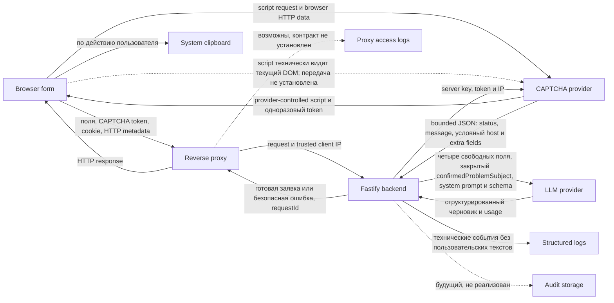

# Обработка персональных данных

## Статус документа

Этот документ фиксирует инженерный контракт обработки персональных данных для
типового публичного экземпляра сервиса. Факты приложения проверены по `main` на
коммите `2453016` 21 августа 2026 года. Законодательство и официальные материалы
проверены 20 августа 2026 года.

Документ не является юридическим заключением и не подтверждает соответствие
сервиса Федеральному закону № 152-ФЗ. Он отделяет установленное требование,
факт текущей архитектуры, предлагаемое инженерное решение и вопрос, который
нельзя закрыть без данных владельца или внешнего юриста.

В документе используются следующие пометки:

- **Норма** — требование из официального источника
- **Факт** — поведение текущего `main`, подтверждённое кодом или документацией
- **Решение** — предлагаемый проверяемый контракт проекта
- **Юридическая проверка** — вопрос, который нельзя считать решённым в репозитории

Публичный репозиторий не содержит и не должен содержать фактические домены,
адреса, хосты, регионы, учётные записи, договоры и реквизиты частной
инфраструктуры. Конкретные production-факты хранятся у оператора и проверяются
вне GitHub.

## Вывод

Сервис обрабатывает данные, которые могут быть персональными, даже если форма
не просит пользователя указать ФИО или телефон. Свободное описание, место,
последствия и желаемые действия могут содержать адрес, номер квартиры, сведения
о самом пользователе и третьих лицах. IP-адрес, технический идентификатор
браузера и `requestId` также следует консервативно учитывать в карте данных.

Текущая архитектура минимизирует собственное хранение. Пользовательские тексты
и готовая заявка не записываются приложением в базу данных или технические
логи. PostgreSQL, audit storage, автоматический retention и ручное удаление
аудиторской записи ещё не реализованы.

Этого недостаточно для публичного запуска. До `v0.2` необходимо установить
оператора и основания обработки, проверить внешних получателей и допустимые
production-конфигурации, определить статус уведомлений Роскомнадзора,
опубликовать политику и обязательную информацию о внешней обработке, принять
процессы запросов субъектов и инцидентов, а также обосновать либо сократить
обработку технических идентификаторов в рамках выбранных целей.

Полный аудит текстов генераций не является условием запуска. Он увеличит объём
обработки и остаётся отдельным post-launch решением, которое допустимо принимать
только после доказанной эксплуатационной цели и отдельной проверки основания,
сроков, доступа и уничтожения.

## Границы исследования

Исследование охватывает:

- текущий поток `browser → reverse proxy → backend → external providers`
- обратный поток результата `backend → reverse proxy → browser`
- текущий поток `backend → technical structured logs`
- возможный поток `reverse proxy → access logs`, который зависит от эксплуатации
- потенциальный поток `backend → audit storage`
- текущий input contract и технические идентификаторы
- поддерживаемые классы CAPTCHA- и LLM-конфигураций
- минимальный baseline документов, UX, процессов и безопасности для `v0.2`

Исследование не устанавливает:

- личность и реквизиты оператора публичного экземпляра
- фактический production endpoint, аккаунт, регион или договор поставщика
- фактическую сетевую топологию и состав лиц с доступом
- окончательное правовое основание обработки
- конкретный уровень защищённости ИСПДн
- юридическую допустимость отдельного provider endpoint
- соответствие сервиса законодательству в целом

Эти факты отсутствуют в публичном репозитории. Там, где от них зависит решение,
результат отмечен как требующий внешней юридической или ИБ-проверки.

## Текущая карта потоков

Диаграмма описывает доступную генерацию. При глобальном отключении browser
получает только public configuration и не передаёт форму, token или пользовательский
ввод в поток генерации. Прямой `POST /api/generate` останавливается в `onRequest`
до предметной обработки и внешних providers.

### Точки обработки

| Точка | Категории данных | Субъекты | Цель и действия | Получатель, хранение и срок | Источник факта | Основание и решение |
| --- | --- | --- | --- | --- | --- | --- |
| Форма в браузере | Свободные поля и закрытый `confirmedProblemSubject` | Пользователь и возможные третьи лица | `Ц1`: сбор, локальная проверка и отправка | Данные находятся в DOM. Приложение не использует `localStorage`, но browser restoration, extensions и локальные кэши не контролируются backend | [`index.html`](../apps/web/public/index.html), [`app.js`](../apps/web/public/app.js), [`contracts.ts`](../packages/core/src/contracts.ts) | Основание `Ц1` не выбрано. Уведомление о минимизации является выбранной инженерной мерой, а не отдельной нормой о конкретном UI-тексте |
| Browser → reverse proxy → backend | При доступной генерации: свободные поля, CAPTCHA token, cookie, HTTP metadata и IP. При глобальном отключении browser не отправляет форму или token | Пользователь и возможные третьи лица | `Ц1`–`Ц4`: принять HTTP-запрос, завершить TLS, передать trusted client IP, проверить и обработать | Proxy и backend получают полный request transit доступной генерации. Приложение держит данные в памяти запроса. Наличие, состав и срок proxy access logs публичным контрактом не установлены | [`PRODUCTION_RUNTIME.md`](PRODUCTION_RUNTIME.md), [`app.ts`](../apps/web/src/app.ts), [`generation-rate-limit-config.ts`](../apps/web/src/generation-rate-limit-config.ts), [`generate.ts`](../apps/web/src/routes/generate.ts) | Основания зависят от `Ц1`–`Ц4`. До запуска закрыть факты доступа и proxy logs без публикации топологии |
| Технический идентификатор браузера | Случайный UUID в подписанной HTTP-only cookie | Пользователь браузера | `Ц2`: дневной и конкурентный limiter | Cookie имеет `Path=/api/generate` и `Max-Age` до следующей UTC-day boundary, на которой сбрасывается дневное состояние limiter. При valid legacy-cookie с `Path=/` backend сохраняет тот же UUID на scoped path и удаляет широкий вариант. Process-local state логически истекает по правилам limiter, физически удаляется при следующем `acquire()` или перезапуске | [`generation-client-id.ts`](../apps/web/src/generation-client-id.ts), [`generate.ts`](../apps/web/src/routes/generate.ts), [`generation-rate-limiter.ts`](../apps/web/src/generation-rate-limiter.ts) | Инженерная минимизация срока и области реализована. Основание `Ц2` по-прежнему не выбрано и требует внешней юридической проверки |
| Browser ↔ CAPTCHA provider | Browser HTTP data, возможная provider telemetry и возвращаемый одноразовый token. Provider-controlled classic script технически видит текущий DOM: исходные поля, а после ответа — `requestId`, `title`, `body` и `warnings` | Пользователь и возможные третьи лица в вводе и результате | `Ц3`: загрузить widget и получить token. Техническая возможность DOM-доступа не доказывает фактическую передачу этих данных provider | Script остаётся в контексте страницы после загрузки. Приложение не хранит token в browser history. Фактический состав и срок provider telemetry не определяются кодом | [`smartcaptcha.js`](../apps/web/public/smartcaptcha.js), [`app.js`](../apps/web/public/app.js), [P1], [P2], [P3] | Основание `Ц3` не выбрано. Проверить договор, роль, настройки, сроки, загрузку и change control. CSP является defense-in-depth, но не изолирует допущенный same-document script от DOM. Нужны реальная изоляция либо документированное принятие остаточного риска |
| Backend → CAPTCHA provider | Server key, одноразовый token и IP | Пользователь браузера | `Ц3`: проверить token | Приложение не сохраняет token и не передаёт его LLM или в structured logs. Provider принимает token один раз в пределах пяти минут | [`smartcaptcha-verifier.ts`](../apps/web/src/smartcaptcha-verifier.ts), [P1] | Основание `Ц3` не выбрано. Подтвердить поручение и допустимость конфигурации |
| CAPTCHA provider → backend verifier | Ограниченный 4096 байтами raw JSON: `status`, `message`, `host` для `status=ok` и возможные provider-defined extra fields, включая возвращённый IP | Пользователь браузера как участник проверяемого запроса | `Ц3`: прочитать и разобрать ответ provider | Raw response существует только в памяти запроса, не попадает в storage, LLM или structured logs. Неизвестные поля допускаются на wire-границе и затем отбрасываются | [`smartcaptcha-verifier.ts`](../apps/web/src/smartcaptcha-verifier.ts), [`smartcaptcha-verifier.test.ts`](../apps/web/tests/smartcaptcha-verifier.test.ts), [P1] | Основание следует из `Ц3`. В provider evidence register подтвердить смысл и допустимый состав ответа |
| CAPTCHA verifier → route | Validated projection: `status` и `message`, плюс непустой `host` только для `status=ok`. Внутренний результат: `verified`, `failed` или `unavailable` | Пользователь браузера как участник проверяемого запроса | `Ц3`: отбросить лишние поля и решить, продолжать ли запрос | Projection и внутренний результат существуют в памяти одного запроса. `host` не передаётся route, а проверка его непустого значения не является собственной allowlist-проверкой домена | [`smartcaptcha-verifier.ts`](../apps/web/src/smartcaptcha-verifier.ts), [`generate.ts`](../apps/web/src/routes/generate.ts) | Основание следует из `Ц3`. Domain restrictions проверяются как provider configuration fact |
| Backend → LLM provider | Четыре свободных поля, закрытый `confirmedProblemSubject`, system prompt, JSON Schema, модель и HTTP metadata | Пользователь и возможные третьи лица | `Ц1`: получить структурированный черновик | Сроки, кэши, журналы, обучение, регионы и субобработчики зависят от provider, endpoint, аккаунта и настроек | [`openai-compatible-gateway.ts`](../packages/llm/src/openai-compatible-gateway.ts), [`llm-config.ts`](../apps/web/src/llm-config.ts) | Основание `Ц1` не выбрано. Production-конфигурация запрещена без provider-specific evidence register |
| LLM provider → backend | Черновик, provider usage и HTTP response | Пользователь и возможные третьи лица | `Ц1`: проверить schema и детерминированно собрать результат | Ответ находится в памяти запроса. Приложение не пишет его в storage или structured logs. Provider retention неизвестен до проверки | [`openai-compatible-gateway.ts`](../packages/llm/src/openai-compatible-gateway.ts), [`generate.ts`](../apps/web/src/routes/generate.ts) | Основание `Ц1` не выбрано. Подтвердить provider retention, поиск и удаление |
| Backend → reverse proxy → browser | `title`, `body`, `warnings`, безопасная ошибка и `requestId` в HTTP response | Пользователь и возможные третьи лица в результате | `Ц1`: предоставить результат | Серверная история отсутствует. Приложение отображает результат на текущей странице, а browser-managed restoration не контролирует | [`generate.ts`](../apps/web/src/routes/generate.ts), [`app.js`](../apps/web/public/app.js) | Основание `Ц1` не выбрано. Отразить отсутствие собственной серверной истории в политике |
| Browser → system clipboard | `title` и `body` по явному действию пользователя | Пользователь и возможные третьи лица в результате | `Ц1`: локально скопировать результат | Срок и последующие получатели определяются браузером и ОС. Backend копию не получает | [`app.js`](../apps/web/public/app.js), [`copy-utils.js`](../apps/web/public/copy-utils.js) | Отдельного серверного основания не добавлять. Прозрачно описать границу локальной обработки |
| Backend → structured logs | `event`, `requestId`, timestamp, статус, HTTP status, duration, raw `provider`, raw `model`, usage и hash prompt | Пользователь как потенциально определяемое лицо через корреляцию | `Ц4`: диагностика и контроль работы | stdout и stderr ограничены объёмом и числом файлов, но не днями. Свободный текст, результат, IP, cookie и CAPTCHA token не входят в контракт. В custom configuration оба raw значения задаются допустимыми произвольными строками, а встроенная model может содержать project или folder identifier | [`llm-config.ts`](../apps/web/src/llm-config.ts), [`generation-log.ts`](../apps/web/src/generation-log.ts), [`ARCHITECTURE.md`](ARCHITECTURE.md#структурированное-логирование-генерации) | Основание `Ц4` не выбрано. Установить доступ, срок и уничтожение, учесть вывод из `systemPromptHash`. Для `provider` и `model` во всех configuration classes выбрать log-safe aliases либо отдельно одобрить raw значения как private configuration metadata с ограниченным доступом |
| Backend → audit storage | Потенциально полный ввод, результат и metadata | Пользователь и третьи лица | `Ц5`: возможный будущий аудит | Не реализовано. Сроки 30 и 365 дней из #21 предварительны и не являются принятым решением | Issue #19, #21, #48 и #51 | Основание отсутствует. Не включать до решения о необходимости, составе, доступе, сроке и уничтожении |

### Ветки недоступной генерации

**Факт.** Public CAPTCHA configuration всегда содержит безопасный boolean
`generationAvailable`. При `false` browser показывает нейтральное состояние
недоступности, оставляет уведомление SmartCaptcha скрытым и не загружает script,
не создаёт widget, не получает token и не отправляет форму в
`POST /api/generate` ([`smartcaptcha-config.ts`](../apps/web/src/smartcaptcha-config.ts),
[`smartcaptcha.js`](../apps/web/public/smartcaptcha.js),
[`app.js`](../apps/web/public/app.js)).

**Факт.** Прямой `POST /api/generate` при `GENERATION_ENABLED=false` сохраняет
существующие `requestId` и metadata-only technical events для диагностики, но
route-level `onRequest` возвращает `generation_unavailable` до предметной
валидации. Эта ветка не подготавливает browser client ID, не создаёт и не
обновляет cookie, не изменяет IP/UUID limiter state, не передаёт token или IP
CAPTCHA provider, не занимает global admission и не вызывает LLM. Body может
быть технически принят Fastify, но не используется, не сохраняется и не
попадает в events ([`generate.ts`](../apps/web/src/routes/generate.ts),
[`generation-disabled-route.test.ts`](../apps/web/tests/generation-disabled-route.test.ts)).

**Факт.** `.env.production.example` задаёт custom LLM URL, key, model и auth
scheme, но не содержит `LLM_PROVIDER`. Частичная или невалидная конфигурация
может молча выбрать `DisabledLlmGateway`, после чего HTTP-сервис запускается и
запрос способен пройти CAPTCHA, но генерация завершится
`generation_provider_unavailable`
([`.env.production.example`](../.env.production.example),
[`llm-config.ts`](../apps/web/src/llm-config.ts),
[`app.ts`](../apps/web/src/app.ts)). Это расходится с публичным production
contract, по которому неполная обязательная конфигурация является ошибкой
запуска ([`PRODUCTION_RUNTIME.md`](PRODUCTION_RUNTIME.md)).

**Решение.** Инвариант отключённой генерации реализован и закреплён regression
tests в #188, закрытой 21 августа 2026 года. Он остаётся каноническим
engineering contract для будущих изменений. Частичная production
LLM-конфигурация должна завершать startup безопасной ошибкой. Полностью
отсутствующая конфигурация может сохранять явно документированный local
development или diagnostic mode. Это выбранные project launch controls, а не
самостоятельные дословные требования закона.

## Категории данных и субъектов

### Категории данных

Текущий сервис потенциально обрабатывает:

- свободное описание наблюдаемой проблемы
- место проблемы, включая адресоподобные сведения и номер помещения
- известные последствия
- желаемые действия
- выбранный предмет проблемы из закрытого списка
- IP-адрес
- случайный идентификатор browser client
- `requestId`
- CAPTCHA token и browser telemetry поставщика
- DOM ввода и результата, включая `requestId`, `title`, `body` и `warnings`,
  технически доступный загруженному provider-controlled CAPTCHA script. Это не
  доказывает фактическую передачу provider
- bounded raw response CAPTCHA provider: `status`, `message`, условный `host` и
  provider-defined extra fields, включая возможный возвращённый IP
- технические статусы, timestamps, длительность, raw provider/model и usage
- private configuration metadata, если raw provider или model содержат
  account, project или folder identifier
- производные metadata, включая `systemPromptHash`, по которому для конечного
  набора вариантов можно вывести выбранный предмет проблемы
- готовый текст заявки

Форма специально не запрашивает ФИО, телефон, email, паспортные данные,
специальные категории или биометрические данные. Их отсутствие в названиях
полей не исключает их появления в свободном тексте.

### Категории субъектов

- пользователь, который заполняет форму
- житель или иное лицо, о котором пользователь сообщил сведения
- представитель управляющей организации или иной участник описанной ситуации
- иное третье лицо, случайно или намеренно указанное в свободном тексте

### Свободный текст и третьи лица

**Норма.** Обработка допустима только при наличии основания, а объём данных не
должен быть избыточным для цели [L1, статьи 5 и 6]. Согласие может дать субъект
или его представитель в пределах полномочий. Получая данные не от субъекта,
оператор должен подтвердить основание и до начала обработки предоставить
субъекту предусмотренные сведения, кроме исключений закона [L1, статья 9,
части 1 и 8, статья 18, части 3 и 4].

**Факт.** Backend и LLM не определяют, кому принадлежат фрагменты свободного
текста. Автоматического поиска персональных, специальных или биометрических
данных нет.

**Решение.** #186 остаётся рекомендуемым post-launch control: рядом с формой
можно предложить описывать только необходимые факты проблемы и не указывать без
необходимости идентифицирующие сведения или данные третьих лиц. Такая подсказка
уменьшает риск, но не является условием запуска или правовым основанием.

**Юридическая проверка.** Согласие пользователя нельзя автоматически считать
основанием для данных другого лица. Требуется проверить представительство,
иные основания и исключения статьи 18, допустимость обработки случайно
полученных сведений, а также условия прекращения запроса или удаления данных.

## Минимизация входных данных

| Поле или идентификатор | Необходимость для основного сценария | Передача LLM | Нужен backend после ответа | Structured logs | Решение о минимизации |
| --- | --- | --- | --- | --- | --- |
| `description` | Необходимо для генерации | Да | Нет | Нет | Сохранить обязательным и ограниченным 2000 символами. В #186 рекомендовать не добавлять без необходимости идентифицирующие сведения и данные третьих лиц |
| `location` | Улучшает результат, но не обязательно | Только непустое значение | Нет | Нет | Сохранить необязательным. Рекомендация #186 может предложить указывать минимально достаточное место без точного адреса и номера квартиры |
| `consequences` | Дополняет результат, но не обязательно | Только непустое значение | Нет | Нет | Сохранить необязательным и не расширять состав |
| `desiredActions` | Дополняет результат, но не обязательно | Только непустое значение | Нет | Нет | Сохранить необязательным и не расширять состав |
| `confirmedProblemSubject` | Нужен только для выбранного нормативного модуля | Да, как закрытый enum или `null`, также определяет system prompt и schema | Да, для deterministic gate с provider `subject` и evidence | Нет | Сохранить закрытым необязательным enum и не добавлять в production logs |
| `captchaToken` | Нужен только в обязательном CAPTCHA-режиме | Нет | Нет после проверки | Нет | Сохранить на HTTP-границе и не добавлять provider metadata |
| IP | Нужен для краткого rate limit и передаётся CAPTCHA | Нет | Логически перестаёт использоваться после окна. Физическое удаление происходит при следующем `acquire()` или restart | Нет | Не добавлять в обычные логи и audit storage без отдельной цели |
| Browser UUID | Нужен для дневного и конкурентного limiter | Нет | Cookie передаётся только на `/api/generate` до следующей UTC-day boundary. Дневное состояние логически истекает на той же границе. Физическое удаление происходит при следующем `acquire()` или restart | Нет | Не добавлять persistent identity или analytics purpose. При valid legacy-cookie удалять широкий вариант `Path=/`, сохраняя UUID |
| `requestId` | Нужен для корреляции технических событий и поддержки ошибок | Нет | Не связывается приложением с полным вводом, результатом или provider record | Да | Сохранить случайным UUID. Не считать текущим locator пользовательского содержания или доказательством личности |

Новых полей ради юридической формальности добавлять не нужно. Выбор правового
основания, операторские реквизиты и контакт для обращений относятся к
прозрачности и процедурам, а не к payload генерации.

## Цели обработки и основания

Идентификаторы `Ц1`–`Ц6` связывают каждую цель с потоками, получателями,
хранением и дополнительным решением.

| ID | Цель, данные и субъекты | Получатели | Хранение и прекращение | Основание и статус |
| --- | --- | --- | --- | --- |
| `Ц1` | Подготовить заявку: получить свободные поля о пользователе или третьих лицах, передать LLM, сформировать и вернуть результат | Оператор, reverse proxy/runtime participant, LLM provider, пользователь | В приложении только память запроса и текущая страница. Browser/OS могут хранить локальное состояние. Срок и удаление у LLM неизвестны | Не выбрано. Возможность согласия, договора по инициативе субъекта или иного основания оценивается по фактической модели [L1, статья 6]. **Требует внешней юридической проверки** до запуска |
| `Ц2` | Ограничить злоупотребления и расходы: обработать IP, browser UUID, timestamps и counters пользователя | Оператор и reverse proxy/runtime participant | Cookie ограничена `/api/generate` и следующим UTC-day boundary. In-memory state логически истекает по окну или UTC day, физически удаляется при следующем `acquire()` или restart | Не выбрано. Не считать автоматически частью согласия на генерацию. **Требует внешней юридической проверки**. #187 реализует инженерную минимизацию, но не выбирает основание |
| `Ц3` | Проверить запрос через CAPTCHA: обработать browser HTTP data, token и IP пользователя. Provider-controlled script технически имеет доступ к текущему DOM ввода и результата | Оператор, reverse proxy/runtime participant и CAPTCHA provider. Фактическая передача DOM-данных provider не установлена | Приложение не сохраняет token. Provider принимает его один раз в пределах пяти минут. Остальные provider сроки неизвестны | Не выбрано. Зависит от роли, договора, browser trust boundary и цели защиты. **Требует внешней юридической проверки** provider facts [P1, P3] |
| `Ц4` | Диагностировать запросы и расходы: записать `requestId`, статусы, timestamps, duration и LLM metadata | Оператор и лица с доступом к runtime logs | Ротация ограничивает объём и число файлов, но не задаёт срок в днях. Удаление определяется эксплуатацией | Не выбрано. До запуска установить срок, доступ и уничтожение. Учесть выводимость закрытого enum из `systemPromptHash` и private identifiers в raw `provider` или `model`. Для обоих полей утвердить log-safe aliases либо отдельный ограниченный режим |
| `Ц5` | Возможный полный аудит генераций: будущий ввод, результат и metadata пользователя и третьих лиц | Не определены | Не реализовано. Сроки и уничтожение не утверждены | Нет доказанной необходимости или основания. Post-launch решение по #19, #21, #48 и #51 |
| `Ц6` | Возможная продуктовая аналитика: будущие события просмотра и воронки | Не определены | Не реализовано | Не определено. Post-launch issue #86, отдельная проверка до фактического включения |

**Норма.** Оператор несёт бремя доказательства получения согласия. Если согласие
будет выбрано, с 1 сентября 2025 года оно должно оформляться отдельно от иных
подтверждаемых пользователем документов [L1, статья 9, L3]. Согласие не
освобождает от минимизации, безопасности, локализации и правил передачи.

**Решение.** В рамках #24 не добавлять чекбокс согласия. Сначала внешний юрист
должен зафиксировать основание для каждой цели и содержание действий. Если
выбрано согласие, отдельная issue должна реализовать точный текст, доказуемость
получения и отзыв.

## Участники и роли

| Участник | Что установлено | Что не установлено | Контракт до запуска |
| --- | --- | --- | --- |
| Оператор публичного экземпляра | Оператором является лицо, фактически определяющее цели, состав и действия обработки [L1, статья 3] | Репозиторий не устанавливает это физическое или юридическое лицо и его реквизиты | Вне репозитория определить оператора и контакт. Если оператор является юридическим лицом, назначить ответственного по статье 18.1, части 1. **Требует внешней юридической проверки** |
| Пользователь | Предоставляет свободный ввод и получает результат | Не установлены возраст, статус и полномочия сообщать сведения о третьих лицах | Не считать пользователя оператором вместо владельца публичного экземпляра |
| Reverse proxy/runtime participant | Передаёт полный HTTP request и response, может завершать TLS и иметь технический доступ к runtime или logs | Не установлено, управляется ли контур оператором или внешним поставщиком. Access logs, срок и доступ не публикуются | Если участвует внешнее лицо, учесть его роль и договор. В любом случае закрыть access и logs facts без раскрытия топологии |
| CAPTCHA provider | Получает browser HTTP data, token и IP. Provider-controlled script технически видит текущий DOM ввода и результата, но это не доказывает передачу provider. Действующие условия SmartCaptcha называют отношения поручением и допускают собственное использование HTTP-информации для развития и обучения, если не включён запрет [P3] | Полный состав telemetry, DOM behavior, срок, настройка аккаунта и достаточность договорного механизма | Проверить договор, специальный параметр, роль для каждой цели, весь DOM lifetime и исполнение требований поручения [L1, статья 6, часть 3] |
| LLM provider | Получает четыре свободных поля, system prompt и schema | Роль, юридическое лицо, страны, storage, processing, logs, cache, training, subprocessors и deletion зависят от конкретной конфигурации | Не считать OpenAI-compatible протокол доказательством роли или географии. Нужен provider-specific evidence register |
| Будущий database provider | Отсутствует в текущей архитектуре | Не выбран | Не определять роль и договор до решения о persistent audit storage |

Если обработка поручается другому лицу, статья 6, часть 3, требует определить в
поручении перечень данных, операции, цели, конфиденциальность, требования части
5 статьи 18 о локализации и статьи 18.1, предоставление подтверждающих
документов по запросу оператора, безопасность по статье 19 и сообщение об
инцидентах. Конкретная география, transfer, retention и другие provider facts
дополнительно фиксируются в evidence register и не выдаются за дословный
перечень условий поручения [L1, статьи 6, 12 и 18]. Наличие обычных terms или
API-ключа само по себе не доказывает полноту договорного механизма.

## Хранение и сроки

| Носитель или система | Текущее содержание | Текущий срок | Решение |
| --- | --- | --- | --- |
| DOM и browser-managed state | Ввод, `requestId`, результат и warnings | Приложение не задаёт local persistence. Срок restoration, cache, autofill и extensions зависит от браузера. Загруженный provider-controlled CAPTCHA script технически видит текущий DOM до ухода со страницы | Не обещать срок, который backend не контролирует. Отдельно решить browser script isolation или принять документированный риск |
| System clipboard | `title` и `body` после действия пользователя | Определяется браузером и ОС | Backend не получает копию. Описать как локальную границу пользователя |
| Browser cookie | Подписанный случайный UUID | До следующей UTC-day boundary, `Path=/api/generate` | Не использовать как persistent identity. При valid legacy-cookie удалять вариант `Path=/`, сохраняя UUID |
| Process-local limiter | IP, UUID, timestamps, counters | Данные логически перестают влиять после окна, UTC day или завершения active request. Физически удаляются при следующем `acquire()` либо restart | Сохранить без текстов. Не заявлять автоматическое удаление сразу после истечения |
| Backend memory | Ввод, token, черновик и результат | На время одного запроса | Не добавлять cache и retries без отдельного анализа |
| Reverse proxy | Полный HTTP transit и потенциальные access-log metadata | Публичным contract не установлено | До запуска зафиксировать наличие logs, состав, срок, доступ и уничтожение в закрытом эксплуатационном реестре |
| Structured Docker logs | Технические события и LLM metadata | Ограничены объёмом и числом файлов, не фиксированным числом дней | Установить операционный срок или проверяемое условие удаления, доступ и уничтожение |
| CAPTCHA provider | HTTP data, token, IP и telemetry | Token живёт пять минут. Остальные сроки из текущего provider contract публичным кодом не установлены [P1, P3] | Подтвердить до допуска production-конфигурации |
| LLM provider | Свободные поля, prompt/schema, output и metadata | Зависит от конкретного provider, endpoint и аккаунта | `store: false` в Responses request не является общей гарантией. Требуется письменное evidence для конкретной конфигурации |
| Audit storage | Отсутствует | Не применяется | Не принимать предварительные 30/365 дней из #21 как итог #24 |
| Резервные копии audit storage | Отсутствуют | Не применяется | При появлении storage определить backup, восстановление, срок, доступ и подтверждаемое уничтожение до включения записи |

**Норма.** Идентифицируемые данные хранятся не дольше, чем этого требует цель,
и уничтожаются или обезличиваются после достижения цели либо утраты
необходимости [L1, статья 5, часть 7]. Уничтожение должно подтверждаться по
требованиям Роскомнадзора [L7].

## Локализация и трансграничная передача

### Требования

**Норма.** При сборе персональных данных граждан Российской Федерации, в том
числе через Интернет, нельзя использовать находящиеся за пределами России базы
данных для записи, систематизации, накопления, хранения, уточнения и извлечения,
кроме указанных в законе исключений [L1, статья 18, часть 5, L2].

**Норма.** Трансграничная передача охватывает передачу органу власти
иностранного государства, иностранному физическому или юридическому лицу. До
начала такой деятельности оператор направляет отдельное уведомление
Роскомнадзору и выполняет требования статьи 12 [L1, статья 12, L4, L10]. Это
самостоятельный вопрос и не заменяет локализацию.

До уведомления оператор получает от иностранного получателя сведения о мерах
защиты, условиях прекращения обработки, его наименовании и контактах. Для
государства вне действующего перечня адекватной защиты нужны также сведения о
его правовом регулировании [L1, статья 12, часть 5, L10, L13]. После уведомления
передача в государство из перечня может начаться с учётом возможного решения о
запрете или ограничении. Для государства вне перечня она по общему правилу не
начинается до истечения срока проверки по статье 12, части 9, кроме узкого
случая защиты жизни, здоровья или иных жизненно важных интересов [L1, статья 12,
части 8–11, L10]. Применение этой развилки к конкретному маршруту требует
внешней юридической проверки.

### Классы поддерживаемых конфигураций

| Класс | Возможная запись, хранение и обработка | Localization и transfer risk | Production invariant |
| --- | --- | --- | --- |
| SmartCaptcha `required` | Browser напрямую загружает provider script. Он технически видит текущий DOM ввода и результата весь срок жизни страницы, хотя фактическая передача не установлена. Backend передаёт token и IP | География и операции должны подтверждаться договором и настройками. Иностранный маршрут может создать трансграничную передачу | Provider approval #181 проверяет получателя и конфигурацию. Browser trust boundary имеет отдельный outcome #193 и не считается доказательством фактической передачи DOM provider |
| SmartCaptcha `disabled` | Внешней CAPTCHA-передачи нет | Риски CAPTCHA provider отсутствуют, остальные потоки не меняются | Допустимо для разработки и диагностики. Для публичного экземпляра запрещено действующим release contract #62 и #169 |
| Встроенная LLM-конфигурация | Конкретные provider endpoint и account могут хранить input, output, logs, cache и metadata | Название preset не доказывает фактическую локализацию конкретного аккаунта и функции | Требовать тот же evidence register, что и для custom endpoint. Не публиковать production choice |
| Произвольный OpenAI-compatible endpoint | Протокол задаёт только HTTP-форму. Provider может реализовать любые storage, cache, training и routing | Риск неизвестен до проверки конкретной пары provider и endpoint | Default deny. Разрешать только утверждённую конфигурацию с доказанными facts |
| Responses API со `store: false` | Gateway просит не хранить application state, если provider поддерживает это значение | Не управляет abuse logs, cache, processing location или договором и может иметь иной смысл у compatible provider. Официальные правила OpenAI подтверждают это только для OpenAI [P4] | Считать техническим сигналом, а не legal approval |
| Chat Completions API | Gateway не передаёт универсальный storage flag | Поведение полностью зависит от provider | Отдельно подтвердить retention, cache и deletion |
| `DisabledLlmGateway` | Данные не передаются LLM | LLM localization и transfer отсутствуют, но генерация недоступна | Допустимо для разработки и диагностики, не решает публичный сценарий |

### Evidence register конфигурации

До установки production-переменных оператор должен иметь закрытую запись для
конкретной конфигурации:

- юридическое лицо получателя и его роль
- применимый договор и поручение
- API endpoint, project или account и модель
- закрытая версия или fingerprint полного набора одобренных параметров без
  публикации их значений
- категории передаваемых данных и цели
- страны обработки и хранения
- место баз данных для операций статьи 18, части 5
- наличие и маршрут трансграничной передачи
- принадлежность стран к действующему перечню адекватной защиты [L13]
- меры защиты иностранного получателя и условия прекращения обработки
- правовое регулирование государства вне действующего перечня
- наименование и контакты иностранного получателя
- input, output, metadata, cache и abuse-log retention
- использование данных для обучения или улучшения
- subprocessors
- способ ограничения доступа и удаления
- инцидентный контакт и обязательство своевременно сообщать оператору
- дата проверки и лицо, одобрившее конфигурацию

Запись содержит частные реквизиты и не публикуется. В GitHub допустим только
обезличенный итог `approved` или `blocked` без endpoint, account, региона и
договорных материалов. Перед deployment оператор сверяет фактическую
конфигурацию с закрытой записью. Изменение endpoint, project или account,
модели, протокола, retention controls либо subprocessors аннулирует прежний
допуск до повторной проверки. Для MVP это может быть
проверяемый operator/deployment gate без runtime allowlist.

Browser trust boundary внешнего CAPTCHA script не входит в provider approval
issue #181. Отдельная issue #193 использует подтверждённые provider facts как
входные данные. Принятое по ней решение зафиксировано ниже. CSP остаётся
defense-in-depth и не считается изоляцией same-document script от DOM.

### Решение по browser trust boundary внешнего CAPTCHA script

**Решение от 22 августа 2026 года. Владелец решения — ответственный за
информационную безопасность проекта.** Для текущего MVP принят остаточный риск
same-document DOM-доступа внешнего CAPTCHA script. Это решение закрывает только
инженерный browser trust boundary #193. Оно не утверждает допустимость
конкретного получателя или production-конфигурации, не заменяет закрытый
provider approval #181 и внешнюю юридическую проверку.

**Техническая граница.** После локальной проверки валидной формы приложение
запрашивает CAPTCHA controller. В обязательном режиме controller динамически
добавляет в текущий документ обычный classic script. После успешной загрузки
script не удаляется, а controller кэшируется. Код приложения не создаёт между
этим script и страницей отдельного origin, sandbox или иного разграничения
DOM-прав.

Фактический интервал технического доступа начинается с исполнения добавленного
script после валидной отправки и продолжается до уничтожения текущего документа,
например при переходе или закрытии страницы. Сброс CAPTCHA widget после
результата не завершает этот интервал. Удаление тега после исполнения также не
отозвало бы уже полученные ссылки, callbacks, observers или иной созданный кодом
state.

В этом интервале same-document script технически может читать:

- значения `description`, `location`, `consequences`, `desiredActions` и
  `confirmedProblemSubject`, включая их последующие изменения
- статический текст и состояние текущей страницы
- показанные после успешного ответа `title`, `body` и `warnings`
- показанные после ошибки безопасное сообщение и `requestId`

Обезличенный characterization test воспроизводит эту возможность на локальном
classic script без внешней сети и реального provider. Он доказывает только
возможность доступа в общей DOM-границе. Ни тест, ни это решение не утверждают,
что фактический CAPTCHA provider читает, собирает, сохраняет или передаёт
перечисленные данные.

**Действующие компенсирующие меры.** При `generationAvailable=false` browser не
загружает script, не создаёт widget или token и не отправляет форму. Невалидная
форма не начинает CAPTCHA. Недоступная или некорректная конфигурация, ошибка
загрузки, пустой token и ошибки CAPTCHA обрабатываются fail closed без
незащищённой генерации. CAPTCHA token отделён от предметного ввода на серверной
границе и не передаётся LLM или structured logs. Пользовательские тексты и
готовая заявка не пишутся приложением в persistent storage или technical logs.
Эти меры сокращают число запусков, downstream-передачу и собственное хранение,
но не ограничивают DOM-права успешно загруженного script.

Серверный код сейчас не задаёт CSP policy. Даже после добавления CSP останется
только defense-in-depth: allowlist источников может запретить загрузку
неразрешённого кода, но допущенный classic script исполняется в том же документе
с теми же DOM-возможностями. CSP не задаёт отдельный ACL на поля формы и
результат для каждого script и не отзывает доступ после загрузки. Поэтому CSP не
может быть доказательством изоляции допущенного provider script.

**Остаточный риск.** Ошибка, компрометация цепочки поставки или изменение
допущенного внешнего script технически могут привести к чтению ввода, результата
и `requestId` в течение срока жизни страницы и к действиям с ними в пределах
доступных browser API. Содержание может включать персональные данные пользователя
или третьих лиц. Факт реализации такой возможности текущим provider не
установлен.

Для текущего MVP риск принят, потому что script загружается только для
пользовательской валидной попытки при доступной генерации и обязательной CAPTCHA,
собственное постоянное хранение текстов отсутствует, а действующий release
contract требует внешнюю CAPTCHA. Подтверждённого provider-specific механизма
изолированного widget в #181 нет. Введение отдельного документа или origin,
замена anti-abuse механизма либо проверка совместимости ограниченного iframe
потребовали бы нового интеграционного контракта и несоразмерного текущему MVP
изменения потока. Принятие риска не разрешает неодобренную production-
конфигурацию и не отменяет остальные launch blockers.

#### Сравнение применимых вариантов

| Вариант | Фактическая граница | Проверяемость | Same-document доступ к вводу и результату | Сложность для MVP | Предположение о provider |
| --- | --- | --- | --- | --- | --- |
| Текущая загрузка и принятие риска | Общий документ без изоляции | Локальный characterization test воспроизводит доступ | Да, ввод доступен после загрузки, результат и `requestId` — после rendering | Низкая, production-код не меняется | Не требуется утверждать фактическое чтение или передачу |
| CSP с allowlist текущего script | Ограничение источника загрузки, не DOM-граница | Проверяется по headers и blocked resources | Да для допущенного script | Низкая или средняя, но outcome #193 не меняет | Требуется доверять допущенному содержимому |
| Более поздняя динамическая загрузка после локальной валидации | Сокращает начало интервала, не создаёт границу | Проверяется последовательностью событий | Да после загрузки, включая ещё заполненный ввод и более поздний результат | Уже реализовано | Не требуется |
| Удаление тега после загрузки или token | Не отзывает исполненный код и созданный им state | Удаление тега проверяемо, отсутствие дальнейшего доступа не следует из него | Может сохраниться для ввода и результата | Низкая, но риск не закрывает | Не требуется |
| Загрузка как module | Меняет область имён и loading semantics, не DOM-права | Тип script проверяем | Да | Средняя и требует совместимости script | Требует неподтверждённой поддержки module |
| Proxy или self-hosting того же script | Меняет доставку и change control, не DOM-права | Доставка и fingerprint проверяемы | Да | Средняя или высокая | Требует права, обновления и проверяемый supply contract, которых #181 не подтвердил |
| Ограниченный iframe | Изоляция возникает только при доказанных отдельном origin или sandbox и узком message contract. Для текущей интеграции такая граница не установлена | При установленном контракте проверяются DOM denial и сообщения | Может быть закрыт, только если input и result не передаются frame | Высокая | Требует неподтверждённой совместимости widget и token flow |
| Отдельный CAPTCHA document или origin до основной страницы | Отдельный browsing context без DOM основной страницы | Проверяются origin boundary, token handoff и отсутствие input/result в CAPTCHA document | Нет при корректной реализации | Высокая, меняет пользовательский и token flow | Не требует предполагать отсутствие DOM-чтения внутри отдельного документа |
| Отказ от внешнего browser script или замена anti-abuse механизма | Устраняет эту внешнюю same-document границу | Проверяется отсутствием загрузки и новым end-to-end contract | Нет для внешнего CAPTCHA script | Высокая и противоречит текущему release contract | Требует выбора и одобрения другого механизма |

#### Обязательный пересмотр

Владелец решения обязан открыть повторную security/privacy review до выпуска
изменения, если происходит хотя бы одно из событий:

- меняются CAPTCHA provider, URL или способ загрузки внешнего script
- меняется модель интеграции classic script, module или iframe, site/widget API,
  controller cache, widget lifecycle, token flow, момент либо срок жизни script
- появляются подтверждённые в #181 или при инциденте provider facts, влияющие на
  оценку чтения, сбора, передачи, хранения, обучения, subprocessors или
  содержимого script
- меняются состав пользовательских данных на странице, поля формы или категории
  ввода, включая появление специальных либо биометрических данных
- меняются состав или время rendering результата, warnings, ошибок и `requestId`,
  появляются новые чувствительные результаты или идентификаторы в DOM, browser
  history, persistent DOM либо переход без уничтожения документа
- CSP изменяется так, что расширяет полномочия внешнего кода
- вводятся или меняются iframe, sandbox, origin boundary, proxy, self-hosting,
  integrity либо иные меры, заявленные как изменение границы
- появляется технически простая и поддерживаемая настоящая isolation boundary
- characterization test перестаёт воспроизводиться либо начинает показывать
  более широкий или более долгий доступ
- происходит компрометация supply chain, неправомерный DOM-доступ или иной
  security/privacy incident, относящийся к внешнему script
- меняется обязательность внешней CAPTCHA, release contract или scope продукта
  выходит за пределы текущего MVP

**Юридическая проверка.** Для каждого provider требуется установить, выполняет
ли он операции в базе данных за пределами России при сборе, возникает ли
трансграничная передача, достаточны ли уведомления и поручение, а также допустим
ли конкретный маршрут. Согласие пользователя не следует считать автоматическим
разрешением любого маршрута.

## Публичные документы и UX

| Сущность | Правовой или продуктовый статус | Предлагаемый минимальный состав проекта | Текущее состояние |
| --- | --- | --- | --- |
| Политика обработки персональных данных | Обязательна для оператора, собирающего данные через сайт [L1, статья 18.1, часть 2] | Оператор и контакт, цели, категории данных и субъектов, основания, действия, сроки, получатели, transfer, права, удаление и сведения о реализуемых требованиях защиты без чувствительных деталей. Финальный состав проверяет юрист | Отсутствует. Launch blocker |
| Отдельная политика конфиденциальности | Не установлена как отдельный второй обязательный документ, если политика обработки полностью покрывает прозрачность | Создавать только при подтверждённой отдельной цели, не дублировать политику | Не создавать автоматически |
| Согласие | Нужно только если выбрано основанием. Тогда оформляется отдельно и должно быть доказуемым [L1, статья 9, L3] | Для любого согласия обеспечить конкретное, предметное, информированное, сознательное и однозначное волеизъявление по статье 9, части 1. Реквизиты части 4 применяются, только когда закон требует письменную форму | Решение об основании отсутствует. Чекбокс не добавлять до юридического решения |
| Рекомендация о минимизации рядом с формой | Рекомендуемый project control, а не установленный законом отдельный документ или точный UI-текст | Не вводить без необходимости идентифицирующие сведения и данные третьих лиц | Реализовано в #186. Не является release gate |
| Уведомление SmartCaptcha | Требование provider при скрытом shield [P2] | Указать обработку SmartCaptcha и дать provider notice | Уже реализовано. Не заменяет документ оператора |
| Сведения об операторе | Нужны для прозрачности, обращений и уведомлений | Подтверждённые реквизиты и канал связи | Отсутствуют в репозитории. Публикуются только после правового решения #182 |
| Механизм отзыва | Нужен, если согласие выбрано основанием | Канал, идентификация, срок, прекращение у обработчиков | Не реализован. Зависит от юридического решения |

Финальные юридические формулировки не входят в #24. Они зависят от оператора,
оснований и договоров и должны пройти внешнюю юридическую проверку в отдельной
issue.

### Внутренние артефакты оператора

Статья 18.1, часть 1, требует необходимых и достаточных мер, состав которых
оператор определяет самостоятельно, если иное не установлено законом. Пункты
1–6 приведены как примеры таких мер, а не как шесть независимо универсальных
обязанностей. Предикат юридического лица прямо указан для пунктов 1 и 2.
Внутренний контроль или аудит и ознакомление непосредственно обрабатывающих
данные работников ниже являются выбранными project controls `v0.2`. Их форма,
достаточность или документированная замена проверяются внешним юристом и ИБ, а
не приписываются закону автоматически [L1, статья 18.1, часть 1].

Эти материалы содержат частные факты и не публикуются целиком. В публичной
issue допустим только безопасный статус `approved`, `not applicable` или
`blocked` и дата проверки. Таблица фиксирует решения проекта, а не утверждает,
что закон всегда требует отдельного документа для каждой строки.

| Артефакт | Назначение и владелец | Статус до запуска | Внешняя проверка |
| --- | --- | --- | --- |
| Реестр целей и оснований | Оператор фиксирует `Ц1`–`Ц4`, категории, субъектов, действия, сроки и прекращение | Project launch artifact. Для юридического лица форма также учитывает статью 18.1, часть 1 | Юридическая |
| Политика и локальные акты | Оператор, являющийся юридическим лицом, издаёт документы по статье 18.1, части 1, пункту 2, в необходимом составе | Для юридического лица — `approved`. Для иной формы оператора допустим `not applicable` только после проверки предиката нормы | Юридическая |
| Внутренний контроль или аудит | Выбранный project control по примеру статьи 18.1, части 1, пункта 4: оператор проверяет соответствие обработки закону, требованиям защиты и своим документам | До запуска — `approved` либо документирована другая необходимая и достаточная мера после внешней проверки. Это не универсальная отдельная обязанность для каждого оператора | Юридическая и ИБ |
| Ознакомление работников | Выбранный project control по примеру статьи 18.1, части 1, пункта 6, когда работники непосредственно обрабатывают данные | При наличии таких работников — `approved` либо документирована другая необходимая и достаточная мера после внешней проверки. При их отсутствии — `not applicable` | Юридическая и ИБ |
| Evidence register получателей и конфигураций | Оператор хранит договорные, localization, transfer, retention и incident facts | Обязателен для каждого production provider и reverse proxy/runtime контура | Юридическая и ИБ |
| Подтверждения уведомлений | Оператор хранит решения по статьям 12 и 22, номера и даты без публикации реквизитов | Для описанного автоматизированного public flow уведомление по статье 22 требуется до обработки, если не доказано конкретное исключение части 2, пунктов 7–9. Статья 12 применяется при наличии transfer | Юридическая |
| Матрица ролей и доступа | Назначенное оператором лицо фиксирует минимальные доступы к configuration и logs | Обязательна | ИБ |
| Процедура и журнал запросов субъектов | Назначенное оператором лицо регистрирует сроки и безопасный результат | Обязательны, журнал создаётся по факту обращений | Юридическая |
| Процедура и журнал инцидентов | Ответственные фиксируют классификацию, уведомления, идентификаторы и меры | Обязательны, журнал создаётся по факту событий | Юридическая и ИБ |
| Оценка вреда, модель угроз и уровень защищённости | Оператор обосновывает применимые меры без публикации инфраструктуры | Обязательны в применимом составе | ИБ и при необходимости юридическая |
| Регламент technical logs | Оператор фиксирует состав, доступ, срок и уничтожение app и proxy logs | Обязателен | ИБ и юридическая для срока |

## Права субъектов и жизненный цикл

### Минимальный процесс

1. Принять запрос через опубликованный канал оператора и зарегистрировать дату.
2. Безопасно проверить личность или полномочия заявителя, не собирая больше
   данных, чем требуется статьёй 14, частью 3, и конкретным риском раскрытия.
3. Использовать `requestId` только для корреляции доступных technical events.
   Знание UUID не доказывает личность и сейчас не находит пользовательский ввод,
   результат или запись provider.
4. Установить системы и получателей, где могут находиться данные.
5. Заблокировать спорные данные с момента обращения на период проверки, когда
   применима статья 21, часть 1.
6. Выполнить либо обеспечить у лица, действующего по поручению, применимые
   уточнение, прекращение, блокирование или уничтожение в установленный срок.
   Уведомить субъекта, представителя или Роскомнадзор в случаях, прямо
   предусмотренных статьями 20 и 21.
7. Передать требование иному получателю согласно установленной роли и получить
   подтверждение исполнения.
8. Зафиксировать безопасный результат без копирования пользовательского текста в
   журнал процедуры.

### Сроки из закона

| Сценарий | Срок | Источник |
| --- | --- | --- |
| Формальный запрос субъекта или представителя | Должен содержать сведения и подтверждение отношений с оператором либо обработки, предусмотренные законом. Электронная форма подписывается электронной подписью | [L1, статья 14, часть 3] |
| Ответ о наличии и обработке данных | 10 рабочих дней, мотивированное продление не более 5 рабочих дней | [L1, статья 20, часть 1] |
| Блокирование спорных данных на время проверки | С момента обращения субъекта, его представителя или запроса Роскомнадзора, если данные относятся к заявителю | [L1, статья 21, часть 1] |
| Уточнение после подтверждающих сведений субъекта | Внести изменения в течение 7 рабочих дней с представления сведений и уведомить субъекта или представителя | [L1, статья 20, часть 3] |
| Уничтожение после подтверждения незаконного получения или ненужности для заявленной цели | Уничтожить в течение 7 рабочих дней с представления сведений и уведомить субъекта или представителя | [L1, статья 20, часть 3] |
| Уточнение после подтверждения неточности | Уточнить либо обеспечить уточнение в течение 7 рабочих дней, снять блокирование и уведомить субъекта, представителя или Роскомнадзор | [L1, статья 21, часть 2] |
| Прекращение неправомерной обработки | Прекратить либо обеспечить прекращение не более чем за 3 рабочих дня после выявления и уведомить субъекта, представителя или Роскомнадзор | [L1, статья 21, часть 3] |
| Уничтожение, если обеспечить правомерность невозможно | Уничтожить либо обеспечить уничтожение не более чем за 10 рабочих дней после выявления и уведомить субъекта, представителя или Роскомнадзор | [L1, статья 21, часть 3] |
| Прекращение по требованию субъекта | 10 рабочих дней, мотивированное продление не более 5 рабочих дней, с законными исключениями | [L1, статья 21, часть 5.1] |
| Прекращение и уничтожение после достижения цели | Прекратить либо обеспечить прекращение и уничтожить либо обеспечить уничтожение обычно не более чем за 30 дней | [L1, статья 21, часть 4] |
| Прекращение и уничтожение после отзыва согласия, когда иных оснований нет | Прекратить либо обеспечить прекращение и уничтожить либо обеспечить уничтожение обычно не более чем за 30 дней | [L1, статья 21, часть 5] |
| Уничтожение при временной невозможности выполнить его | Блокирование и уничтожение не позднее 6 месяцев, если иной срок не установлен | [L1, статья 21, часть 6] |

Точный срок и исключения выбираются по основанию и фактам запроса. Таблица не
заменяет юридическую проверку отдельного обращения.

### Связь с существующими issue

- #21 остаётся будущим автоматическим retention для audit storage
- #51 остаётся будущей локальной CLI-командой удаления одной audit record
- текущий `requestId` коррелирует structured events, но не служит locator
  пользовательского текста, результата или provider-held record
- до реализации #48 в приложении нет полного серверного текста, который можно
  искать или удалять через #51
- gateway не сохраняет provider request ID, поэтому поиск и удаление у LLM или
  CAPTCHA provider зависят от их retention, идентификаторов и договорного процесса

Личный кабинет, публичный admin API и учётные записи для исполнения прав сейчас
не требуются.

## Безопасность и инциденты

### Текущий минимальный baseline

Уже реализовано:

- строгая server-side Zod-валидация и body limit
- rate limit, SmartCaptcha и общий safeguard до LLM
- отделение CAPTCHA token от core и LLM
- случайный `requestId` без кодирования пользовательских данных
- structured logs без свободного ввода, результата, prompt, response body, IP,
  cookie, CAPTCHA token, secrets и полного набора headers
- secrets вне кода и публичной browser-конфигурации
- один непривилегированный контейнер с read-only root filesystem и без
  persistent application volume
- ограничение роста Docker logs
- отсутствие необязательной базы данных и истории пользовательских текстов

Отсутствие пользовательских текстов не делает все поля логов публично
безопасными. В custom configuration raw `provider` и `model` задаются
произвольными допустимыми строками, а встроенная model может включать private
project или folder identifier. Представление, доступ и срок обоих полей ещё не
утверждены.

До запуска требуется операционный baseline:

- перечень лиц и ролей с доступом к configuration и logs
- минимальные права и порядок прекращения доступа
- документированная оценка необходимых и достаточных мер статьи 18.1. Для
  юридического лица она учитывает применимую политику и локальные акты. В
  project baseline выбраны внутренний контроль или аудит и, при наличии
  непосредственно обрабатывающих данные работников, их ознакомление. Внешняя
  проверка может подтвердить другой достаточный набор, не выдавая каждый пример
  статьи 18.1 за универсальную обязанность
- правила доступа и регистрация с учётом всех действий с персональными данными
  в применимой ИСПДн по статье 19, части 2, пункту 8. Запись действия может быть
  metadata-only без копирования payload, но полноту охвата подтверждает внешняя
  ИБ- и юридическая проверка
- срок, просмотр и уничтожение technical logs, а также log-safe aliases или
  отдельное одобрение raw `provider` и `model` как private configuration
  metadata для каждого поддерживаемого класса
- закрытый provider evidence register и договорные incident contacts
- оценка вреда по требованиям Роскомнадзора [L8]
- определение уровня защищённости и применимого набора мер по ПП РФ № 1119 и
  приказу ФСТЭК № 21
- оценка эффективности мер до ввода ИСПДн в эксплуатацию
- применимый механизм уничтожения данных. Отдельно установить, требует ли
  нейтрализация актуальных угроз средств защиты с функцией уничтожения,
  прошедших оценку соответствия, и применить их при выполнении условия статьи
  19, части 2, пункта 3.1
- утверждённый маршрут взаимодействия с ГосСОПКА при применимом computer incident
- процесс резервного копирования и восстановления только если появится
  persistent storage
- проверяемый процесс реагирования на incident

Конкретный уровень защищённости нельзя вывести из публичного кода. Он зависит от
категорий данных, числа субъектов, типа актуальных угроз и эксплуатационных
фактов [L5, L6]. Применимость и реализация перечисленных мер для памяти процесса,
browser state, app и proxy logs, provider processing и будущего storage
определяются по статье 19, части 2, пунктам 3.1, 4, 8 и 12
[L1, L11, L12]. Это требует внешней ИБ- и юридической проверки. Требование
регистрировать и учитывать все действия не является основанием сохранять
полный пользовательский ввод или результат, но выбранная metadata-only запись
должна доказуемо покрывать применимые действия.

### Минимальный процесс инцидента

1. Остановить неправомерную передачу или доступ без уничтожения необходимых
   доказательств.
2. Определить, является ли событие computer incident в ИСПДн. Отдельно
   проверить полный trigger статьи 21, части 3.1: установлена ли неправомерная
   или случайная передача, предоставление, распространение либо доступ и
   повлекло ли это нарушение прав субъектов.
3. Зафиксировать время обнаружения, затронутые категории, системы, получателей,
   описание incident, предполагаемые причины и вред, меры по устранению
   последствий и назначенный контакт оператора в закрытом журнале без
   копирования пользовательского payload.
4. Если применима статья 21, часть 3.1, не позднее 24 часов направить
   Роскомнадзору сведения об incident, предполагаемых причинах и вреде,
   принятых мерах и уполномоченном контакте. Не позднее 72 часов направить
   результаты внутреннего расследования и сведения о лицах, действия которых
   стали причиной incident, если они установлены. Порядок взаимодействия с
   реестром инцидентов установлен приказом Роскомнадзора № 187 [L1, L14].
5. Определить маршрут ГосСОПКА по приказу ФСБ № 77. Если НКЦКИ организовал с
   оператором прямое получение информации, передать сведения по этому каналу в
   течение 24 часов. В остальных случаях формы Роскомнадзора служат маршрутом
   передачи сведений в НКЦКИ и не образуют второе уведомление от оператора
   [L12].
6. Сохранить подтверждения подачи и идентификатор инцидента, если он присвоен,
   без копирования пользовательского текста в журнал процедуры.
7. Уведомить лицо, действующее по поручению, или иного получателя согласно его
   роли, устранить причину и проверить прекращение доступа, блокирование или
   уничтожение, когда это требуется.
8. Зафиксировать lessons learned и минимальное изменение мер.

Закон прямо устанавливает в этом сценарии сроки уведомления Роскомнадзора и
взаимодействие с ГосСОПКА. Факт прямого взаимодействия конкретного оператора с
НКЦКИ отсутствует в репозитории и требует внешней проверки. Документ не
утверждает такой же срок уведомления каждого субъекта без отдельного правового
основания [L1, статья 19, часть 2, пункт 12, статья 21, часть 3.1, L12, L14].

Тяжёлая инфраструктура вроде Kubernetes, SIEM, Vault, отдельной IAM-платформы,
DLP или WAF не следует из исследования как обязательный baseline текущего MVP.
Новые средства выбираются только по модели угроз и проверяемой необходимости.

## Матрица требований

| Результат | Классификация | Статус и основание |
| --- | --- | --- |
| Строгий input contract и ограничение размера | `already satisfied` | Реализованы browser и server limits, strict Zod и pre-parse body limit |
| Отсутствие пользовательских текстов в structured logs | `already satisfied` | Зафиксировано типами, writer и regression tests |
| Корреляция technical events через случайный `requestId` | `already satisfied` | Возвращается в HTTP response и входит в structured events. Не находит пользовательский текст или provider record |
| Отделение CAPTCHA token от core и LLM | `already satisfied` | Token остаётся на HTTP-границе |
| Отсутствие постоянного audit storage | `already satisfied` | Уменьшает launch-scope, но не отменяет внешнюю обработку |
| Ограничение роста Docker logs | `already satisfied` | #47 завершена. Нужен операционный срок и доступ |
| Карта данных и engineering contract | `requires documentation` | Этот документ закрывает архитектурную часть #24 |
| Публичная политика обработки данных | `requires documentation` | Обязательна по статье 18.1, части 2 |
| Рекомендация о минимизации у формы | `post-launch improvement` | #186 реализована как полезный project control. Отдельная норма о таком UI-тексте не установлена, поэтому это не release gate |
| Срок и область technical browser cookie | `already satisfied` | #187: cookie ограничена `/api/generate` и следующей UTC-day boundary, legacy `Path=/` удаляется с сохранением UUID. Закон не задаёт точный срок или path |
| Generation request при глобально отключённой генерации | `already satisfied` | #188 закрыта: public configuration останавливает browser до CAPTCHA и submit, а backend guard до validation, cookie, limiter, CAPTCHA, admission и LLM сохраняет только `requestId` и metadata-only events |
| Частичная production LLM-конфигурация | `requires application change` | Сейчас может молча выбрать disabled gateway. Production contract должен fail closed до начала приёма пользовательских запросов |
| Raw provider/model в structured logs | `requires operational procedure` | Оба поля недоверенны во всех configuration classes и могут содержать private identifiers. Нужны log-safe aliases либо отдельное ограничение доступа и срока, при необходимости с application follow-up |
| Процесс запросов субъектов | `requires operational procedure` | Нужны канал, проверка заявителя, сроки и действия всех получателей |
| Необходимые и достаточные меры статьи 18.1 | `requires operational procedure` | Для юридического лица учитывается предикат пунктов 1 и 2. Контроль или аудит и применимое ознакомление выбраны как project controls, а не универсальные самостоятельные обязанности |
| Доступ и жизненный цикл technical logs | `requires operational procedure` | Нужны роли, срок, уничтожение и безопасное представление provider/model. Атомарный outcome #190 |
| Применимые меры защиты ИСПДн | `requires operational procedure` | Нужны закрытая классификация, оценка вреда и угроз, уровень защищённости и проверяемый минимальный набор мер. Атомарный outcome #191 |
| Incident response | `requires operational procedure` | Нужны полный trigger нарушения прав, закрытый журнал, точный RKN/NKTsKI flow и tabletop. Атомарный outcome #183 |
| Допустимые CAPTCHA и LLM configurations | `requires provider/configuration constraint` | #181 утверждает внешних получателей и конкретные configurations по закрытому evidence register. Фактический deployed config проверяется против одобренной записи без обязательного runtime policy engine |
| Browser trust boundary внешнего CAPTCHA script | `accepted residual risk` | #193: 22 августа 2026 года ответственный за ИБ проекта принял для текущего MVP same-document риск. Characterization test фиксирует возможность DOM-доступа без утверждения о поведении provider. Обязательные triggers выше требуют повторной review |
| Оператор и основания целей | `requires external legal review` | Факты отсутствуют в репозитории |
| Поручения внешним обработчикам | `requires external legal review` | Роль и договор зависят от каждого provider |
| Локализация и трансграничная передача | `requires external legal review` | Нужны endpoint-specific факты и уведомления |
| Уведомление об обработке по статье 22 | `requires operational procedure` | Для описанного автоматизированного public flow действует default уведомления до обработки. Исключение требует конкретного доказательства пункта 7, 8 или 9 части 2 и внешней проверки |
| Полный audit storage | `post-launch improvement` | #19 и #48 без milestone. Не нужен для `v0.2` |
| Автоматический retention и ручное удаление audit record | `post-launch improvement` | #21 и #51 выполняются только после #48 |
| Browser history | `post-launch improvement` | #37, требует отдельной privacy review перед реализацией |
| Product analytics | `post-launch improvement` | #86, фактическое включение зависит от этого контракта |

## Launch blockers для `v0.2`

Следующие результаты являются blockers, потому что без них нельзя доказать
наличие основания, прозрачность и допустимость действующего внешнего потока:

1. Установлены оператор публичного экземпляра, контакт и основания каждой
   текущей цели. Если оператор является юридическим лицом, назначен
   ответственный за организацию обработки. Для юридического лица приняты
   применимая политика и локальные акты. Оператор документировал необходимый и
   достаточный набор мер статьи 18.1. Project baseline включает внутренний
   контроль или аудит и применимое ознакомление работников либо внешне
   проверенное обоснование другого достаточного набора.
2. Для фактических CAPTCHA, LLM и внешних runtime participants закрыт evidence
   register, подтверждены договорные роли, локализация, transfer, retention и
   incident obligations. Deployed config совпадает с одобренной записью, а
   изменение значимых параметров аннулирует допуск. Неодобренная конфигурация
   не включается. Для MVP достаточно закрытой approval record и проверяемого
   operator/deployment verification без runtime allowlist.
3. Для внешнего CAPTCHA script #193 закрыта документированным принятием
   остаточного риска same-document доступа к DOM от 22 августа 2026 года и
   воспроизводимым обезличенным characterization test. CSP учитывается только
   как defense-in-depth. Решение действует до обязательного trigger повторной
   review.
4. Уведомление Роскомнадзора об обработке выполнено до начала описанного
   автоматизированного public flow. Отступление допустимо только при
   документированном доказательстве конкретного исключения статьи 22, части 2,
   пункта 7, 8 или 9, и внешней юридической проверке. Отдельное уведомление о
   трансграничной передаче выполнено при её применимости.
5. На странице сбора опубликована проверенная политика обработки данных,
   сведения об операторе, контакт и применимая информация о внешней обработке.
   Решение о согласии принято отдельно.
6. Приняты отдельные минимальные outcomes: процесс запросов субъектов #184,
   доступ и жизненный цикл technical logs #190, применимые меры защиты ИСПДн
   #191 и incident process #183. Для raw `provider` и `model` утверждены log-safe
   aliases либо отдельный режим ограниченного доступа и срока.
7. Technical browser cookie ограничена `/api/generate` и следующей UTC-day
   boundary, общей с дневным limiter. Legacy-вариант `Path=/` удаляется без
   замены UUID. Закон не задаёт точный TTL или `Path`.
8. Частичная или невалидная production LLM-конфигурация завершает startup
   безопасной ошибкой и не подменяется `DisabledLlmGateway`. Production example
   содержит полный синтетический набор обязательных имён параметров.

Финальная обезличенная end-to-end проверка этих результатов уже предусмотрена
issue #169. Новую дублирующую release-gate issue создавать не нужно.

## Post-launch improvements

- Вернуться к #19 и #48 только после подтверждения необходимости хранения
  полных текстов. До этого PostgreSQL не добавлять.
- Для #21 заново определить сроки по утверждённым целям и фактам provider.
  Значения 30 и 365 дней не считать результатом этого исследования.
- Реализовать #51 после стабильной audit schema и регламента запросов субъектов.
- Перед #37 отдельно оценить локальное хранение результата в browser и
  прозрачность для пользователя.
- Перед фактическим включением #86 проверить provider, cookies, telemetry,
  уведомления и основание аналитики.
- После появления persistent storage определить backup, restoration, access
  review и подтверждаемое уничтожение.
- После появления нескольких экземпляров приложения пересмотреть process-local
  limits только по измеренной необходимости.

## Вопросы для внешнего юриста

1. Кто юридически является оператором публичного экземпляра и какие реквизиты
   должны быть опубликованы?
2. Какое основание статьи 6 применяется к основной генерации, anti-abuse
   обработке, CAPTCHA и technical logs?
3. Нужен ли consent UX? Если да, как разделить цели, доказать получение и
   обеспечить отзыв с учётом статьи 9 и 156-ФЗ?
4. Как обрабатывать случайно введённые данные третьих лиц и выполнять статью 18,
   части 3 и 4, если субъект неизвестен оператору?
5. Следует ли немедленно прекращать обработку ввода со специальными или
   биометрическими данными и какой product contract для этого достаточен?
6. Какова роль каждого фактического CAPTCHA, LLM, runtime и future database
   provider? Соответствует ли договор требованиям статьи 6, части 3?
7. Допустима ли конкретная LLM-конфигурация с учётом статьи 18, части 5, включая
   provider logs, caches, abuse review и model processing?
8. Возникает ли трансграничная передача в каждом внешнем потоке, какие страны и
   получатели указывать и когда разрешено начать передачу после уведомления?
9. Имеются ли у конкретного оператора доказательства исключения статьи 22,
   части 2, пункта 7, 8 или 9? Если нет, какие operator-specific сведения нужны
   для уведомления до начала обработки?
10. Какие сроки technical logs, provider data и возможного audit storage
    соответствуют целям и как учитывать backup?
11. Какие идентификаторы и проверка заявителя нужны для поиска у каждого
    получателя и может ли `requestId` безопасно помогать только корреляции?
12. Какой уровень защищённости ИСПДн и набор мер применимы с учётом фактических
    угроз, числа субъектов, категорий данных и эксплуатационного контура?
13. Как документально подтвердить уничтожение данных в памяти, logs, backups и у
    внешнего processor?
14. Какие уведомления субъектам требуются при incident помимо прямо
    установленного 24/72-hour уведомления Роскомнадзора?
15. Организовал ли НКЦКИ прямое получение сведений от оператора или применяется
    маршрут через формы Роскомнадзора по приказу ФСБ № 77?
16. Какой набор мер статьи 18.1 является необходимым и достаточным для
    фактического оператора? Подходят ли выбранные project controls внутреннего
    контроля или аудита и ознакомления работников либо нужна документированная
    замена?

## Связанные issue

### Переиспользуются без дублирования

- #18 — structured logging и `requestId`
- #19 — инфраструктура PostgreSQL, только после решения о необходимости аудита
- #20 — provider/model/usage и prompt metadata
- #21 — двухэтапный retention будущих audit records
- #37 — post-launch browser history
- #38–#41 — действующие generation safeguards
- #47 — ограничение роста Docker logs
- #48 — будущая прикладная запись аудита
- #51 — будущая ручная очистка или удаление одной audit record
- #61 и #62 — trusted proxy contract и обязательная SmartCaptcha
- #83 и #92 — production runtime contract и его синхронизация
- #86 — post-launch product analytics
- #89 — уже реализованное узкое уведомление SmartCaptcha
- #115 — отказоустойчивость structured logging
- #166–#168 — body limit, граница продукта и поддержка через `requestId`
- #169 — финальная сквозная приёмка `v0.2`

### Дочерние issue по результатам #24

Перед созданием проверены все существующие issue и отдельно выполнен поиск по
заголовкам для каждой задачи. Milestone `v0.2 — Public beta` назначен только
результатам, необходимым для public beta. Рекомендуемая подсказка #186 остаётся
в backlog без milestone.

| Issue | Размер и результат | Зависимости | Release-классификация |
| --- | --- | --- | --- |
| #181 | `[M]` Утвердить допустимых внешних получателей и production-конфигурации | #24, финальный допуск связан с #182. #190 и #193 выполняются отдельно | Blocker `v0.2`: каждый внешний получатель и фактическая configuration требуют закрытого approval record и проверки совпадения перед deployment |
| #182 | `[M]` Утвердить правовой контур публичного экземпляра | #24 и provider facts #181 | Без оператора, оснований и решения об уведомлениях нельзя разрешить обработку |
| #183 | `[M]` Утвердить процесс реагирования на инциденты | #181, #182 и результаты #190–#191 для tabletop | Нужны один проверяемый incident flow, точный RKN/NKTsKI route и обезличенный tabletop |
| #184 | `[M]` Утвердить процесс запросов субъектов | #181 и #182 | Права должны исполняться и без собственной БД. Account и admin API не требуются |
| #185 | `[M]` Опубликовать политику обработки данных | #181–#184, #187, #190 и #191 | Политика должна быть доступна на странице сбора и отражать утверждённые срок и scope browser identifier |
| #186 | `[S]` Добавить уведомление о минимизации у формы | Формулировку можно согласовать с #182 и #185 | Post-launch improvement без milestone. Рекомендуемый project control, а не release gate или отдельное требование закона |
| #187 | `[S]` Минимизировать срок и область передачи browser identifier | Limiter contract #39 | Реализовано: UUID передаётся только на `/api/generate` до следующей UTC-day boundary, а legacy `Path=/` удаляется с сохранением UUID. Точные значения закон не задаёт |
| #188 | `[M]` Не обрабатывать запрос при отключённой генерации | Safeguards #38–#41 и CAPTCHA #62 | Закрыта 21 августа 2026 года: реализованный invariant предотвращает CAPTCHA, submit и downstream processing при отключённой генерации |
| #189 | `[S]` Запрещать частичную production LLM-конфигурацию | Runtime #83, #92 и provider approval #181 | Неполная production-конфигурация должна fail closed до приёма пользовательских запросов |
| #190 | `[M]` Утвердить доступ и жизненный цикл technical logs | #18, #20, #47, #115, #181 и #182 | Текущие technical logs требуют одного contract для доступа, срока, уничтожения и provider/model metadata |
| #191 | `[M]` Определить применимые меры защиты ИСПДн | #24, #181 и #182, параллельно с #190 | До обработки нужен внешне проверенный минимальный набор мер, а не заранее выбранный security stack |
| #193 | `[M]` Утвердить решение для browser trust boundary внешнего CAPTCHA script | Provider facts #181 используются как входные данные | 22 августа 2026 года для текущего MVP документированно принят остаточный same-document риск и добавлен обезличенный characterization test. Provider behavior не утверждается |

Минимально уточнены существующие #17, #19, #21, #37, #48 и #51: полный аудит
и browser history сохранены post-launch, значения 30/365 не считаются принятым
retention, полный ввод не сохраняется по умолчанию, а `requestId` не считается
доказательством личности или locator данных внешнего получателя. Статусы,
milestones и GitHub Project не менялись.

## Официальный реестр источников

Все источники проверены 20 августа 2026 года. Правовые выводы опираются только
на первичные или официальные материалы. Provider documentation используется
только для установления технического data flow и договорных фактов конкретного
сервиса.

| Код | Источник | Что устанавливает | Однозначность и граница |
| --- | --- | --- | --- |
| L1 | [Федеральный закон № 152-ФЗ, официальный консолидированный текст](https://ips.pravo.gov.ru/api/ips/legislation/document?baseid=None&hash=98490812b3409e2a8d78a11ca9010f434ea3d9250a11dbbdb78690cd5551bdd6) | Статьи 3, 5–7, 9, 12, 14, 18, 18.1, 19–22 в редакции портала от 01.09.2025. Текущая статья 12 читается с L10 | Высокая для текста норм в указанной редакции. L10 действует с 26.07.2026, остальные цитируемые статьи им не изменены |
| L2 | [Федеральный закон № 23-ФЗ от 28.02.2025](https://publication.pravo.gov.ru/document/0001202502280034) | Новая редакция статьи 18, части 5, действующая с 01.07.2025 | Высокая для нормы. Endpoint-specific применение требует проверки |
| L3 | [Федеральный закон № 156-ФЗ от 24.06.2025](https://publication.pravo.gov.ru/document/0001202506240021) | Отдельное оформление согласия с 01.09.2025 | Высокая, если согласие выбрано основанием |
| L4 | [Федеральный закон № 266-ФЗ от 14.07.2022](https://publication.pravo.gov.ru/Document/View/0001202207140080) | Конструкция поручения, transfer notification, incident и прав субъектов | Высокая. Итоговые нормы читаются по L1 |
| L5 | [Постановление Правительства РФ № 1119](https://government.ru/docs/6339/) | Четыре уровня защищённости и факторы их определения | Высокая для необходимости классификации. Уровень сервиса не определён |
| L6 | [Приказ ФСТЭК № 21 от 18.02.2013](https://rg.ru/documents/2013/05/22/soderjanie-dok.html), регистрация Минюста № 28375, с официальными изменениями [№ 49](https://publication.pravo.gov.ru/document/0001201704260010) и [№ 68](https://publication.pravo.gov.ru/document/0001202007100002) | Состав организационных и технических мер для ИСПДн | Высокая для набора действующих актов на дату проверки. Конкретные меры зависят от классификации |
| L7 | [Приказ Роскомнадзора № 179 от 28.10.2022](https://publication.pravo.gov.ru/Document/View/0001202211290008) | Подтверждение уничтожения персональных данных | Высокая. Применение к каждому носителю требует процедуры |
| L8 | [Приказ Роскомнадзора № 178 от 27.10.2022](https://publication.pravo.gov.ru/Document/View/0001202211290004) | Требования к оценке вреда | Высокая. Оценка зависит от фактов оператора |
| L9 | [Приказ Роскомнадзора № 180 от 28.10.2022](https://publication.pravo.gov.ru/Document/View/0001202212150022) | Формы уведомлений об обработке, изменении сведений и прекращении | Высокая. Не заменяет решение о применимости исключения |
| L10 | [Федеральный закон № 265-ФЗ от 26.07.2026](https://publication.pravo.gov.ru/document/0001202607260024) | Действующие с 26.07.2026 изменения статьи 12, частей 2, 5, 10 и 11. Критерий режима transfer зависит от перечня Роскомнадзора, а не от одного участия в Конвенции | Высокая для поправок. Конкретный маршрут зависит от стран и получателей |
| L11 | [Федеральный закон № 233-ФЗ от 08.08.2024](https://publication.pravo.gov.ru/document/0001202408080031) | Изменения статьи 19 о средствах защиты с функцией уничтожения и оценке соответствия | Высокая для нормы. Необходимость средства зависит от актуальных угроз |
| L12 | [Приказ ФСБ № 77 от 13.02.2023](https://publication.pravo.gov.ru/document/0001202302200021) | Маршруты и 24-hour взаимодействие операторов с ГосСОПКА через НКЦКИ или формы Роскомнадзора | Высокая для порядка. Факт прямого взаимодействия конкретного оператора неизвестен |
| L13 | [Приказ Роскомнадзора № 128 от 05.08.2022](https://publication.pravo.gov.ru/Document/View/0001202209200008) | Действующий перечень государств с адекватной защитой для применения статьи 12 после L10 | Высокая для перечня на дату проверки. Каждую страну нужно сверять повторно перед transfer |
| L14 | [Приказ Роскомнадзора № 187 от 14.11.2022](https://publication.pravo.gov.ru/Document/View/0001202212280052) | Порядок взаимодействия при ведении реестра инцидентов в области персональных данных | Высокая для порядка. Текущую техническую форму подачи проверяют на дату incident |
| P1 | [Yandex SmartCaptcha: server-side validation](https://yandex.cloud/en/docs/smartcaptcha/concepts/validation) | Browser token, backend `secret`, token и IP, одноразовость и TTL пять минут | Высокая только для SmartCaptcha |
| P2 | [Yandex SmartCaptcha: widget methods](https://yandex.cloud/ru/docs/smartcaptcha/concepts/widget-methods) | Browser script и обязательное альтернативное уведомление при `hideShield` | Высокая только для SmartCaptcha |
| P3 | [Условия использования SmartCaptcha](https://yandex.ru/legal/cloud_terms_smartcaptcha/ru/) | Поручение обработки HTTP-информации и настройка использования для развития и обучения | Высокая для опубликованных terms. Достаточность договора требует юриста |
| P4 | [OpenAI API data controls](https://developers.openai.com/api/docs/guides/your-data) | Provider-specific distinction between storage, abuse logs, cache and regional controls | Высокая только при выборе OpenAI. Не характеризует arbitrary compatible provider |

Перед merge или новой эксплуатационной проверкой источники следует открыть
повторно. Версионированный URL официального консолидированного текста может
измениться после новой редакции закона.
